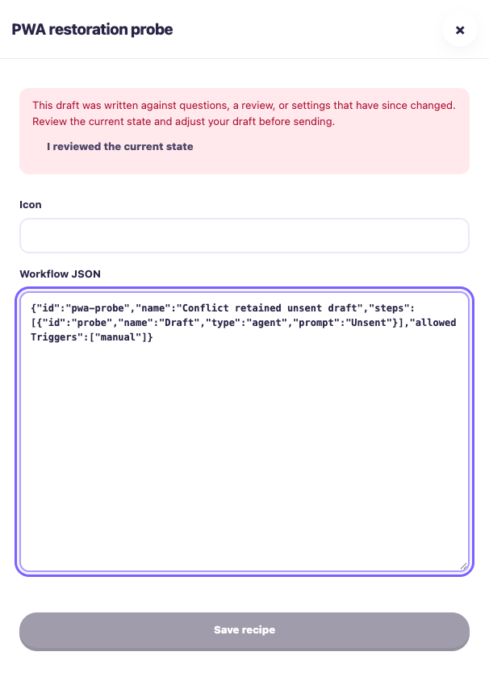
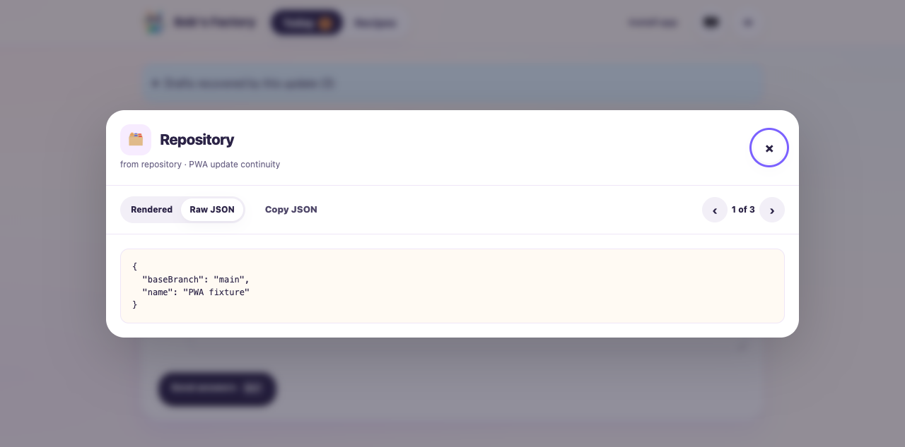
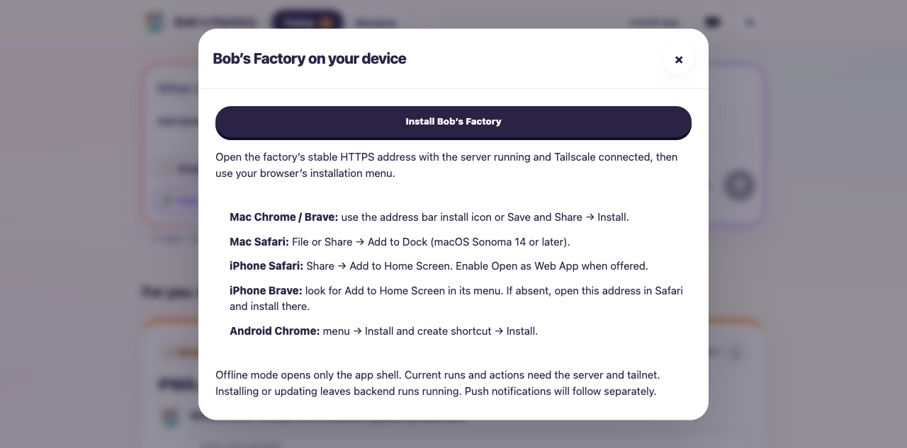
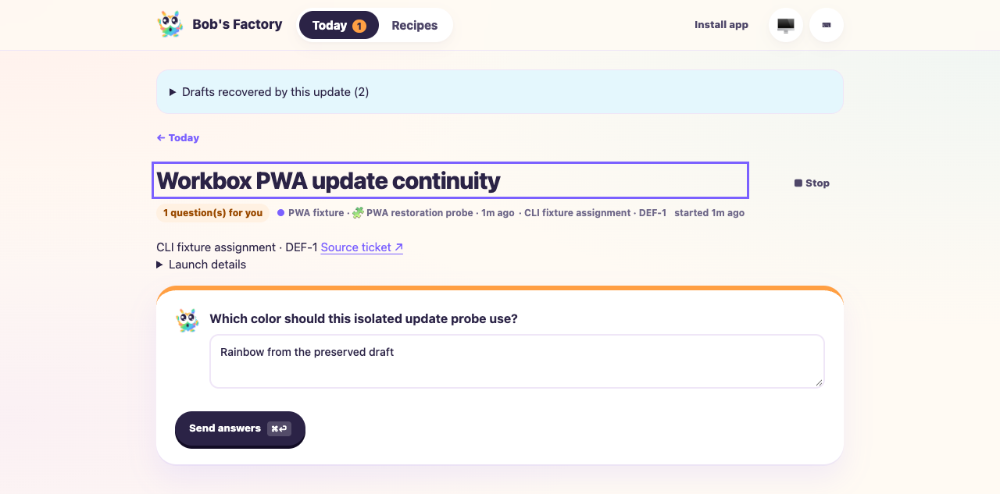
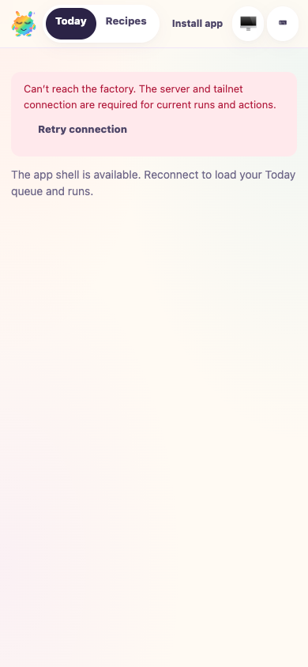

# Factory PWA: safe updates and continued execution

Date: 2026-10-05. Tested base `7b9be55260ea7b09aa04b199276cae43f3c30d7d`
plus the uncommitted Taskbot #41 implementation. Final shell build:
`43cf49d72997c3a9359d04f6`. macOS 26.6.2; agent-browser 0.38.1 with
Chromium/HeadlessChrome 154. Google Chrome 154.0.8037.97 was also checked for
connected rendering and worker registration, without native installation.

## Scope and fixture

F1 applies to dashboard activity, action availability, reconnect and run
continuation. Two isolated built EdgeWorkers used the real CLI tracker, routing,
Git worktrees, FactoryRuntime, checkpoints, activity sink, server and browser.
Only the model call was deterministic: emit 240 cursor-bearing workflow events
and a thought activity, ask one question, then continue after an answer. The
next script waited for a fixture-local release file before completing.

The local test repository has a bare origin; no production runs, remote tickets,
GitHub repositories or Tailscale configuration were changed by these drives.
The first worker used `node_modules/.cache/manual41` (UI 3615, RPC 3616); the
fresh final drive used `node_modules/.cache/manual41-current` (UI 3625, RPC
3626). Each has its own repository, home directory and worktree.

## Assertions and results

- **Issue and session:** F1 `create-issue` returned DEF-1/issue-1;
  `start-session` returned session-1 and created the isolated worktree.
  `view-session --limit 10 --offset 0` displayed timestamped routing/thought
  activities and the clarification response. Pagination with limit 2/offset 2
  returned two of five activities after continuation.
- **Real action:** The current question was filled and submitted once through
  the browser. Factory state changed from waiting/clarify to running/work with
  exactly one answer and two history records. Releasing the script completed
  the same run/workspace with three history records and checkpoint `end`.
  F1 `stop-session` then stopped the tracker session cleanly; `view-session`
  reported complete.
- **Cache boundary:** Browser Cache Storage contained exactly eight static
  shell entries: root HTML, manifest, versioned JS/CSS and four icons. No API,
  SSE, transcript, artifact, raw entry, image response or mutation was cached.
  Built-server inventory contained those eight resources plus the worker, with
  complete manifest/HTML references and 192/512/512/180 PNG dimensions.
- **Disconnected:** A controlled cold navigation at 390 × 844 loaded the shell
  and useful reconnect/retry text without indefinite loading. A loaded run
  retained editable drafts while actions were disabled and data marked stale.
  Reconnecting refreshed authoritative state, re-enabled valid actions and
  preserved the draft and paused reading position.
- **Explicit updates:** With two open tabs, the server's UI snapshot was
  replaced while its worker/run remained running. Later retained the old
  mounted UI. Updating one tab restored launch inputs/recipe selection,
  clarification and chat drafts, route, open step panels, a raw artifact
  inspector, and a paused older activity anchor/cursor beyond the initial
  history page. The other tab retained its own draft and did not reload.
  Old-client caches remained available. Restoration storage was consumed.
  Separate explicit updates preserved an open recipe JSON editor and its
  unsent JSON. Backend state before/after UI updates retained run ID, workspace,
  waiting checkpoint, zero answers and unchanged history: no automatic action.
- **Preservation failure:** Denying `sessionStorage.setItem` postponed Update
  with a visible error, retaining route, draft and inspector; restoring storage
  allowed retry and restored the raw inspector. A separate browser context
  whose `sessionStorage` getter throws rendered the connected app with a warning.
- **Stale state:** Real HTTP requests with an old configuration revision or
  changed question context returned 409 without altering configuration or
  recording an answer. Changing the authoritative fixture recipe while its
  editor was open retained the unsent JSON and disabled Save. Editing did not
  clear the warning; deliberate acknowledgement enabled Save. The draft was
  never saved, and original fixture configuration was restored.

The browser update sequence exercised intermediate candidate builds
`91cdac… → 166ea… → 7a… → 613d66… → 73cdd… → 43cf49…`.
The final fresh drive and cold-offline screenshot used the full final build ID
above. This is runtime provenance, not a claim that every earlier screenshot
was captured from the final build.

## Commands

```sh
bun node_modules/.cache/manual41-current/fixture.mjs
CYRUS_PORT=3626 apps/f1/f1 create-issue --title 'PWA current lifecycle' \
  --description 'Isolated installation/update acceptance fixture' \
  --labels workflow:pwa-probe
CYRUS_PORT=3626 apps/f1/f1 start-session --issue-id issue-1
CYRUS_PORT=3626 apps/f1/f1 view-session --session-id session-1 --limit 10 --offset 0
agent-browser --session manual41fresh open http://127.0.0.1:3625/#/runs/session-1
# Fill the current question and click Send answers once using snapshot refs.
touch node_modules/.cache/manual41-current/release
CYRUS_PORT=3626 apps/f1/f1 stop-session --session-id session-1
CYRUS_PORT=3626 apps/f1/f1 view-session --session-id session-1 --limit 2 --offset 2
```

UI-only snapshot replacement in the first fixture used SIGUSR2 to stop and
recreate FactoryServer on the same runtime. Optional process-restart testing
also retained the waiting run's persisted checkpoint and identity. That fixture's
CLI tracker is in memory and lost its session on process restart, so post-restart
tracker output is **not** passing evidence. The fresh final drive above covers
the complete tracker/activity/action path without that limitation.

## Other checks and limits

- `pnpm install --frozen-lockfile`: passed; no dependency changes.
- `pnpm build` and `pnpm typecheck`: passed on the final implementation.
- Focused FactoryServer, FactoryWebClient and FactoryPwa tests: **26 passed**.
  Behavioral tests additionally cover incomplete/digest-invalid builds and
  precache failure, root navigation/auth denial/502 fallback, unsupported
  workers, explicit install prompt/dismissal, bounded/expired/malformed
  snapshots, changed gates and conservative multi-tab cache cleanup.
- Biome on changed code/web assets: passed with 13 existing CSS warnings and
  no errors. `git diff --check`: passed.
- Install/help controls and native-prompt availability rendered in Chrome.
  The prompt's explicit invocation/dismissal is tested with a mock event;
  **no native installation or standalone launch is claimed**.
- Required macOS Chrome/Brave/Safari and iPhone Safari/Brave installation,
  launch/uninstall and protected HTTPS-origin evidence is **outstanding**.
  Native desktop automation was unavailable; no iPhone/iOS version was confirmed.
  Installed Brave 154.1.96.61 and Safari 26.6.2 are inventory only. Android's
  physical-device test is explicitly waived. Mobile emulation is not iPhone
  evidence. The implementation's overall native acceptance is not complete.
- No Web Push implementation; linked backlog follow-up is
  [Taskbot #69](https://taskbot.apps.janjaap.de/p/bobs-factory/t/69).

The installation paths in [Factory documentation](../../../docs/FACTORY.md)
were rechecked against official Chrome, Brave and Apple guidance on this date.
The fixture workers and owned browser sessions were stopped after the drive.

## Visual evidence

Final-build cold offline shell (Chromium emulation):


Final-build recipe conflict; draft retained and Save disabled:



Earlier candidate: explicit update restored the open raw inspector:



Earlier candidate: desktop installation help, without native installation:




## Workbox follow-up and user decision (2026-10-05)

The record above describes the initial implementation and its then-outstanding
native installation requirement. The user subsequently waived native-device
installation tests and requested maintained libraries. Native installation is
still unverified, but is no longer an implementation acceptance blocker.

The worker now bundles `workbox-precaching` and `workbox-routing` 7.4.1 locally.
Workbox downloads and stores the build-scoped precache and routes allowlisted
requests. Browser SRI validates resource bytes; the factory plugin validates
build/MIME/status and refuses redirects. There are no CDN imports or external
app providers. Explicit activation, conservative old-tab cache retention, the
root-only navigation fallback and draft/gate protections remain. The linked
[push follow-up #69](https://taskbot.apps.janjaap.de/p/bobs-factory/t/69) now records
maintained Web Push libraries and direct server-to-browser push-service delivery
with VAPID authentication, without a hosted notification provider. Push remains
outside this implementation.

A fresh isolated fixture at `node_modules/.cache/manual41-workbox` (UI 3635, RPC
3636) reused only the deterministic model fixture described above with a fresh
clone/home. It tested the previous custom worker `43cf49d72997c3a9359d04f6` to the
Workbox shell `332e05ff6a89d1078623add0`, without changing production state.

- F1 create-issue/start-session returned DEF-1/issue-1 and session-1. Four initial
  timestamped activities included routing, the thought and clarification.
- The native browser installed the complete Workbox precache with browser SRI:
  exactly eight static resources, no API/SSE/media or mutation entries. A waiting
  update coexisted with the old shell cache.
- Later preserved question/chat drafts and paused reading. Explicit update in
  one tab restored those drafts, route, open step and stable reading anchor;
  session storage was consumed. A second tab retained its own chat draft and
  old mounted UI without reloading. Both old/new static caches remained available.
- Before/after update, the same run retained its ID, workspace, waiting/clarify
  state, one history record and zero answers. No automatic action occurred.
- Connected data became stale and actions disabled after loss of connectivity.
  A controlled cold offline reload at 390 × 844 loaded the Workbox shell and
  retry guidance; reconnect refreshed the current run and enabled actions.
- Actual stale-build and changed-question POSTs returned 409; answers remained
  zero. One explicit current answer then continued the same run; releasing the
  fixture script completed it at checkpoint `end`, with three history records
  and exactly one answer. Pagination returned two of five tracker activities;
  F1 stop-session cleanly finished the tracker. Owned worker/browser were stopped.

Commands used the same F1/browser flow as the initial record with ports 3635/3636,
`agent-browser --session manual41workbox`, SIGUSR2 UI snapshot replacement and
`touch node_modules/.cache/manual41-workbox/release`. No new source changes were
made between this follow-up drive and the checks below.

Validation: `pnpm build` and `pnpm typecheck` passed. Focused FactoryServer,
FactoryWebClient and FactoryPwa tests: 26 passed. The PWA tests execute bundled
Workbox modules, including failed precache, bounded snapshots and multi-tab
cleanup. Node's mock fetch simulates SRI; the real browser drive checks native
successful installation. Binary asset inspection confirmed 192/512/512/180 PNGs
and a complete nine-route inventory including the 18,702-byte bundled worker.

`pnpm audit` exited 1 with two unchanged high advisories unrelated to the new
Workbox dependency graph: [node-forge](https://github.com/advisories/GHSA-86w9-cpqp-85rv)
and [braces](https://github.com/advisories/GHSA-vfj7-8cjw-p6xm). Both advisories and
npm latest versions show no published patched version (`node-forge` 1.4.0,
`braces` 3.0.3); bumping their owners cannot currently produce zero advisories.
No advisory suppression, override or unrelated crypto/watch implementation was
introduced. At that point the repository zero-advisory mandate blocked
completion pending a scoped exception or separate remediation.

Workbox behavior follows its [precaching](https://developer.chrome.com/docs/workbox/modules/workbox-precaching)
and [routing](https://developer.chrome.com/docs/workbox/modules/workbox-routing)
documentation. Native Mac/iPhone/Android installation is not claimed.





## Delegated security decision (2026-10-05)

The user responded to the two-warning exception question with **“You decide,
I don’t get it…”**. Under that delegated authority, the implementation proceeds
to review with a narrow exception to `CLAUDE.md`'s zero-advisory requirement for
this PWA change. This does not change the repository policy or resolve either
security warning. No unrelated dependency changes, audit suppression, publication
or deployment were performed.

A fresh `pnpm audit --json` exited 1 and reported the same two high-severity
warnings, with no patched versions listed. The dependency diff adds only
Workbox packages; `node-forge` 1.4.0 and `braces` 3.0.3 are unchanged. The
[node-forge warning](https://github.com/advisories/GHSA-86w9-cpqp-85rv) concerns
forged RSA signatures; the
[braces warning](https://github.com/advisories/GHSA-vfj7-8cjw-p6xm) concerns a
process crash from deeply nested patterns. Both published records were checked
again and list no patched version. Actual application exposure remains
unverified and needs separate security assessment and fixes.

The exception is limited to carrying this implementation into review because
the PWA adds neither warning nor a dependency path to the affected packages.
The existing build, typecheck, 26 focused-test results and F1/browser evidence
above remain valid; runtime code was unchanged during this decision pass.
`git diff --check` passed. Native installation remains unverified under the
user's recorded test waiver. Web Push remains in linked backlog ticket #69.
