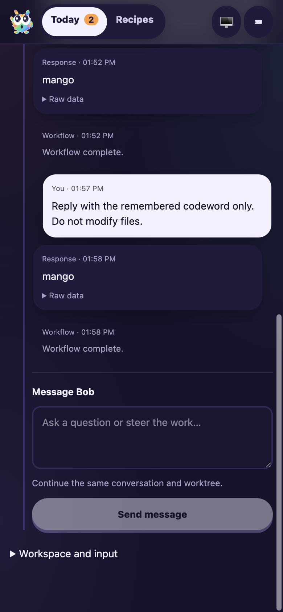

# Workflow-configured Cyrus session chat

Date: 2026-10-05. Taskbot #61 / PR #5.
Tested runtime: `c3ece4a09eeb10c33c97af03302c6eba59b44b4a`.
Initial native drives used `a4c259b1`; follow-up transcript/stop protections used
`9870731f`. The final runtime was rebuilt and restarted for persistence,
follow-up action and recipe/mobile checks.

## Scenario and setup

Validate actual user-message delivery and conversation continuity, not just
whether a composer renders. Fresh F1 repository `/tmp/factory-session-chat-repo`,
local bare origin `/tmp/factory-session-chat-origin.git`, worker home
`/tmp/factory-session-chat-home`, CLI tracker/RPC 3600 and UI 3497.
The fixture uses the real EdgeWorker, CLI issue tracker, activity sink and native
Codex `gpt-6.1-sol` with low reasoning. It uses the existing host CLI authentication.
No product files, commits or PRs are created by the fixture agents.

The collaborative browser could reach Tailscale but not the fixture's loopback
port. A temporary **tailnet-only** Serve endpoint on HTTPS 8443 proxied through
an isolated validating proxy (3498) to the fixture. Production HTTPS 443 and its
access policy were retained. The temporary endpoint and both fixture processes
were removed after validation.

```sh
apps/f1/f1 init-test-repo --path /tmp/factory-session-chat-repo
CYRUS_PORT=3600 apps/f1/f1 ping
CYRUS_PORT=3600 apps/f1/f1 create-issue --title 'Interactive color inspection' \
  --description 'Return the latest color after taking a live chat message from the operator.' \
  --labels workflow:interactive
CYRUS_PORT=3600 apps/f1/f1 start-session --issue-id issue-1
CYRUS_PORT=3600 apps/f1/f1 view-session --session-id session-1 --limit 5 --offset 0
```

## Delivery and continuity assertions

- DEF-1 / session-1 selected a custom `chat: true` agent workflow. During its
  shell wait, POST `/api/runs/session-1/messages` accepted a request for blue.
  The native agent completed with `{"color":"blue"}` rather than its initial red.
- DEF-3 / session-3 repeated that scenario through the actual browser composer:
  typing and clicking **Send message** submitted violet. The response cleared
  the draft, retained one human bubble and produced `{"color":"violet"}`.
  Native factory-context calls, command activity and final JSON were visible in
  the CLI tracker. Pagination returned the requested subset and total count.
  Custom completion was asserted against the runtime; the CLI tracker's status
  can still say active after a custom workflow finishes.
- DEF-2 / session-2 used the existing ticket-triggered Cyrus path with
  `workflow:simple,question,codex,gpt-6.1-sol`. It remembered apricot. A browser
  follow-up asked for the remembered word and returned apricot without restating
  it. Native thread remained `01a10be7-b8f1-7f80-8d23-6c5345d3865f`.
- A second browser continuation ran a 35-second shell command. During that turn,
  Ctrl+Enter submitted a change to pear. The final native answer was pear in the
  same thread, proving live Cyrus steering as well as continuation.
- Manual Cyrus run `manual-05b2c289-1052-4dd9-bc8f-ab634cad9515` remembered mango.
  API continuation returned mango and retained native thread
  `01a10be7-d88f-75e0-808d-8c3019326ff2`, run ID, original input and worktree.
- Graceful fixture restart preserved transcript and chat records. The manual
  run's existing **Ask a follow-up** control then returned mango in that same
  native thread. The URL/run ID stayed unchanged and the run count stayed four;
  it did not create another Factory run. The CLI tracker is an in-memory fixture,
  so post-restart native continuation was checked on the manual runtime path.

## UI, configuration and failure checks

- At 390×844, chat and Recipes had no horizontal overflow. The final recipe
  checkbox measures 20px and its label retains a 44px hit area. The screenshot
  below was opened and inspected visually.
- Disabling Cyrus chat in Recipes changed the real server capability to false;
  its protected send endpoint returned HTTP409. Restored the setting afterward.
- A custom script workflow with no chat opt-in rejected a real send request.
  Its stop endpoint completed and the other completed runs were unchanged.
- A one-request browser fixture returned HTTP409 before reaching the server.
  The actual composer kept the typed draft and displayed the inline error.
  This verifies presentation of failed delivery, not a native transport failure.
- Consecutive identical answers initially disappeared because the old formatter
  coalesced result messages. The final renderer retains each answer in separate
  chat turns, while still coalescing an assistant/result copy within a turn.
  Repeated identical user instructions remain separate too.
- Unit checks cover nested workflow inheritance and explicit overrides,
  ambiguous fanout rejection, terminal-turn races, stopped runners still closing,
  duplicate continuation prevention, server input/origin guards, failed delivery
  without a false saved bubble, and message persistence.



## Verification and rollout

- 61 focused tests across SessionChat, EdgeWorker chat/recovery, WorkflowRuntime,
  FactoryServer and activity formatting pass.
- All 42 existing ClaudeRunner tests pass. Native end-to-end delivery was tested
  with Codex; a live Claude turn was not part of this drive.
- Full workspace build/typecheck and required pre-commit hooks pass; targeted
  Biome and `git diff --check` pass. Existing CSS specificity warnings remain.
- Runtime c3ece4a0 deployed into the existing launchd service after verifying no
  runs were active. Backup/manifest:
  `~/.cyrus/runtime-backups/20261005-workflow-session-chat`.
- All eight stored run checkpoints, history, outputs, statuses, simple execution
  receipts and worktrees match their backups. Existing failed runs were preserved.
- Production Tailscale UI, JS, CSS and run API returned HTTP200. After a full page
  refresh, the real completed Cyrus session displayed **Message Bob** and the
  server exposed same-session continuation. No production prompt was sent.
- Temporary F1 listeners 3600/3497/3498 and tailnet HTTPS8443 were removed.
  Normal tailnet Serve on HTTPS443 remains. No PR approval or merge occurred.

This validates chat/session behavior, not a complete delivery pipeline or PR merge.
