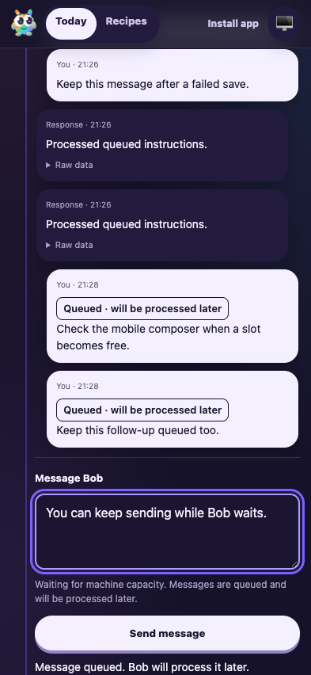
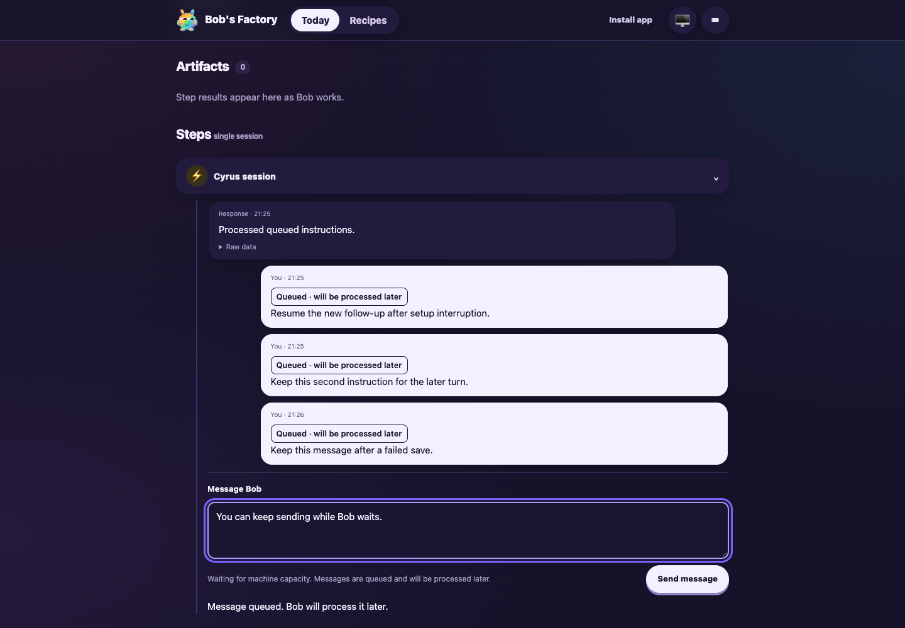
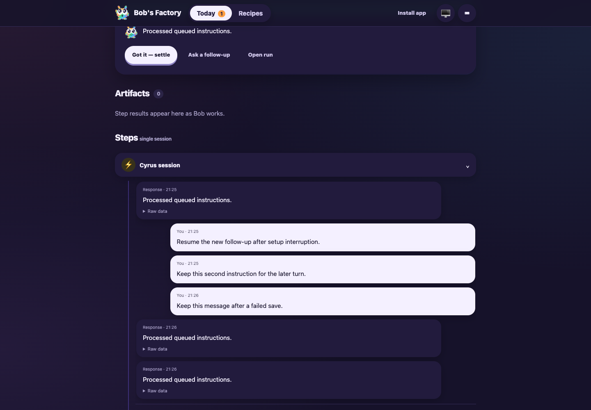

# Capacity chat: accept and display queued follow-ups

Date: 2026-10-06. Tested revision: `6ed0bf71b798c06151e805288cfda004af6b1fc3` plus the human-feedback changes in this commit. Factory web build: `f996ee4f98ccb9f5b771d716`.

This drive addresses the rejection on [PR #20](https://github.com/Attraccess/bobs-factory/pull/20): allow sending messages during capacity waits and show which messages will be processed later. Session continuation, restart recovery and activity rendering make F1 applicable.

## Setup and commands

Used a real isolated EdgeWorker, ChatSessionHandler, persistence, Factory API/UI and machine-capacity coordinator. The provider was replaced with a controlled nonstreaming runner that records starts and retains native conversation ID `human37-native`. A separate process held the only available machine slot. No production service was restarted.

- State root: `/tmp/human37-final-OEUC3K`; coordinator: `/tmp/human37-final-OEUC3K-pool`.
- Factory UI: port 3830; F1/RPC: port 3831; competing lease holder: port 3832.
- Fixture sources and JSON observations are retained in `/Users/jappy/.cyrus/factory/evidence/manual-2fbfe0ef-dbff-4400-9a37-ecf459304b8c`, named `human37-chat-fixture.mjs`, `human37-holder.mjs` and `human37-final-*.json`.

```sh
HUMAN37_HOME=/tmp/human37-final-OEUC3K \
CYRUS_CAPACITY_DIRECTORY=/tmp/human37-final-OEUC3K-pool \
CYRUS_FACTORY_PORT=3830 CYRUS_DISABLE_REMOTE_SESSION_STORE=1 \
node <evidence>/human37-chat-fixture.mjs

CYRUS_CAPACITY_DIRECTORY=/tmp/human37-final-OEUC3K-pool \
node <evidence>/human37-holder.mjs

CYRUS_PORT=3831 apps/f1/f1 ping
CYRUS_PORT=3831 apps/f1/f1 status
CYRUS_PORT=3831 apps/f1/f1 start-chat-session \
  --channel C_HUMAN37 --user U_F1 \
  --text 'Start a fresh conversation for the final checkpoint check'

agent-browser --session human37 open \
  'http://127.0.0.1:3830/#/runs/slack-human37-1791314729.413'
```

F1 ping/status and synthetic Slack dispatch succeeded. Browser interactions used the actual composer and API; screenshots were captured at 393×852 and 1440×1000.

## Assertions and results

1. **Durable setup checkpoint — passed.** After the initial turn completed, blocked asynchronous continuation setup and submitted two follow-ups. The saved pending execution already contained the new prompt before setup completed. Stopped/restarted the isolated worker. Recovery retained both accepted message IDs, the native conversation and the competing capacity lease; provider starts remained at one. The previous completed prompt was not replayed.
2. **Save failure and retry — passed.** Injected one persistence failure, then clicked Send. The API returned 409 with the controlled storage error, the draft remained, and no provider turn started. Retried successfully; exactly one additional accepted message appeared. Three queued messages were visible and Send remained enabled for another nonempty draft.
3. **Capacity admission and ordered delivery — passed.** Released the competing lease. Provider start two received `Resume the new follow-up after setup interruption.`. After completing that turn, start three received `Keep this second instruction for the later turn.\n\nKeep this message after a failed save.`. Both resumed `human37-native`. No overlap or extra start occurred. After completion, queued badges disappeared, the pool had zero active/queued requests, and the unsent draft remained.
4. **Mobile composer — passed.** Reacquired the competing slot and submitted two more messages through the browser. Both displayed “Queued · will be processed later”; a new draft kept Send enabled. Document width was 393 pixels, without horizontal overflow.
5. **Stop — passed.** Used the existing two-click stop confirmation. The competing slot had been released before confirmation, so the first mobile follow-up was admitted as start four. Confirmed Stop cancelled that active turn and discarded the remaining queued follow-up. Starts remained four, the session became terminal, and active/stopping/queued counts returned to zero. The earlier isolated drive also stopped two messages before admission; releasing its competing slot started neither.

The temporary worker and competing holder were stopped after the drive.

## Browser evidence

Mobile composer with accepted queued messages and enabled Send:



Desktop capacity wait after restart and successful storage retry:



Delivered messages after the queued turns completed:



## Automated validation and limits

- Focused continuation, Slack/Zulip integration and Factory API tests: 30 passed across three files.
- Full edge-worker suite: 105 files passed; 1,259 tests passed, one skipped.
- `pnpm lint`: passed with 28 existing warnings.
- Core and edge-worker builds: passed. Repository pre-commit build/typecheck results are recorded in the role result.

This is an isolated controlled-provider drive. It verifies real persistence, queue admission, API and browser behavior, but does not test live model inference, Slack/Zulip delivery or physical mobile devices. Zulip behavior is covered by the integration tests. The shared coordinator is independent of the worker state root, and no real tracker lifecycle was mutated by these fixtures.
