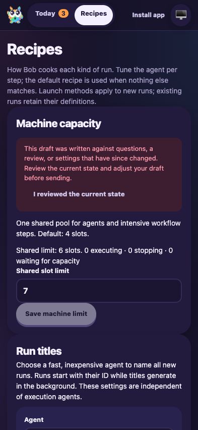
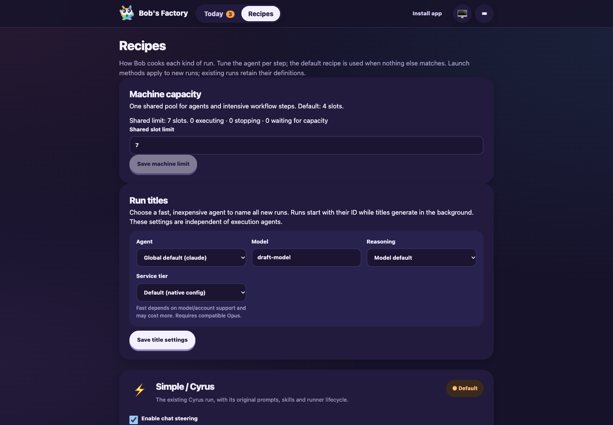

# Capacity and guided-review base integration

Date: 2026-10-06. Tested `79e94bf1` merged with main `c4322e5f`, with the
documentation conflict resolutions committed alongside this report.

## Scope

F1 applies to integrating the guided-review reader and its update restoration
with the accepted capacity settings and passive handoff behavior. Both changelog
entries and documentation sections were retained. Code merged automatically;
earlier review fixes and historical evidence remain intact.

The retained `capacity-merge-review-fixture.mjs` ran from the workflow evidence
directory against the freshly built local packages. It created a fresh repository,
CLI issue DEF-1, worker home and isolated machine coordinator. UI port 3710, F1
RPC 3711 and fixture control 3712 were used. The actual EdgeWorker, tracker,
activity sink, runtime, script execution, FactoryServer and service worker ran;
GitHub readiness was simulated. Production services were unchanged.

## Assertions and results

- A saved handoff snapshot with `computeIntensive: true` polled readiness while
  the limit-one pool reported no active or queued execution. A separate intensive
  script completed during polling, and the handoff leaf remained `waiting-ci`.
- After the fixture reported readiness, handoff completed and posted exactly one
  issue comment. The final pool had zero active, stopping or queued requests.
- F1 `ping` and `status` passed against the isolated worker.
- Chromium Recipes retained an unsaved limit of 7 and title model `draft-model`
  through the real **Update now** flow. An HTML-comment-only shell variant was
  built for this transition; source was restored immediately afterward.
- The shared limit was then changed to 6. Updating back to the unchanged final
  build retained both drafts and the Recipes route. A stale-state warning disabled
  Save until acknowledgment. At 393×852, document and viewport widths were 393px.
- Acknowledgment followed by explicit Save persisted limit 7, leaving Save
  disabled in its pristine state. Updates themselves submitted no capacity change.
- Desktop and mobile screenshots were captured and visually inspected. The final
  web build was `23af0f4cad8639d20410b09a`; the temporary variant was not committed.

## Checks and evidence

- Edge-worker regression suite: 105 files, 1,252 tests passed, one skipped. This
  includes capacity, integration recovery, guided-review files/model, PWA update
  restoration, guide generation, capture recovery and runtime tests.
- Root build and typecheck passed. Lint passed with 28 warnings and no errors.
- `git diff --check` passed and no unresolved merge entries remained.

Commands included `pnpm --filter cyrus-edge-worker test:run`, `pnpm build`,
`pnpm typecheck`, `pnpm lint`, `CYRUS_PORT=3711 apps/f1/f1 ping`,
`CYRUS_PORT=3711 apps/f1/f1 status`, fixture `/heavy`, `/ready`, `/status` controls,
and `agent-browser --session ci37-guided open http://127.0.0.1:3710/#/recipes`.

Logs, fixture source and `ci37-guided-{passive,restoration,completed}.json` are in
`/Users/jappy/.cyrus/factory/evidence/manual-2fbfe0ef-dbff-4400-9a37-ecf459304b8c`.
The worker and browser were stopped after validation; the fixture removed its
temporary home, repository and coordinator. This focused integration drive does
not certify live GitHub polling, native provider execution or physical iPhones.
Human approval remains external; this step leaves PR #20 draft.

