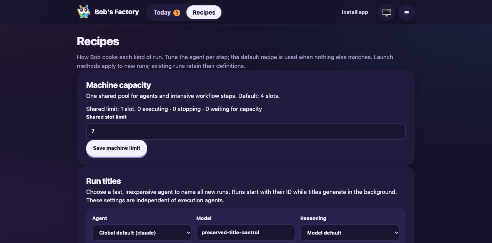
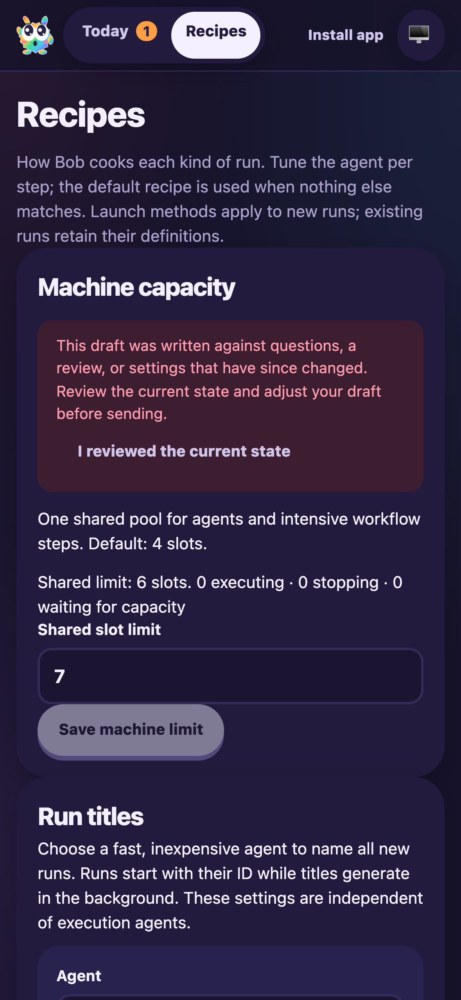

# Capacity fixes after PWA and handoff integration

Date: 2026-10-06. Candidate: `3cd8a158` plus the fixes committed with this report.

F1 applies to the changed capacity classification and PWA settings lifecycle.
An isolated CLI EdgeWorker used a fresh repository, home and machine coordinator,
UI port 3710, F1 RPC port 3711 and fixture control port 3712. The real tracker,
runtime, command execution, activity sinks, FactoryServer and service worker were
retained. A temporary `gh` executable simulated GitHub readiness without external
requests. No production worker or coordinator was changed.

## Handoff capacity

- Created CLI ticket DEF-1 and attached a manual handoff run with current-revision
  CI and guide receipts. Its accepted snapshot carried `computeIntensive: true`,
  reproducing the previously allowed classification.
- While the real handoff tool repeatedly polled UNKNOWN mergeability, the pool
  reported limit 1, active 0, stopping 0 and queued 0. Its leaf phase was
  `waiting-ci`.
- A separate intensive script ran through the same runtime and coordinator to
  completion while handoff remained running. No slot was held by polling.
- Switching the fixture to MERGEABLE completed handoff on its second poll and
  posted exactly one comment to DEF-1. The final pool was empty. F1 `ping` and
  `status` passed; activity events included the mergeability wait.
- New recipes reject intensive handoff classification; the Recipes selector
  disables that choice. Saved intensive snapshots execute passively.

The first fixture omitted guide arrays required by the handoff formatter. It
demonstrated free capacity during polling but failed at formatting. The corrected
fixture repeated the drive from a fresh home and completed successfully.

## PWA capacity draft

- In desktop Chromium, entered an unsaved limit of 7 while the shared limit was
  1, alongside an unsaved title-model control value.
- Published an isolated HTML-comment-only shell variant and restarted only the
  fixture FactoryServer. Used the real **Update now** button. Both drafts and
  the Recipes route survived; Save machine limit became available. The new
  service worker controlled the tab and the snapshot was consumed.
- Changed the shared limit to 6 via the API, rebuilt the unchanged final source,
  and updated again. The input remained 7, the authoritative shared value was 6,
  and the stale warning blocked Save until explicit acknowledgment.
- Acknowledgment and Save wrote exactly 7. Save returned to its disabled pristine
  state. No capacity setting was submitted automatically by either update.
- iPhone 16 emulation retained the draft and warning without horizontal overflow:
  viewport and document widths were both 393px. Both screenshots were inspected.

The temporary HTML comment was removed immediately after building its isolated
variant. The final source and shell were rebuilt. The fixture worker and browser
were stopped, and its temporary home/repository/coordinator were removed.

## Commands and evidence

The fixture and JSON snapshots are retained in the workflow evidence directory
`/Users/jappy/.cyrus/factory/evidence/manual-2fbfe0ef-dbff-4400-9a37-ecf459304b8c`.
The fixture source is `capacity-merge-review-fixture.mjs`.

```sh
node node_modules/.cache/capacity-merge-review/fixture.mjs
curl http://127.0.0.1:3712/heavy
curl http://127.0.0.1:3712/ready
curl http://127.0.0.1:3712/status
CYRUS_PORT=3711 apps/f1/f1 ping
CYRUS_PORT=3711 apps/f1/f1 status
agent-browser --session capacity-merge-review open http://127.0.0.1:3710/#/recipes
```

169 focused tests passed across WorkflowRuntime, FactoryPwa, FactoryPipeline,
MergeReadiness, FactoryWebClient and FactoryServer. Regression coverage includes
saved intensive handoff snapshots, limit-one nested execution, snapshot validation
and capacity-draft round trips. Lint passed with 24 existing warnings. Repository
commit hooks run the full build and typecheck.

This drive simulates GitHub readiness and uses Chromium mobile emulation; live
GitHub polling and native iPhone installation remain outside this validation.
Earlier review dispositions and historical evidence are preserved.




