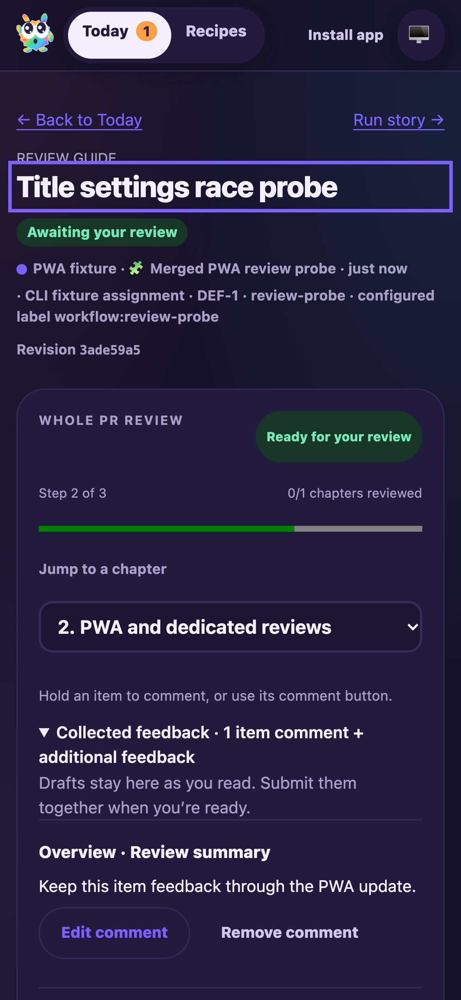

# PWA integration with collected review feedback

Date: 2026-10-06. Candidate: PR #12 head `1bb44c80` merged with freshly fetched main `e07cc3e5`, plus the conflict resolutions in this report.

F1 applies to combined dashboard and review lifecycle behavior. Manual conflicts were in the changelog, CSS, focus controls and API/client tests. Both branches' entries and checks remain. The newer review controller owns collected comments, storage and request locks; its complete draft is now included in the bounded tab-local PWA snapshot with revision checks. Earlier single-text snapshots migrate without accepting another tab's text. Empty feedback drafts are pruned, and malformed item snapshots are rejected.

## Fixture and assertions

Fresh isolated fixture: `node_modules/.cache/manual41-ci4`, with local bare origin, UI 3695 and RPC 3696. Deterministic model/title/guide output; real CLI tracking, repository routing, worktrees, runtime, activity sink, review gate and FactoryServer. No production actions or remote model calls.

- F1 ping, issue creation (`DEF-1`/`issue-1`) and session start (`session-1`) passed. Routing and thought activities appeared.
- Opened the real review guide, added a summary item comment and additional feedback, and selected chapter 2.
- Published an isolated HTML-comment-only shell build, immediately restored the source and restarted only FactoryServer. The existing tab paused feedback and refresh actions and offered Update now.
- Used Update now; the real service worker activated the complete target shell. The same review route, selected chapter, summary item comment and additional feedback were restored. The item retained its original context and revision identity.
- Mobile Chromium emulating iPhone 16: viewport/document width 393px, form text 16px, viewport scale 1. Screenshot inspected: collected comment wraps within the app width.
- Submitted the restored feedback once through the real review API. Drafts cleared, the response activity reported workflow completion, and F1 stop-session succeeded.
- 168 tests passed across FactoryServer, FactoryWebClient, FactoryPwa, FactoryReviewFeedback, FactoryReviewState, ActivityPage, FactoryPipeline, RunTitleGenerator and WorkflowRuntime. Coverage includes stale/conflicting saves, snapshot validation/migration, submission locks across remounts, title retries and QA pipeline changes.

## Reproduction

```sh
CYRUS_PORT=3696 apps/f1/f1 init-test-repo --path "$PWD/node_modules/.cache/manual41-ci4/repo"
bun node_modules/.cache/manual41-ci4/fixture.mjs
CYRUS_PORT=3696 apps/f1/f1 ping
CYRUS_PORT=3696 apps/f1/f1 create-issue --title 'Merged feedback PWA validation' --description 'Preserve item and additional feedback through safe updates.' --labels workflow:review-probe
CYRUS_PORT=3696 apps/f1/f1 start-session --issue-id issue-1
agent-browser --session manual41ci4 open http://127.0.0.1:3695
agent-browser --session manual41ci4 set device 'iPhone 16'
CYRUS_PORT=3696 apps/f1/f1 view-session --session-id session-1 --limit 5
CYRUS_PORT=3696 apps/f1/f1 stop-session --session-id session-1
```

The ignored fixture derives from the prior latest-main fixture with fresh paths and ports. Browser and fixture are stopped after validation. Required commit hooks build/typecheck the final source. Historical evidence, accepted native-testing waiver and scoped audit exception remain; no dependency versions changed. Source `index.html` is unchanged by the isolated update probe.

Sourcery comment `6019194902` retains its informational disposition: review was skipped because the diff exceeds its size limit. No correction, review or unresolved thread was supplied. Base/code changes require renewed pipeline review. PR readiness is unchanged and the PR is unmerged.


