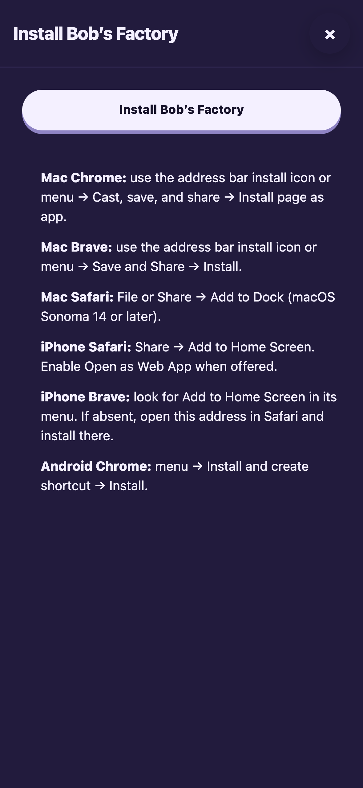
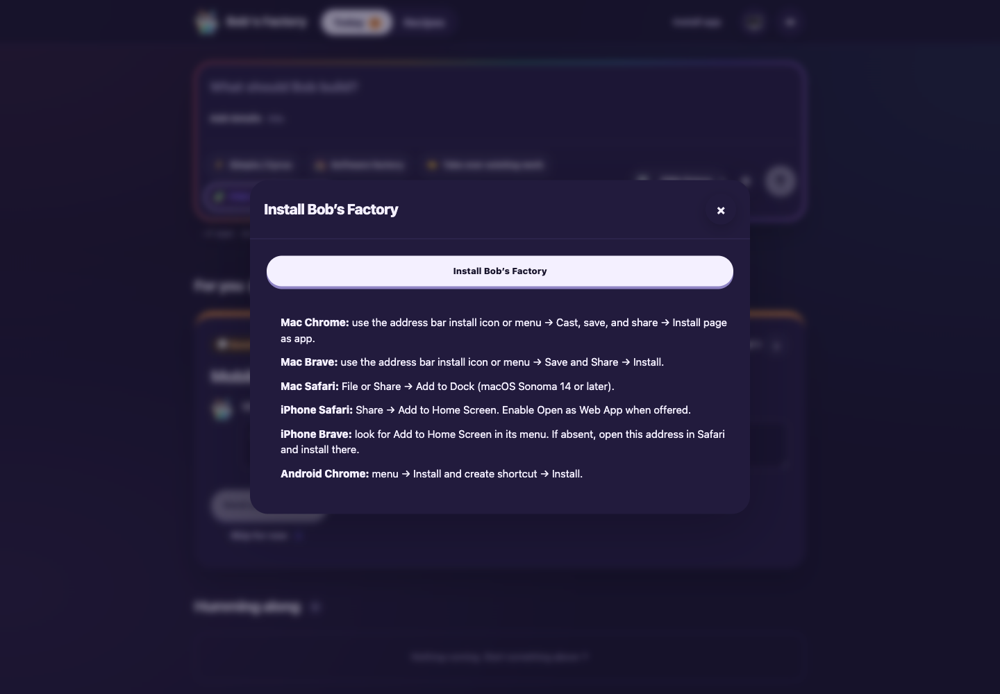
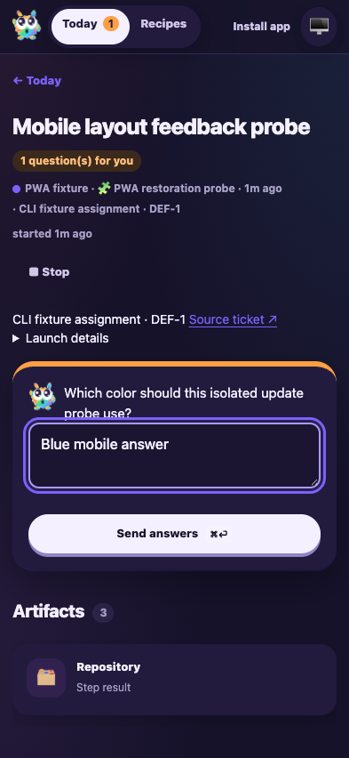
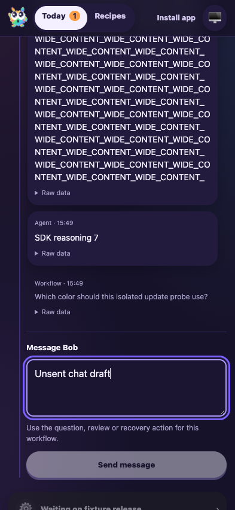

# Factory PWA human feedback: installation copy and mobile layout

Date: 2026-10-06. Tested `217c4c8b9dce105485ced5cfe5e35308f6b89c99`
plus this feedback delta. Final shell build: `d2555a2139a1c0d30e0440ac`.
Agent-browser 0.38.1 with Chromium; desktop 1440×1000 and mobile 393×852,
with an additional 320×700 narrow layout check. Screenshots were captured while
refining the CSS; the offline capture uses the final shell above.

## Changed behavior and fixture

F1 applies to the changed activity layout and mobile question/action surfaces.
A fresh isolated fixture in `node_modules/.cache/manual41-human-feedback`
used a local bare origin, UI 3685 and RPC 3686. It reused the real CLI tracker,
routing, worktree creation, FactoryRuntime, checkpoints, activity sink and
FactoryServer. Only the model was deterministic: eight SDK messages with long
unbroken text, one clarification question, then a script waiting for release.
No production runs or deployment configuration were changed.

## Assertions and results

- `create-issue` returned DEF-1/issue-1; `start-session` created session-1 and
  its worktree. `view-session` displayed routing, thought and response activity.
- Installation help on desktop/mobile contains only the native install control
  and browser installation steps. It has no deployment, offline, push or
  uninstall discussion. Connection UI and maintained installation docs use
  factory wording without assuming a particular networking product.
- Launch input/select controls computed to 16px, with the main composer at
  17px. Clarification, chat, recipe icon and recipe JSON fields computed to
  16px. Filling question/chat fields kept the emulated viewport scale at 1.
  The viewport continues to allow user zoom. Native iPhone focus zoom remains
  unverified under the existing native-testing waiver.
- Long SDK activity text wrapped inside its 335px conversation container.
  At 393px and 320px, document/body width matched the viewport and an attempted
  horizontal window scroll remained at zero. Header links and visible controls
  stayed inside the 320px viewport; narrow headers wrap their controls.
- A temporary DOM table probe inside the real Markdown container retained local
  horizontal scrolling: 285px client width, 3725px scroll width and scrollLeft
  1000, while document width remained 393px and window scrollX remained zero.
  The probe was removed immediately; screenshots show actual fixture content.
- Cold offline navigation loaded the cached shell and factory-only retry text.
  Reconnection restored the connected Today view and current state.
- A single browser answer continued the same run and release completed it at
  checkpoint `end`, with three history records and exactly one saved answer.
  `stop-session` succeeded; pagination returned two of five tracker activities.
  The owned fixture and browser were stopped.

## Commands and checks

```sh
CYRUS_PORT=3686 apps/f1/f1 init-test-repo --path "$PWD/node_modules/.cache/manual41-human-feedback/repo"
bun node_modules/.cache/manual41-human-feedback/fixture.mjs
CYRUS_PORT=3686 apps/f1/f1 create-issue --title 'Mobile layout feedback probe' \
  --description 'Verify browser installation help, large activity content and mobile textboxes.' \
  --labels workflow:pwa-probe
CYRUS_PORT=3686 apps/f1/f1 start-session --issue-id issue-1
agent-browser --session manual41human open http://127.0.0.1:3685
agent-browser --session manual41human set device 'iPhone 16'
# Snapshot refs drive install/dialog controls, question/chat filling and answer submission.
# Browser eval reads computed fonts, document widths and viewport scale.
# set offline on + reload exercises the cached shell; off + reload reconnects.
touch node_modules/.cache/manual41-human-feedback/release
CYRUS_PORT=3686 apps/f1/f1 stop-session --session-id session-1
CYRUS_PORT=3686 apps/f1/f1 view-session --session-id session-1 --limit 2 --offset 2
```

- Focused FactoryPwa, FactoryWebClient and FactoryServer tests: **31 passed**.
- Edge-worker build, Biome and `git diff --check`: passed. Biome reports
  11 existing CSS warnings and no errors.
- Full build and typecheck are required by the commit hook.
- No dependencies changed. The accepted audit exception, native-test waiver,
  push follow-up #69 and resolved review findings remain intact.

## Visual evidence









