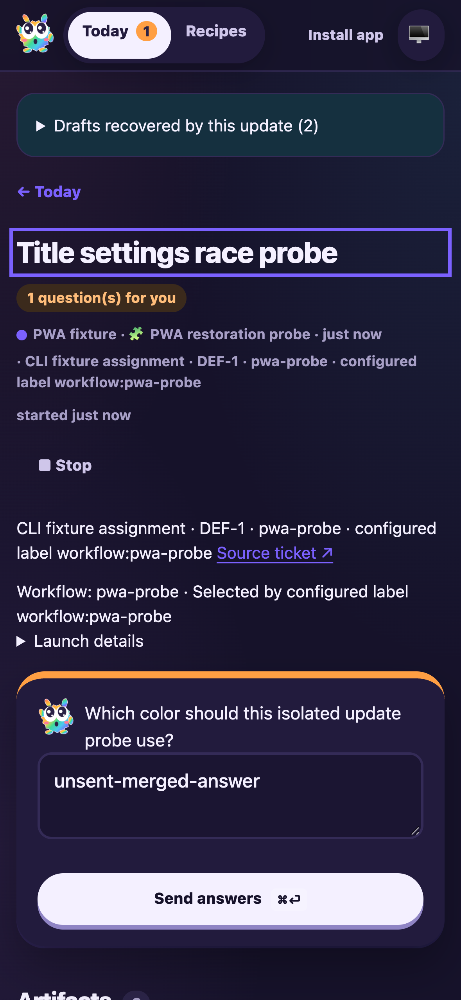

# PWA integration with workflow selection and capture recovery

Date: 2026-10-06. Candidate: PR #12 head `7a9ad9c1` merged with freshly fetched main `a5f5dcd8`.

Only CHANGELOG.md required manual resolution; both branches’ entries were retained. Automatic merges in focus.tsx, artifacts.tsx and docs/FACTORY.md preserve both intents. No new product behavior was added by the resolution.

F1 applies to the combined dashboard and run lifecycle. A fresh isolated fixture in `node_modules/.cache/manual41-ci3` used a local bare origin, UI 3693 and RPC 3694. Model/title output was deterministic; CLI tracking, routing, worktrees, runtime, activities and FactoryServer remained real. No production run or remote model request was used.

## Assertions and results

- F1 ping, issue creation (`DEF-1`/`issue-1`) and session start (`session-1`) succeeded. Real routing, thought and clarification response activities appeared.
- Run origin rendered the accepted `pwa-probe` workflow and configured `workflow:pwa-probe` label, alongside the source ticket.
- Filled an unsent answer and chat draft. Published an isolated HTML-comment-only shell build, immediately restored the source, and restarted only FactoryServer. The existing page paused actions and offered an explicit update.
- The real service worker activated the complete new shell through **Update app**. The same run route, both drafts and workflow-origin details remained visible. Screenshot inspected for wrapping and retained fields.
- Mobile Chromium emulating iPhone 16 had viewport/document/body width 393px, 16px text fields and viewport scale 1. No sideways document scrolling occurred with wide SDK activity.
- Answered the clarification once and released the deterministic script. The same session completed at checkpoint `end`, retaining its generated title and three history records. F1 stop-session succeeded.
- Edited title settings, saved newer settings independently, then attempted the older browser save. The existing conflict error appeared, the draft remained, Save became disabled, and `/api/config` retained the newer settings.
- All 174 tests passed across FactoryServer, FactoryWebClient, FactoryPwa, WorkflowRuntime, ActivityPage, FactoryPipeline, WorkflowSelector and EdgeWorker.workflow-triggers. Full build/typecheck and Biome checks passed.

## Reproduction

```sh
CYRUS_PORT=3694 apps/f1/f1 init-test-repo --path "$PWD/node_modules/.cache/manual41-ci3/repo"
bun node_modules/.cache/manual41-ci3/fixture.mjs
CYRUS_PORT=3694 apps/f1/f1 ping
CYRUS_PORT=3694 apps/f1/f1 create-issue --title 'PWA latest-main integration' --description 'Exercise merged workflow origin and draft retention.' --labels workflow:pwa-probe
CYRUS_PORT=3694 apps/f1/f1 start-session --issue-id issue-1
agent-browser --session manual41ci3 open http://127.0.0.1:3693
agent-browser --session manual41ci3 set device 'iPhone 16'
CYRUS_PORT=3694 apps/f1/f1 view-session --session-id session-1 --limit 5
CYRUS_PORT=3694 apps/f1/f1 stop-session --session-id session-1
```

The ignored fixture derives from the retained title-save-race fixture with fresh paths and ports. Browser and fixture were stopped. Commit hooks rebuild the unchanged final source. Historical reports, accepted native-testing waiver and scoped audit exception remain intact; no dependencies changed.

Sourcery comment `IC_kwDOU7nq-c8AAAABZsWgFg` is informational: the integration skipped review because the diff exceeds its 150,000-character limit. No corrections or review threads were supplied. Base changes require renewed review. PR readiness was not changed and the PR was not merged.


