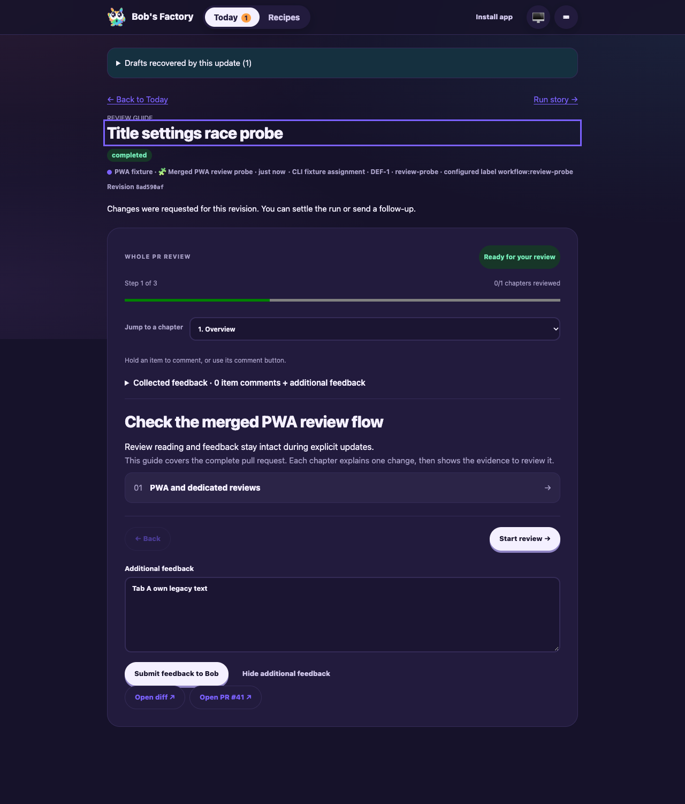

# Legacy PWA review-feedback isolation

Date: 2026-10-06. Candidate: PR #12 head `b0cd978d` plus the legacy migration fix in this commit. Built shell: `755d444fa91c9bd2c95b11ae`.

F1 applies to review feedback restoration and submission. A fresh isolated fixture at `node_modules/.cache/manual41-legacy` used a local bare origin, UI 3697 and RPC 3698. The fixture derives from the earlier collected-feedback drive: deterministic guide/title output, real CLI tracking, routing, worktrees, workflow runtime, activities, review gate and FactoryServer. No production actions or remote model calls.

## Assertions and results

- F1 ping, issue creation (`DEF-1` / `issue-1`) and session start (`session-1`) passed; routing and thought activities appeared.
- Opened the real guide in two browser tabs. Tab B added `Tab B unsent item comment` through the summary comment popover; shared storage contained that item.
- Seeded tab A's session storage with the original shell's schema-1 text/open restoration keys, current build, route and gate revision. This simulates the snapshot created by an earlier shell; it does not claim a new service-worker activation test.
- Reloaded tab A through the real PWA loader. Its additional feedback was `Tab A own legacy text`, its collected item count was zero, the other tab's comment was absent, and the snapshot was consumed.
- Mobile Chromium emulating iPhone 16 had viewport/document width 393px. Tab A's additional feedback stayed intact.
- Submitted tab A once through the UI. Captured exactly one `/api/runs/session-1/review` request, containing only the legacy additional feedback. The persisted human decision matched the request exactly, and the runtime completed with a response activity. Tab B's stored item and mounted comment count remained intact.
- F1 stop-session succeeded. Browser and fixture stopped.
- Restarted the same isolated fixture to capture a full desktop screenshot of the restored text and zero item comments after completion. The fixture's workflow registration was made idempotent for this restart; no product code changed. Screenshot inspected.
- All 56 tests passed across FactoryPwa, FactoryReviewFeedback, FactoryReviewState, FactoryWebClient and FactoryServer. Regression checks cover conflicting shared collected comments, the entire serialized message, retained revision, consumed legacy keys and text-only/open-only legacy snapshots.

## Reproduction

```sh
apps/f1/f1 init-test-repo --path "$PWD/node_modules/.cache/manual41-legacy/repo"
bun node_modules/.cache/manual41-legacy/fixture.mjs
CYRUS_PORT=3698 apps/f1/f1 ping
CYRUS_PORT=3698 apps/f1/f1 create-issue --title 'Legacy review draft isolation' --description 'Restore only this tab legacy feedback while another tab has unsent collected comments.' --labels workflow:review-probe
CYRUS_PORT=3698 apps/f1/f1 start-session --issue-id issue-1
agent-browser --session manual41legacy open http://127.0.0.1:3697/#/runs/session-1/review
CYRUS_PORT=3698 apps/f1/f1 view-session --session-id session-1 --limit 5
CYRUS_PORT=3698 apps/f1/f1 stop-session --session-id session-1
```

The ignored `seed.js` derives the real review identity and revision from the API before storing the legacy snapshot; `assert.js` checks the captured submission against the persisted decision and retained shared item. Historical evidence, native-testing waiver and audit exception remain. No dependencies changed. Full build passed; repository commit hooks perform final formatting, build and typecheck.


