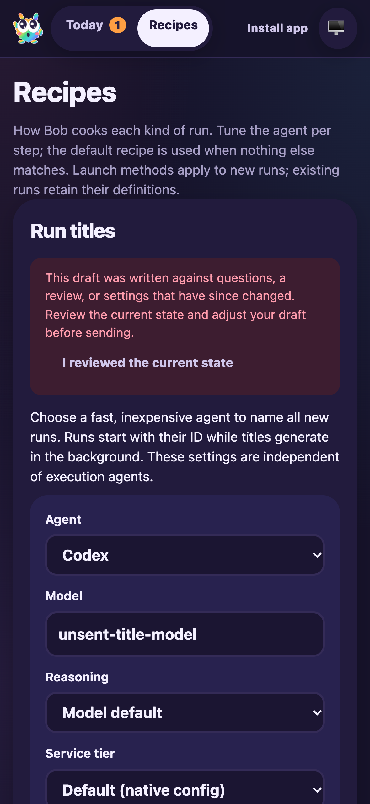

# PWA and automatic run-title merge validation

Date: 2026-10-06. Candidate: PR #12 head `8102da1d` merged with freshly fetched main `23d55780`, plus title-settings restoration integration.

F1 applies to the combined run lifecycle, dashboard settings and PWA update behavior. A fresh fixture in `node_modules/.cache/manual41-ci-title` used a local bare origin, UI 3685 and RPC 3686. Real CLI tracking, routing, worktrees, runtime, checkpoints, activity sinks and FactoryServer were retained. Execution and title model output were deterministic; no production services or model requests were used.

## Results

- F1 ping, issue creation (DEF-1/issue-1) and session start (session-1) succeeded. Real routing/thought/response activities appeared. The generated fixture title appeared while the run waited for clarification.
- In Recipes, selected Codex and typed `unsent-title-model` without saving. Changed the server settings separately, published an isolated HTML-comment-only shell build and restarted only FactoryServer. Clicked the install dialog’s **Update app** control.
- The real service worker activated the complete new shell. The same Recipes route restored the unsaved provider/model, displayed the stale-draft warning and disabled Save. Explicit acknowledgement enabled saving; the API then returned the exact unsent settings. Save returned to its disabled pristine state.
- Disconnection disabled Save with an edited `offline-title-draft`. Reconnection and navigation retained that draft.
- Mobile Chromium emulating iPhone 16: viewport/document/body widths were all 393px, naming-model text computed to 16px and viewport scale remained 1. Screenshot inspected for wrapping and retained fields.
- One browser clarification answer continued session-1. Fixture release completed it at checkpoint `end`, preserving its generated title and three history records. F1 activity viewing and stop-session succeeded; fixture and browser were stopped.
- 196 tests passed across 12 affected suites, including PWA restoration, API protection, configuration cache races, run naming, runtime, provider configuration and chat continuation. Full build/typecheck, Biome and diff checks passed. Initial typecheck used stale core dist declarations; rebuilding the workspace and rerunning passed.

## Reproduction commands

```sh
CYRUS_PORT=3686 apps/f1/f1 init-test-repo --path "$PWD/node_modules/.cache/manual41-ci-title/repo"
bun node_modules/.cache/manual41-ci-title/fixture.mjs
CYRUS_PORT=3686 apps/f1/f1 create-issue --title 'Merged PWA title draft probe' --description 'Check named run lifecycle and preservation of title-agent settings across PWA updates.' --labels workflow:pwa-probe
CYRUS_PORT=3686 apps/f1/f1 start-session --issue-id issue-1
agent-browser --session manual41ci2 open http://127.0.0.1:3685
agent-browser --session manual41ci2 set device 'iPhone 16'
CYRUS_PORT=3686 apps/f1/f1 view-session --session-id session-1 --limit 8
CYRUS_PORT=3686 apps/f1/f1 stop-session --session-id session-1
```

The fixture derives from the retained earlier PWA feedback fixture, uses a fresh home/repository, and replaces only execution/title model outputs. Browser snapshots supplied control refs. The temporary HTML comment was removed immediately after publishing its isolated build; commit hooks rebuild the unchanged final source.

Native iPhone installation/focus behavior remains unverified under the accepted waiver. Existing scoped audit exceptions remain unchanged; no dependencies changed. Earlier restoration findings remain resolved and their historical evidence is retained. No PR comments or threads required assessment. The PR remains draft; merge/base changes require renewed review.


