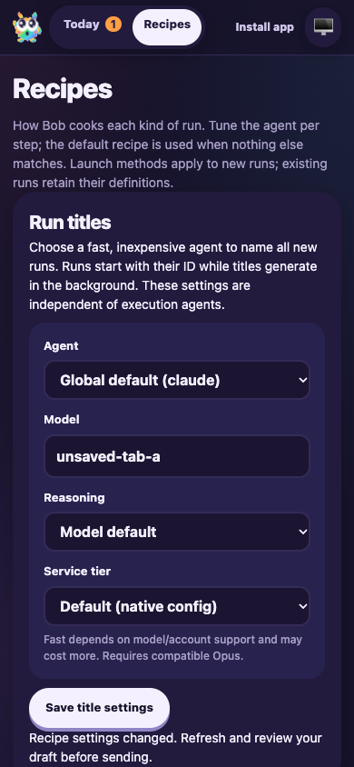

# Run-title settings conflict guard

Date: 2026-10-06. Candidate: PR #12 head `354dd74f` plus the targeted conflict-guard fix.

F1 applies to the live dashboard settings behavior. A fresh isolated fixture in `node_modules/.cache/manual41-title-conflict` used a local bare origin, UI port 3687 and RPC port 3688. It reused the previous title-merge fixture with fresh paths/ports and deterministic execution/title model output. Real CLI tracking, routing, worktrees, runtime, activity sinks and FactoryServer were retained; no production runs or model requests were used.

## Assertions and results

- F1 ping, issue creation (`DEF-1`/`issue-1`) and session start (`session-1`) succeeded. Routing, thought and clarification response activities appeared. The dashboard rendered the generated run title and current question.
- Opened two actual browser tabs on Recipes. Tab A edited its model to `unsaved-tab-a`; its configuration fetches were delayed using a browser fetch wrapper. Tab B saved `saved-tab-b` using the real Save control.
- Tab A still showed an enabled Save control against its older configuration. Clicking it produced the server’s settings-conflict error. An independent fetch confirmed the server still held `saved-tab-b`, while tab A’s input retained `unsaved-tab-a`.
- Captured and inspected the 390×844 mobile error state. The retained draft and error wrap within the page.
- Released tab A’s delayed reads. The existing stale-draft notice appeared and disabled Save. Explicitly acknowledged the current state, then saved: the server held `unsaved-tab-a` and Save returned to its pristine disabled state. The response revision supports subsequent configuration edits without requiring a successful refresh.
- Answered the current clarification once in the browser and released the deterministic script. The same `session-1` completed with its generated title and three history records. F1 stop-session succeeded. Browser and fixture were stopped.
- All 95 tests passed across FactoryServer, FactoryWebClient, FactoryPwa, WorkflowRuntime and ActivityPage. API coverage rejects stale writes with and without query parameters, retains persisted settings and accepts a current revision. Client coverage preserves the original revision even if configuration refreshes during the asynchronous version check, and retains the returned revision across late reads/unrelated saves.

## Reproduction commands

```sh
CYRUS_PORT=3688 apps/f1/f1 init-test-repo --path "$PWD/node_modules/.cache/manual41-title-conflict/repo"
bun node_modules/.cache/manual41-title-conflict/fixture.mjs
CYRUS_PORT=3688 apps/f1/f1 ping
CYRUS_PORT=3688 apps/f1/f1 create-issue --title 'Title settings conflict guard' --description 'Verify stale title settings saves preserve the newer settings and the browser draft.' --labels workflow:pwa-probe
CYRUS_PORT=3688 apps/f1/f1 start-session --issue-id issue-1
agent-browser --session manual41conflict open http://127.0.0.1:3687/#/recipes
agent-browser --session manual41conflict tab new http://127.0.0.1:3687/#/recipes
CYRUS_PORT=3688 apps/f1/f1 view-session --session-id session-1 --limit 5
CYRUS_PORT=3688 apps/f1/f1 stop-session --session-id session-1
```

No dependencies changed. The accepted native-testing waiver and scoped audit exception remain unchanged. Earlier restoration findings remain resolved; historical evidence is retained. PR #12 remains draft and unmerged.


