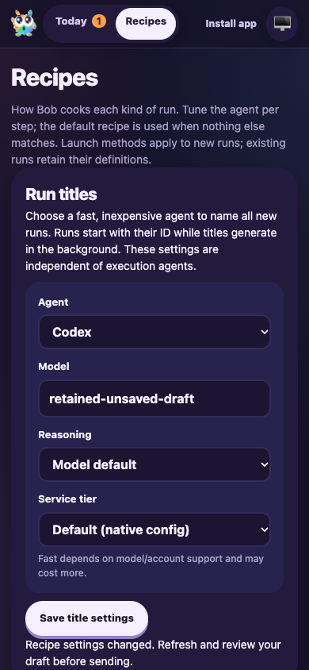

# Settings saves overtaken during request parsing

Date: 2026-10-06. Candidate: PR #12 head `acc3c236` plus the targeted synchronous settings-save revision check.

F1 applies to the live dashboard settings path. A fresh isolated fixture at `node_modules/.cache/manual41-title-race` used a local bare origin, UI port 3691 and RPC port 3692. It reused the prior title-conflict fixture with fresh paths/ports. Only model output was deterministic; CLI issue tracking, routing, worktrees, runtime persistence, activities and FactoryServer were real. No production runs or remote model calls were used.

## Assertions and results

- Added a real HTTP regression test that starts a title-settings request with headers and a partial JSON body, waits for the server to receive the headers, saves newer settings, then completes the original body. Against `acc3c236`, the delayed request returned 200 instead of 409. With the fix it returns 409, and the newer settings remain in memory and on disk.
- The same test sends two simultaneous injected title saves against one revision. Exactly one returns 200 and the other 409; the successful settings remain persisted.
- F1 ping, issue creation (`DEF-1`/`issue-1`) and session start (`session-1`) succeeded. Routing, thought and clarification response activities appeared. The browser rendered the generated run title and current question.
- On the real F1 HTTP listener, held a title-settings request body open while the browser saved `saved-tab-b` through Recipes. Completing the delayed request returned 409. Both `/api/config` and `home/factory/settings.json` still held `saved-tab-b`.
- Held browser configuration refreshes, edited the model to `retained-unsaved-draft`, and saved newer settings independently. The browser Save control produced the existing conflict error and retained its unsaved draft; the server still held `saved-newer-settings`. Captured and inspected the 390×844 mobile state.
- On the live listener, concurrent title-settings saves and concurrent workflow saves each returned exactly [200, 409]; the successful configuration remained authoritative.
- Restored normal browser reads, answered the current clarification once, and released the deterministic script. The same `session-1` completed with its generated title and three history records. F1 stop-session succeeded. Browser and fixture were stopped.
- All 96 focused tests passed across FactoryServer, FactoryWebClient, FactoryPwa, WorkflowRuntime and ActivityPage. Biome passed for changed TypeScript files.

## Reproduction commands

```sh
CYRUS_PORT=3692 apps/f1/f1 init-test-repo --path "$PWD/node_modules/.cache/manual41-title-race/repo"
bun node_modules/.cache/manual41-title-race/fixture.mjs
CYRUS_PORT=3692 apps/f1/f1 ping
CYRUS_PORT=3692 apps/f1/f1 create-issue --title 'Settings save race regression' --description 'Verify delayed settings saves cannot overwrite newer edits.' --labels workflow:pwa-probe
CYRUS_PORT=3692 apps/f1/f1 start-session --issue-id issue-1
agent-browser --session manual41race open http://127.0.0.1:3691/#/recipes
node node_modules/.cache/manual41-title-race/delayed.mjs
CYRUS_PORT=3692 apps/f1/f1 view-session --session-id session-1 --limit 5
CYRUS_PORT=3692 apps/f1/f1 stop-session --session-id session-1
pnpm --filter cyrus-edge-worker test:run test/FactoryServer.test.ts test/FactoryWebClient.test.ts test/FactoryPwa.test.ts test/WorkflowRuntime.test.ts test/ActivityPage.test.ts
```

The regression test is the durable reproduction; the ignored fixture and delayed-request driver are local validation helpers. The change checks configuration after parsing, in the same synchronous route-handler operation as settings persistence. No dependencies changed. Existing native-testing waiver and scoped audit exception remain unchanged. Historical test-drive evidence is retained. PR #12 remains draft and unmerged.


