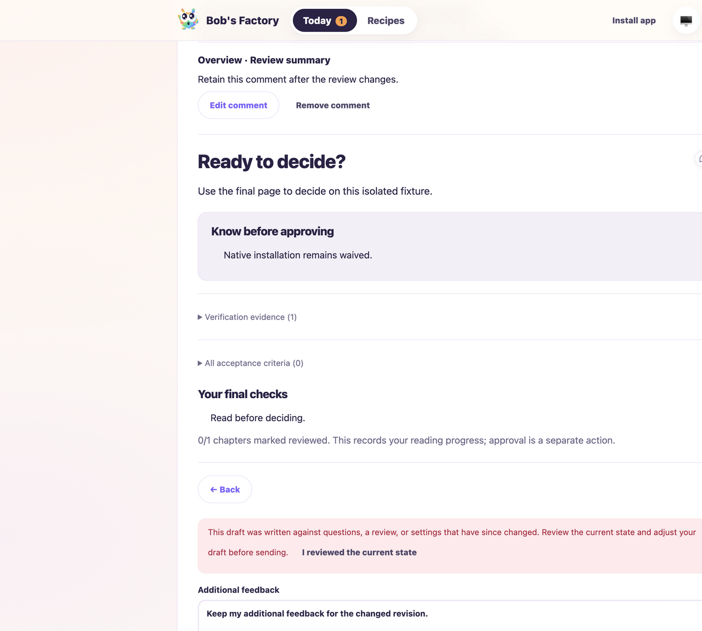
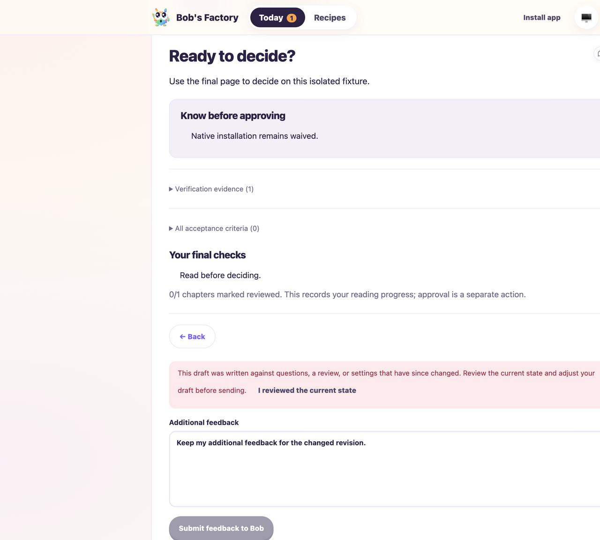

# Review feedback recovery across revision changes

Date: 2026-10-06. [PR #12](https://github.com/Attraccess/bobs-factory/pull/12).
Tested base: `0830b3384457c3fa91a21445dc564dac4ca0d20d` (includes main
`8f3b5f6562a20685889ac81d5fcb0e86da19a439`) plus this report's recovery fix.

The reported run `manual-edeac3fd-3bc9-4031-8bee-9d2efffcc1fe` could not
capture its changed-review state: a replacement head/guide/gate changed the
feedback identity, so exact-key restoration produced empty feedback. This is
an application failure, not a browser-access failure. This tab's mounted or
explicitly snapshotted drafts now move to the same run's replacement identity,
retaining their original context. Shared storage from another tab is never
searched across identities. Head, guide and gate changes require explicit
acknowledgment before feedback submission.

F1 applies to the changed review/update rendering and action flow. Two fresh
repositories and isolated state directories were created under ignored
`node_modules/.cache/review-revision-fix` and `review-revision-capture`.
Their workers used the compiled EdgeWorker, CLI tracker, real routing/worktrees,
workflow runtime, review API, activity sink and FactoryServer. Deterministic
fixture guide/tool output replaced external AI/GitHub work. UI/RPC ports were
3767/3768 and 3777/3778.

```sh
apps/f1/f1 init-test-repo --path "$PWD/node_modules/.cache/review-revision-fix/repo"
bun run node_modules/.cache/review-revision-fix/fixture.mjs
CYRUS_PORT=3768 apps/f1/f1 ping
CYRUS_PORT=3768 apps/f1/f1 create-issue --title 'Review revision update recovery' --description 'Retain item comments and additional feedback across a changed guide, head and gate.' --labels workflow:review-probe
CYRUS_PORT=3768 apps/f1/f1 start-session --issue-id issue-1
CYRUS_PORT=3768 apps/f1/f1 view-session --session-id session-1 --limit 5
CYRUS_PORT=3768 apps/f1/f1 stop-session --session-id session-1
```

The collaborative browser entered an item comment and additional feedback
through the actual controls. The baseline shell differed only by a temporary
HTML comment; the source was restored and the target shell rebuilt before
replacing the fixture's head, guide and gate and restarting only its UI server.
The browser chose **Update now**. Both drafts returned, the stale warning
appeared, and submission remained disabled. Acknowledgment made the draft
eligible; deliberate submission emitted exactly one review request containing
both texts and the current head/gate. The server retained the complete rejection
decision and the workflow posted its final response to the CLI activity timeline.
No automatic submission occurred. The first fixture was then stopped cleanly.

The second fixture exercised the live revision transition without a shell
change. Both drafts again survived with acknowledgment required. Checks &
decision displayed expanded collected feedback and the populated additional
feedback field. The browser used light appearance at a measured CSS viewport
of 1440×1000; the collaborative screenshot surface emitted 1280×1152 images,
so two scroll positions document the controls. These are real fixture captures,
not production-run acceptance receipts. The second session/worker also stopped
cleanly; production runs were not answered or approved by the drive.





The three new head/guide/gate regressions fail against the original loader
with empty drafts and pass with the fix. Existing shared-storage isolation
coverage now explicitly distinguishes another tab's storage from this tab's
mounted drafts. Five focused suites pass (59 tests); package-wide regression
checks pass, including 1,197 edge-worker tests and one existing skip. Full
monorepo build/typecheck, changed-file Biome and `git diff --check` pass.

`pnpm audit --json` reports the same three high and one critical advisory on
current main and this branch (`node-forge`, `braces`, `source-map-js`,
`proxy-addr`). This fix changes no dependencies. The earlier historical audit
counts are preserved, but are not claimed to describe today's advisory feed.
Native installation and real Linear/GitHub transport are not exercised here;
the historical installation waiver and broader PWA evidence remain separate.
