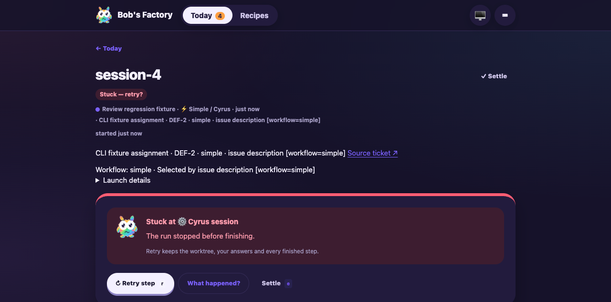

# Workflow selector merge with current main

Date: 2026-10-06. Draft PR #13.

Validated source: merge of `45ccf46e76b4af20bc869d7709f9054eb6da24ba`
with `23d5578016175e6794e6150fbbaaceffe707cf2a`, including the conflict
resolution and title-test tracker stubs committed with this report.

## Resolution and scope

Retained both changelog entries, ticket completion feedback and background title
hooks, startup admission checks and recovery title bookkeeping. Runtime stop
retains failed/interrupted recovery settlement and cancels title work. Both
branches' launch regression tests remain present. The upstream Simple title test
now supplies empty paginated comments and attachments at its network boundary,
as required by the full-ticket snapshot path.

## Scoped F1 validation

The actual built EdgeWorker, CLI tracker, activity posting, durable admission and
session persistence ran with fresh state/repository in
`node_modules/.cache/workflow55-ci-merge`, RPC port 3600 and dashboard port 3632.
The existing startup-race fixture/drive was copied into that isolated directory;
the title generator was replaced with a no-op fixture to avoid provider calls.
This drive validates lifecycle integration; title generation itself is covered by
the worker suite, not a live provider here.

For streaming and non-streaming Simple runners, the drive:

1. Created an issue with `[workflow=simple] Keep working` and started its session.
2. Paused persistence after runner registration, then unassigned the issue.
3. Verified settled ownership and a stopped runner before releasing persistence.
4. Verified neither start method ran and explanatory response activity appeared.
5. Replayed the original delivery and verified it stayed settled without startup.
6. Started a distinct assignment and verified exactly one new runner started.
7. Unassigned again and verified all receipts settled and all runners stopped.

Both modes passed. These are controlled F1 deliveries, not new genuine Linear
webhook evidence. Earlier genuine-delivery and review-fix reports are preserved.
The browser opened the run detail and confirmed readable assignment origin,
selected workflow, description-selector source and ticket link with the merged UI.

## Checks and evidence

- `pnpm install --frozen-lockfile`: passed.
- `pnpm build` and `pnpm typecheck`: passed. An initial typecheck before rebuilding
  encountered stale shared declarations; rebuilding restored the current exports.
- `pnpm --filter cyrus-edge-worker test:run`: 1,106 passed, one existing skip.
- Core suite: 198 passed; Linear transport suite: 35 passed.
- Conflict-resolution files: Biome passed; `git diff --check` passed.
- `apps/f1/f1 ping`, `apps/f1/f1 status` and copied `drive.mjs`: passed.

Redacted receipt/activity snapshots are preserved with `ci-merge-race-` prefixes
in `/Users/jappy/.cyrus/factory/evidence/manual-8321a0ae-7e34-46fc-a622-0acb59021b79`.
Fixture source and drive assertions are retained in the isolated cache directory.
The browser and fixture were stopped after validation. No production integration
settings changed and no human review or merge approval was supplied by this step.
