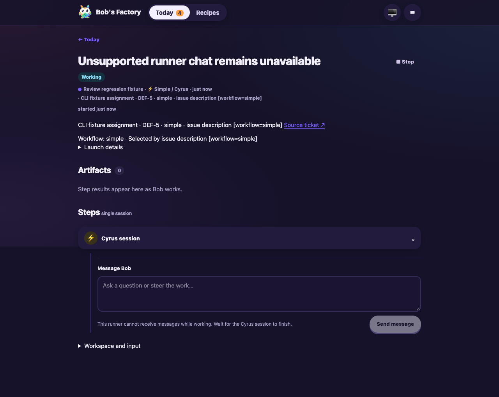

# Workflow selector lifecycle review fixes

**Date:** 2026-10-06  
**Revision:** review-fix diff on `7cda4c52d15861dad0679be5fe6dac13c5b005ee`, committed with this report  
**Scope:** REVIEW-001 through REVIEW-004 on draft PR #13.

These changes affect startup recovery, issue ownership, stopping and reply
delivery, so F1 applies. The drive used a fresh rate-limiter repository and
isolated state under `node_modules/.cache/workflow55-review`, CLI port 3600 and
dashboard port 3630. No production configuration or Linear integration changed.

The fixture used the built EdgeWorker, CLI tracker and transport, real Git
worktrees, activity posting, admission journal, session persistence and dashboard.
Runner fixtures supplied deterministic warm, streaming and non-streaming behavior.
A tracker fault failed comments after native-session creation. A fixture endpoint
dispatched unassignment to the real worker handler; native-shaped replay endpoints
supplied stable stop activity IDs. These are controlled fixtures, not genuine
Linear deliveries. The earlier genuine Linear evidence in
[the selector delivery report](2026-10-05-workflow-selector-delivery.md) is preserved.

## Observed behavior

| Finding | Input and assertion | Result |
| --- | --- | --- |
| REVIEW-001 | `issue-3`, description `[workflow=factory] Preserve gates`; fail comments after creating `session-4`, persist, kill the fixture and restart it. Send `Continue` to that session. | Receipt remained `recovery`, accepted workflow remained `factory`, no graph was created, and the legacy Simple resume count stayed zero. Startup feedback described recovery and stop/relaunch. Sending stop settled ownership. |
| REVIEW-002 | Unassign active Simple `session-1`, then start a distinct assignment on `issue-1`. | Receipt became durably `settled`; new `session-2` reached `started` in the existing issue worktree. After unassigning it, restart did not resume either settled session. Unit coverage also verifies settling a pending launch without a native session. |
| REVIEW-003 | Warm Simple `session-3`: replay `warm-stop-one` twice, then send distinct `warm-stop-two` within the double-stop window. | Identical activity interrupted once with no full stop. The distinct second activity fully stopped the runner and settled its receipt. Unit coverage reloads the journal between duplicate deliveries. |
| REVIEW-004 | Active non-streaming Simple `session-1`: `Change direction while working`. Supported streaming `session-5`: `Supported steering`. | Unsupported input posted explanatory response activity without stopping or resuming the runner. Supported input reached the current runner. Unit coverage also checks missing input methods, finishing runners, rejected streams, and completed-session continuation. |

The browser opened `session-6` through Today → Open run. Chat showed the same
non-streaming limitation and a disabled Send button. An F1 reply likewise posted
the limitation without interrupting the runner. Browser Stop and its confirmation
settled the session. The screenshot was visually inspected:



## Commands and checks

```sh
pnpm install --frozen-lockfile
pnpm typecheck
pnpm build
apps/f1/f1 init-test-repo --path node_modules/.cache/workflow55-review/repo
bun run node_modules/.cache/workflow55-review/fixture.mjs
apps/f1/f1 ping
apps/f1/f1 status
apps/f1/f1 create-issue --title 'REVIEW-004 nonstream reply' --description '[workflow=simple] Keep working'
apps/f1/f1 start-session --issue-id issue-1
apps/f1/f1 prompt-session --session-id session-1 --message 'Change direction while working'
node node_modules/.cache/workflow55-review/drive.mjs before
# Kill only the isolated fixture after its explicit persisted checkpoint, restart it.
node node_modules/.cache/workflow55-review/drive.mjs after
apps/f1/f1 view-session --session-id session-4 --limit 12
pnpm --filter cyrus-edge-worker test:run
```

Worker suite: **1,059 passed, one existing skip across 95 files**. Full build and
typecheck passed. The final focused lifecycle suites passed. Existing continuation
tests now model a completed conversation when no active runner exists, consistent
with the steering policy. Changed-file Biome and `git diff --check` passed.

Fixture source, drive assertions, before/after restart receipts, runner counters,
response activities, screenshots and check logs are preserved in
`/Users/jappy/.cyrus/factory/evidence/manual-8321a0ae-7e34-46fc-a622-0acb59021b79`
with the `review-fixes-` prefix. The isolated fixture was stopped after validation.

Recovery deliberately retains ownership for an incomplete startup and asks the
operator to stop and relaunch; it does not reconstruct a missing graph or run an
unapproved Simple replacement. These fixtures establish the changed worker
behavior, not live provider-specific runner internals or new genuine webhook
delivery evidence.
