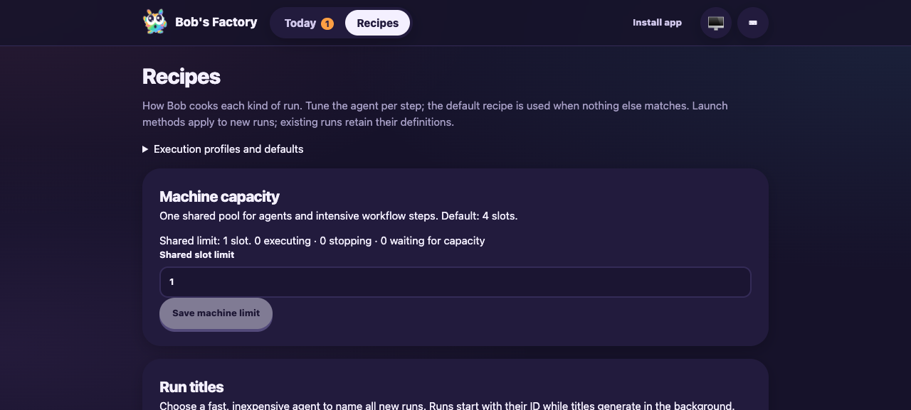
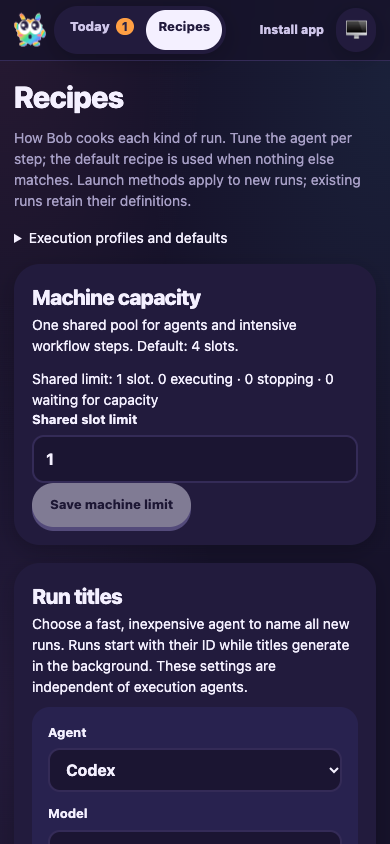

# Execution profiles and current-base integration

**Date:** 2026-10-07
**Revision:** merge-resolution diff on `cf61a989245abb517b9a36771e91af510533fd93`, incorporating `origin/main` at `04f29693`
**Ticket:** [Taskbot #57](https://taskbot.apps.janjaap.de/p/bobs-factory/t/57)
**Draft PR:** [#30](https://github.com/Attraccess/bobs-factory/pull/30)

F1 applies to the runtime overlap between execution profiles and machine capacity.
This scoped drive runs the built EdgeWorker on isolated ports 3741/3742, with a
fresh local repository, configuration roots and capacity coordinator under
`node_modules/.cache/notify57-M1iNnC`. No production service or host login changes.
Historical execution-profile and capacity evidence remains intact.

## Results

- Effective preview and manual admission reject native Codex notification commands
  before creating a run or executing setup; the selected config stays unchanged.
- An empty notification list permits admission. Setting the fixture pool to one
  slot and occupying it makes the admitted script queue without producing output.
- Releasing the blocker permits completion. The child reports the selected Git
  author, a capacity lease and no ambient canary; the pool returns to zero active
  leases. Real bundled Codex 0.159.2 reads both notification configurations.
- Recipes retains execution profiles and defaults alongside the machine-capacity
  and title-agent cards. Desktop and 390px mobile screenshots were captured in a
  fresh headless `agent-browser` session and visually inspected. Build identifier:
  `f48abb42a0320a2515d8f442`.
- The fixture and browser session stop cleanly after capture.

The drive uses controlled `account/read` responses and a local worktree preparation
hook. It exercises actual admission, preview, configuration inspection, workflow
capacity, subprocess execution and UI paths. It does not establish live Codex
subscription authentication or production remote workspace preparation.

## Targeted verification

The nine worker suites exercised profile resolution, native Share, admission,
workflow recovery, capacity integration, server APIs, Git environments and the
complete routing prompt. The first run passed 193 tests and exposed a test-fixture
recording issue in the new Git probe: a later `ls-remote` overwrote the recorded
leased fetch. The corrected probe retains all remote observations; all three Git
tests passed, checking selected environments throughout and lease provenance for
the admitted fetch and setup. No runtime workaround was needed for that fixture.

Seven final worker suites passed all 48 tests, including the corrected Git probe,
profile/capacity redaction and recovery, review UI, theme, web client and prompt
addenda. These overlap the initial suites and are not an additional unique total.
Codex pooling/native-inspection suites passed 20 tests. Artifact leases passed six.
Full build, typecheck and lint passed; lint reports 29 existing/base warnings,
including the new base's website stylesheet warning. `git diff --check` passed.
Repository commit hooks repeat build, typecheck and schema consistency checks.

Commands and receipts are retained in
`/Users/jappy/.cyrus/factory/evidence/manual-a51c4397-ff88-400d-ab07-b692f7f15df5/merge57-drive.mjs`
and `merge57-drive.json`; log output is `/tmp/merge57-drive.log`.

## CI follow-up

The first remote matrix run passed Biome and build, then exposed one MCP test
assertion expecting the old five-argument transport call. The received call
retained its lease and configured server environment and passed the newly
optional sixth child-environment argument. The corrected regression explicitly
covers both Legacy (`undefined`) and selected complete environments. All six
MCP OAuth/transport tests pass locally, as do the direct MCP transport tests.
No runtime behavior or approval rule changed for this follow-up.

## Limitations

Live runner/GitLab checks remain waived by the accepted answer. Successful live
Codex subscription admission and GitHub App authorization remain unverified.
The ticket snapshot/status synchronization discrepancy remains documented; this
role does not mutate tracker lifecycle state. No PR comments, reviews or threads
were supplied or found. Human approval remains pending, and the PR stays draft.
