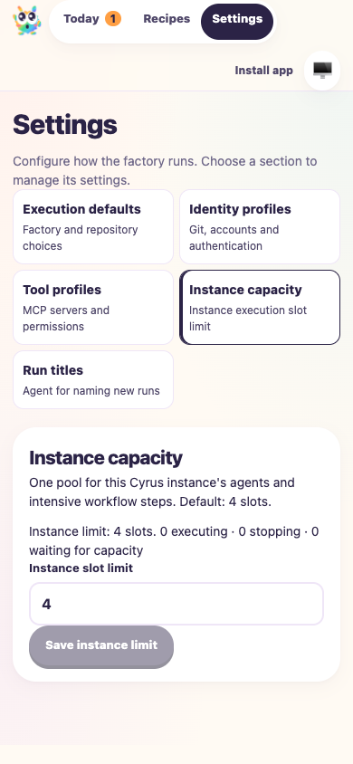

# Execution profiles and current workflow base

**Date:** 2026-10-07
**Revision:** merge-resolution diff on `e9c77ceb759d015ece740003e1c8a463ce8cc0d7`, incorporating `origin/main` at `b9974c8b121468e2075d82fd70a3ffa75d5cb757`.
**Ticket:** [Taskbot #57](https://taskbot.apps.janjaap.de/p/bobs-factory/t/57)
**Draft PR:** [#30](https://github.com/Attraccess/bobs-factory/pull/30)

F1 applies to the overlap between execution profiles, instance capacity, runner
construction and refinement/recovery workflows. Dedicated Settings pages remain;
capacity labels describe the current instance scope. Restoration retains execution
IDs, Settings routes and recommendation/custom-answer drafts. The complete routing
prompt describes both execution profiles and refinement recommendations.

## Executed evidence

Two isolated embedded EdgeWorker fixtures ran sequentially with
`F1_AGENT_MODE=mock`. The refinement fixture injects canned runners for every
agent/title call. The execution fixture disables model/title jobs and controls
only native Codex `account/read`; actual configuration reads use installed Codex.
No live model turn or production service was started.

- F1 CLI issue creation, session start and activity reads passed for dashboard and
  ticket-response scenarios. Generated recommendations were retained without
  automatic submission. Explicit dashboard submission and an existing-session
  ticket reply each resumed exactly one mocked turn and one receipt step.
- Headless browser navigation exposes all five Settings sections. A 390px capture
  confirms Instance capacity, the numeric limit and Save instance limit remain
  readable and reachable. The browser session and fixture stopped cleanly.
- Native Codex notification commands reject preview/admission before run creation
  or setup. Empty notifications pass. A selected-profile script queues behind an
  instance-capacity lease, then completes with the selected Git author, inherited
  execution lease and no ambient canary. Capacity returns to zero active leases.
  Selected native configuration remains intact and no notification executes.
- All 256 tests in 12 focused worker suites passed, including complete prompt
  assembly, profile admission/recovery, Settings/update restoration, recommendation
  drafts, workflow/QA recovery, instance capacity, server APIs and merge readiness.
- Build and repository-wide Biome CI passed (29 existing warnings).
- The first full CI test command found an `ENOTEMPTY` cleanup race in one
  persistence fixture after instance-capacity initialization became home-scoped.
  Persistence assertions passed; fixture deletion raced constructor-owned writes.
  Both persistence scenarios now await the coordinator readiness barrier before
  running their assertions. The focused suite passed all four tests. The full rerun then passed all 119
  worker suites (1,418 tests and one existing skip), all package suites and F1.
  Seven CLI release fixtures exceeded their inherited five-second timeout while
  launching many mocked npm subprocesses. Those two suites now have a bounded
  30-second test budget, matching the existing subprocess limit; their publication
  and protected-tag assertions are unchanged. The complete CLI rerun passed all
  162 tests in 12 suites. Build/typecheck and schema checks also run in commit
  hooks. Final test logs are `/tmp/ci57-all-tests-final.log` and
  `/tmp/ci57-cli-final.log`.

Fixture scripts and JSON receipts are in the run evidence directory:
`ci57-refinement-merge.mjs`, `ci57-refinement/qa83-mock-path.json`,
`ci57-refinement/qa83-mock-commands.json`, `ci57-execution-capacity.mjs`,
`ci57-execution-capacity.json`. Logs: `/tmp/ci57-f1-refinement.log` and
`/tmp/ci57-execution-capacity.log`.

## Limits

Canned responses establish orchestration and transport, not live model reasoning
or authentication. The native account response is controlled; successful live
Codex subscription and GitHub App authorization remain unverified. Live
runner/GitLab checks remain waived by the accepted answer. The originating ticket
synchronization discrepancy remains documented. Historical evidence is retained.
No PR comments/reviews or unresolved threads were supplied or found. Required
human approval remains pending; the PR stays draft.
