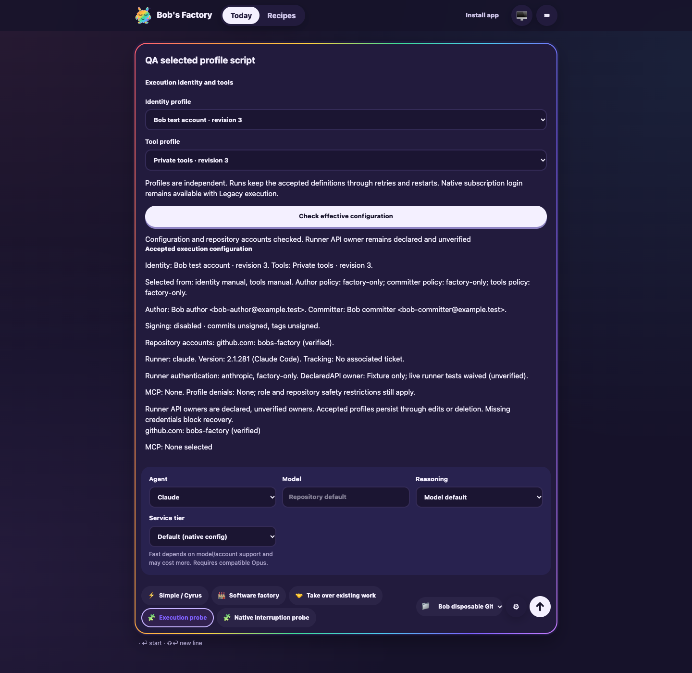
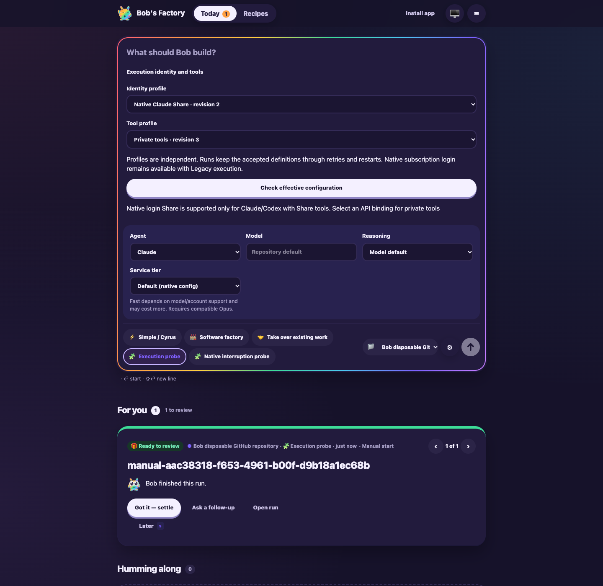
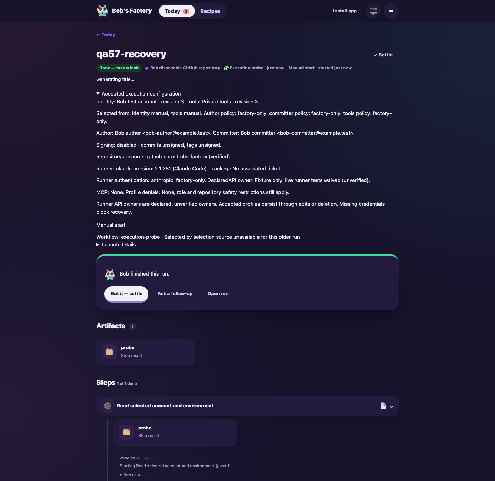

# Execution profile QA corrections

**Date:** 2026-10-07  
**Revision:** fixer delta on `f9f70bab4aa8b3766fba51069ae88b878e0cc5d2`  
**UI build:** `837a1bfae212836d602eec83`  
**Draft PR:** [#30](https://github.com/Attraccess/bobs-factory/pull/30)

F1 applies to the changed admission diagnostics and composer selection behavior.
This scoped drive exercises built EdgeWorker preview/manual-launch endpoints,
real Git worktrees, bundled Claude read-only authentication inspection, workflow
scripts and restart recovery. The fixture uses a fresh state root
`node_modules/.cache/execution57/qa57-fix-home`, dashboard port 3731 and RPC port
3732. It removes the preceding QA fixture's cached `getReport` workaround.
Model jobs are held at the existing deterministic no-model boundary. Preparation
creates local worktrees; remote workspace fetch is outside this delta drive.
The script's GitHub principal lookup uses the previously authorized Bob store.
No production worker or host credentials were changed.

| Finding / criterion | Retest and result |
| --- | --- |
| R57-COMPOSER-RESTORE / qa57-preview-independent | Fresh headless `agent-browser` session `qa57-fix-20261007` selects native-claude/shared, reloads, and asserts both restored selectors and exact stored profile IDs. Bob/private browser launch independently retains the displayed IDs and manual provenance. Session storage contains no resolved profiles or credentials. Unit checks cover clearing one choice, malformed stored values, storage denial and update snapshot restoration. Passed. |
| R57-CLAUDE-DIAGNOSTIC-DNS / qa57-preview-effective | Actual unmodified capability probe after an active GitHub HTTP connection returns Claude 2.1.281 in 182 ms; unmodified real preview responds 200 in 1862 ms. No cached header or report stub. Preview shows revisions, manual provenance, distinct author/committer, unsigned policy, verified bobs-factory account, runner version, MCP inventory and unverified API-owner guidance. Passed. |
| Preview rejection and repair | Native/private returns Share-tools/API-binding guidance. Switching only tools to shared produces a successful native preview without a model turn. Passed. |
| R57-RECOVERY-SCREENSHOT-CONTEXT / qa57-recovery-snapshot | Launch qa57-recovery to a persisted script boundary; delete Bob/private definitions and change defaults; kill only that fixture and restart. Recovery completes with byte-equivalent accepted snapshot and original Bob attribution/account. Replacement image includes the run heading, completed status and accepted configuration together. Passed. |

Linux glibc/musl package selection is covered by focused unit fixtures that assert
network exclusion and restoration of report settings, including the error path.
Non-Linux inspection never generates the report. Node's
[diagnostic report documentation](https://nodejs.org/api/report.html) describes
`excludeNetwork`, supported since Node 20.13 / 22.0, to exclude slow networking.
Live Linux binary execution is not claimed on this macOS host.

All 70 focused tests passed across ExecutionCapabilities, ComposerExecution,
FactoryPwa, FactoryExecution, ExecutionProfiles and NativeExecutionShare.
EdgeWorker build passed. Lint passed with 29 existing warnings. Required commit
hooks run the full build and typecheck; their receipts are in the evidence root.

The three replacement images were opened and inspected individually. Earlier
accepted images and settled review dispositions remain unchanged.

Safe committed receipts: [verification](assets/execution57-qa-fixes/verification.json)
and [recovery](assets/execution57-qa-fixes/recovery.json). Fixture source, detailed
before-restart receipt and logs are retained in
`/Users/jappy/.cyrus/factory/evidence/manual-a51c4397-ff88-400d-ab07-b692f7f15df5`
with the `qa57-fix-` prefix. The named browser and fixture were closed afterward.

Live runner API-key and GitLab checks remain waived. Successful live Codex
subscription admission, live App/enterprise/hardware credentials and absent
Gemini CLI execution remain unverified. Ticket receipts versus the original
backlog/in-progress snapshot discrepancy remain visible; no tracker lifecycle
mutations were made by this fixer. These limitations are unchanged.
