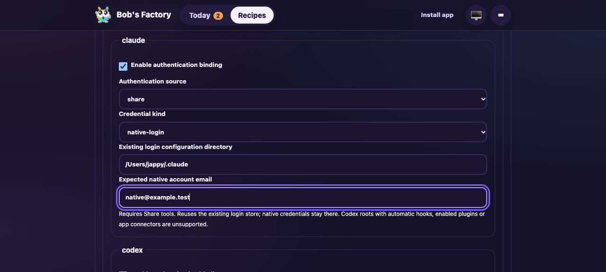
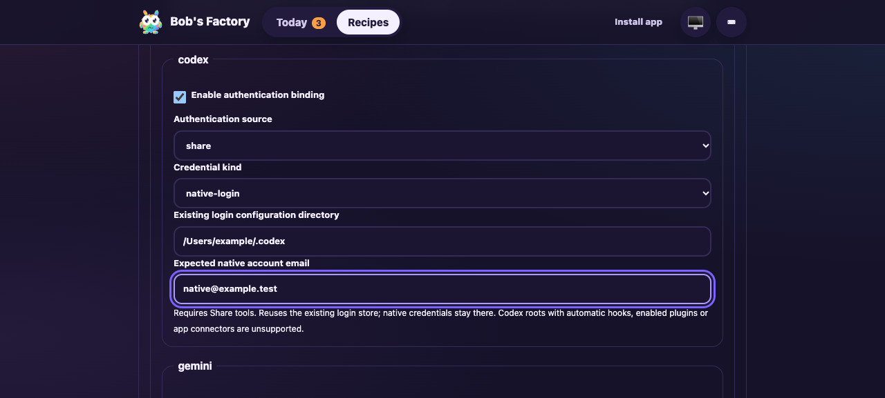

# Execution profile review fixes

**Date:** 2026-10-07  
**Revision:** fixer diff on `1ff450e41b3e52dee3daa9f0c1049f86c676acea`  
**Ticket:** [Taskbot #57](https://taskbot.apps.janjaap.de/p/bobs-factory/t/57)  
**Draft PR:** [#30](https://github.com/Attraccess/bobs-factory/pull/30)

F1 applies to the admission and authentication changes. This delta drive uses the
built EdgeWorker, manual launch/preview endpoints, persisted execution snapshots,
real Git and bundled Claude's native login status. No model turn starts. Historical
[implementation evidence](2026-10-07-execution-profiles.md) remains unchanged.

The isolated fixture uses dashboard port 3721, RPC port 3722 and state beneath
`node_modules/.cache/execution57/review-home`. The selected-model script completed
in the existing disposable GitHub repository with account `bobs-factory`. An
additional account-check attempt later failed due to connectivity; it is not
counted as a passing check. The native-login scenarios therefore use a local Git
repository with no remote authentication dependency. Their workspace preparation
hook creates real local worktrees instead of fetching a provider remote. Production
remote-workspace setup with native login is not covered by this delta drive.

## Assertions

| Scenario | Expected and observed behavior |
| --- | --- |
| Manual model | `anthropic/selected` survives admission and scoped script execution; `openai/incompatible` rejects without adding a run. |
| Shared signing | `commit.gpgsign=yes` without an explicit selected key rejects before admission/setup; `no` and `off` produce disabled commit/tag diagnostics. |
| Native tool restriction | Native Claude login with private tools rejects before setup. |
| Native Claude Share | Existing login status is validated with no model turn. The accepted root/account is retained, scripts receive distinct Writer/Integrator attribution and no API key or remote credential binding. |
| Restart recovery | Kill only the isolated worker after native execution resolution at a deterministic script boundary, with later profile edits/defaults saved. Restart automatically resumes the accepted snapshot and completes with Writer/Integrator and the original native binding. |
| Effective preview | The native binding validates through the same preflight path. |
| UI | Claude and Codex native-login selections expose existing-root and expected-account fields. Switching from an API binding removes its credential-reference fields. Screenshots use an illustrative account email in an unsaved draft. |

## Targeted checks

The focused worker suites passed **94 tests**: execution profiles, factory
execution, manual workflow triggers, native Share and the complete routing prompt.
Native Codex inspection passed **9 tests** using controlled app-server responses.
The artifact lease suite passed **6 tests**, including real process interruption
before rename, original/absent final files and preservation of another owner's
temporary. Shared Git attribution is verified against actual commit metadata;
signing booleans use actual Git normalization. These total **109 unique passing
tests**. Native Share was rerun after preserving USER/LOGNAME/SHELL and all four
cases passed again. The lease verification uses a 30-second test timeout because
of shared-host load; production behavior and repository timeouts were unchanged.

Full build, typecheck and lint passed. Lint retains 28 existing warnings. The
required commit hook repeats build and typecheck. No dependencies changed.

## Evidence and limitations

Runtime receipts, fixture sources and logs are retained in
`/Users/jappy/.cyrus/factory/evidence/manual-a51c4397-ff88-400d-ab07-b692f7f15df5`.
The before/after receipts are `execution57-review-before-restart.json` and
`execution57-review-after-restart.json`. Completed runs correctly reject manual
retry; the interrupted run automatically resumed before a retry was needed.
Private native credential stores are neither copied into evidence nor removed.
The UI screenshots were captured headlessly from the built fixture and visually
inspected. The build identifier was `3661d51e53b97b8188a76a4a`.

Live runner model/API and GitLab tests remain waived by the accepted answer.
The host Codex root has enabled plugins and is ineligible for this constrained
native Share path; a successful live Codex subscription admission is not claimed.
Native inspection and account/source rejection are covered with controlled
responses. Live GitHub App authorization remains unverified. Ticket receipts and
the original backlog/in-progress snapshot discrepancy remain a synchronization
limitation; this fixer does not mutate tracker lifecycle state.
