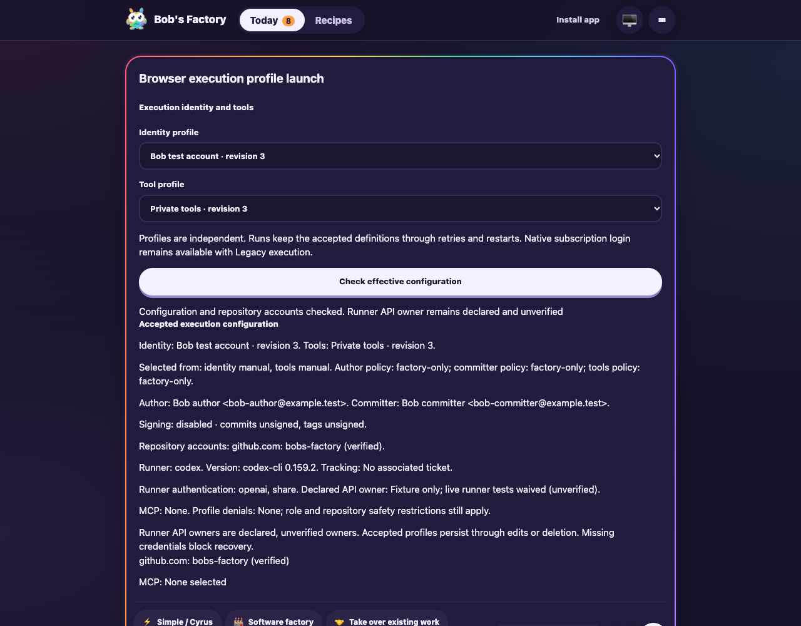
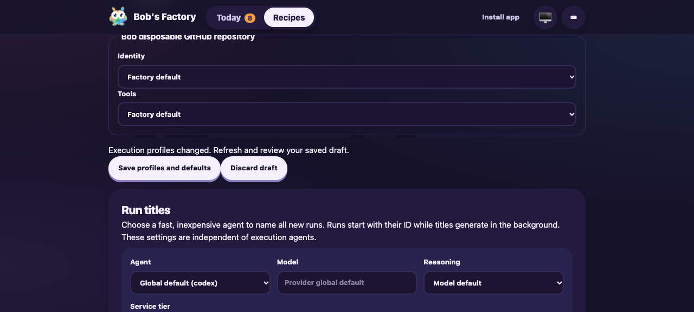
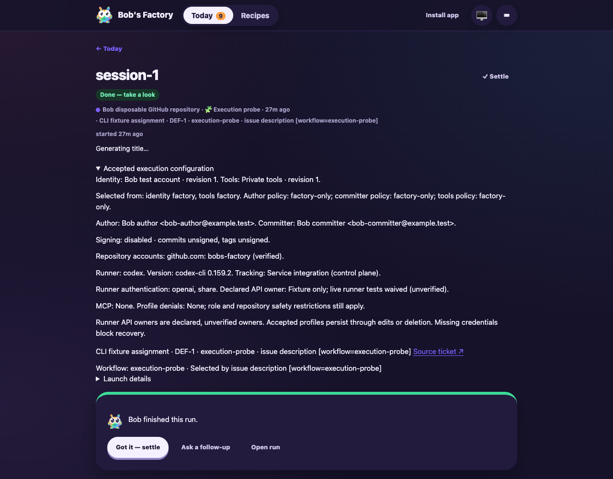

# Execution profile admission and recovery

**Date:** 2026-10-07  
**Revision:** implementation diff on `381c85c5ad5d758b98ba0042bdfbc342722e586a`  
**Ticket:** [Taskbot #57](https://taskbot.apps.janjaap.de/p/bobs-factory/t/57)

F1 applies because this change affects account selection, child environments,
workflow admission and recovery. The scoped drive used the built EdgeWorker,
CLI tracker and transport, actual Git worktrees/setup hooks, workflow scripts,
persisted run state and browser UI. Its private state and fixture scripts reside
under `node_modules/.cache/execution57`, with dashboard port 3711 and RPC port
3712. The real disposable GitHub repository is
`jappyjan/bob-execution-test-a51c4397`; its selected account is `bobs-factory`.
No production worker or host authentication configuration was changed.

Live runner and GitLab authentication tests were waived by the latest human
answer. This drive therefore holds naming jobs pending and replaces agent steps
with an explicit deterministic checkpoint. Script steps, GitHub authentication,
admission and recovery execute through the real runtime. Follow-up graphs end
with the expected `Execution57 fixture checkpoint: live model calls skipped`
error; this is not evidence of a successful model turn or delivery workflow.

## Assertions and results

| Scenario | Observed assertion | Result |
| --- | --- | --- |
| F1 assignment | Create `issue-1` / `DEF-1`, description `[workflow=execution-probe]`, then start `session-1`. | Script completed with the verified Bob account, separate author/committer, private HOME, and no ambient GitHub token. |
| Setup hook | Hook creates `hook-probe.json` in the actual issue worktree. | Bob author and the private execution HOME reached the hook; the host canary was absent. |
| Manual admission | Explicit Bob/private selection launches `manual-2e2015c5-e1a5-4d8e-a722-bcf9ee9e0c9d`. | Script completed; selection provenance was manual. Public run outputs/events replaced the synthetic API canary with `[REDACTED]`. |
| Wrong account | Change the declared account and request execution preview. | Preflight rejected the wrong principal, without falling back to the working host login. |
| Definition deletion | Remove profile definitions and defaults, then follow up `session-1`. | Follow-up retained Bob revision 1 and revalidated `bobs-factory`, then reached the deterministic agent checkpoint. |
| Restart | Stop only the isolated fixture, restart with persisted state, recreate `issue-1` in the ephemeral CLI tracker, then follow up. | Original accepted revision 1 survived newer profile definitions; the new follow-up again verified Bob and reached the checkpoint. |
| Host account | Query the ordinary host `gh api user`. | Host account remained `jappyjan`. |
| Native Codex inventory | Start bundled Codex 0.159.2 with a private root and disable discovered system MCP registrations. Query native MCP status without a model turn. | All five registrations reported disabled and exposed zero tools. No native model turn started. |
| Browser save conflict | Edit Bob's display name, save the unchanged server profile concurrently, then save the browser draft. | Revision conflict was shown and the edited display name remained in the draft. Discard restored server definitions. |
| Browser preview | Open independent identity/tools selectors and check effective configuration. | Verified Bob account, separate Git identities, signing policy, MCP inventory and declared/unverified API ownership are visible. |
| Preview freshness | Change the selected workflow after checking configuration. | The previous preview disappears; a response for a different selection cannot display as the current configuration. |
| Browser admission | Select Bob and private tools explicitly, then submit the execution-probe composer. | Script completes with manual provenance for both selections, verified Bob account, private environment and redacted output. |

The CLI tracker stores issues in memory. Recreating the same issue after restart
supplies tracker metadata; it does not reconstruct or replace the persisted run's
execution snapshot. Native Linear webhook delivery was not tested.

The direct live GitHub smoke from the preceding implementation visit also passed
HTTPS commit/push/fetch, provider PR/CI queries, missing/wrong credential rejection
and hook/grandchild inheritance. Its receipt is historical low-level evidence;
the present drive supplies the previously missing admission and recovery coverage.

## Commands and verification

```sh
pnpm build
pnpm typecheck
pnpm lint
node node_modules/.cache/execution57/fixture.mjs
CYRUS_PORT=3712 apps/f1/f1 create-issue --title 'Execution profile admission' --description '[workflow=execution-probe] Verify selected Bob identity and inherited environment'
CYRUS_PORT=3712 apps/f1/f1 start-session --issue-id issue-1
node node_modules/.cache/execution57/drive.mjs before
# Stop only the isolated fixture; restart it and recreate the ephemeral issue.
node node_modules/.cache/execution57/drive.mjs after
node node_modules/.cache/execution57/native-mcp.mjs
agent-browser --session execution57 open 'http://127.0.0.1:3711/#/recipes'
git diff --check
```

The affected core, runner and MCP suites passed **730 tests**, with one existing
Gemini skip. Cursor's existing filesystem permission tests exceeded their default
five-second timeout on this shared host; all 47 passed serially with a 30-second
verification timeout. This did not change repository test timeouts or production
permission behavior.

The full worker suite reported 1,277 passing tests, one existing skip and one
full-prompt expectation mismatch after the capability reference changed. The
complete expected prompt was updated, and the seven relevant worker suites then
passed all 135 tests. Expanding both crossed-policy cases to Claude, Codex, OpenCode, Cursor and
Gemini subsequently passed the twelve execution/Git environment tests. These
configuration/materialization cases use API references and eligible clean projects;
they do not start native model turns. The full worker
suite was not rerun after this expectation-only correction. Real OpenPGP signing
and commit/tag verification passed after preventing the test fixture's GPG daemon
from inheriting an output pipe.

Full build, typecheck and lint passed; lint retained 28 existing warnings and one
informational diagnostic. Later UI/runtime edits received an affected-package
build/typecheck and another 20 passing execution/server tests. No dependencies changed.

## Evidence and limits

Receipts, source fixtures, logs and visually inspected screenshots are retained
in `/Users/jappy/.cyrus/factory/evidence/manual-a51c4397-ff88-400d-ab07-b692f7f15df5`.
The `execution57-before-restart.json`, `execution57-after-restart.json`,
`execution57-native-mcp.json` and `github-execution-smoke.json` receipts identify
their exact assertions and limits. Private credentials and execution homes are
excluded. Portable UI captures accompany this report under `assets/execution57`.







Desktop and mobile captures were visually inspected. The isolated fixture was
stopped after validation; the disposable repository and private recovery state
were retained as evidence. The browser admission receipt is
`execution57-browser-launch.json`.

Early fixture attempts exposed an incorrect native MCP inventory assumption and
missing private Codex API authentication materialization. Native disabled entries
remain listed, so the assertion now checks disabled status and zero tools. Private
Codex `auth.json` now declares API authentication. An early synthetic-key attempt
returned an authentication error; it is not counted as a passing live auth test.
Subsequent agent steps deliberately stop before model calls. An initial restart
attempt also needed the CLI tracker's ephemeral issue reseeded as described above.

Live runner API ownership, GitLab authentication, GitHub App authorization,
native OAuth-cache migration and unavailable Gemini CLI execution remain outside
this evidence. GitHub App signed-request/principal checks use controlled responses.
Unsupported configurations reject explicitly; the current support table is in
[the execution profile guide](../../../docs/FACTORY-EXECUTION.md).

Ticket synchronization receipts report delivery, while the originating snapshot
had a backlog/in-progress discrepancy. This implementation role preserves that
limitation and does not manually mutate ticket lifecycle state. No PR was created,
published or merged.
