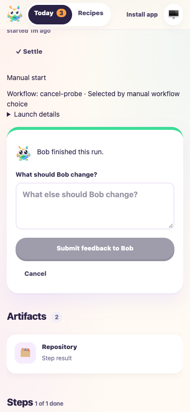

# Cancel discards unsent follow-up feedback

Date: 2026-10-07. Tested `f6a613fab2c1253dd0a2b2ee3f844660f2bd45c2` plus the accompanying Cancel fix. Dashboard build: `1be50e98f5b5f6a0a72b4d11`. Draft PR: [#41](https://github.com/Attraccess/bobs-factory/pull/41).

The review found that Cancel hid a completed run's guide-less feedback form while retaining its text. Cancel now resets feedback and validation state. Opening the form again starts empty. This follows the accepted decision to discard unsent edits when leaving a form.

## Relevant F1 coverage

F1 applies to the changed follow-up interaction. A fresh repository at `/tmp/f1-cancel-feedback-50347929/repo` uses a local bare origin. An isolated worker home at `/tmp/f1-cancel-feedback-50347929/home` serves the rebuilt dashboard on 3727, F1 RPC on 3728 and fixture controls on 3729. The embedded EdgeWorker injects `f1AgentHandlers('mock')`, with deterministic completed-run and follow-up workflow roles. No real provider runs.

The evidence directory is `/Users/jappy/.cyrus/factory/evidence/manual-50347929-ffc6-40cc-a0a4-53f774a3076a`. It contains `review-fix-f1-fixture.mjs`, `review-fix-browser-qa.mjs`, the server log, `review-fix-browser-receipt.json`, `review-fix-submitted-followup.json` and inspected desktop/mobile screenshots.

```sh
pnpm --filter cyrus-edge-worker test:run test/FactoryReviewFeedback.test.ts test/FactoryWebClient.test.ts
pnpm --filter cyrus-edge-worker build
CYRUS_PORT=3728 apps/f1/f1 init-test-repo --path /tmp/f1-cancel-feedback-50347929/repo
F1_AGENT_MODE=mock node <evidence-directory>/review-fix-f1-fixture.mjs
CYRUS_PORT=3728 apps/f1/f1 ping
agent-browser --headed false --session review-fix-cancel-50347929 open http://127.0.0.1:3727
node <evidence-directory>/review-fix-browser-qa.mjs
```

## Results

- All 18 focused feedback/client tests passed; the edge-worker build passed.
- A run launched through the dashboard completes through the isolated runtime and displays the actual guide-less follow-up form.
- On desktop, typing, canceling and reopening leaves an empty textarea and disabled submission button.
- On mobile, the same flow sends no request. Feedback exceeding 100,000 characters produces the existing length warning; Cancel removes both text and warning on reopening.
- Fresh replacement feedback submits once through the real follow-up API. Its exact request body is `{ "feedback": "Fresh follow-up only" }`. Only this explicit submission creates a new run; the server retains only the replacement input.
- The simulated follow-up completes. The final browser run reports no uncaught browser errors.



## Limits and cleanup

This verifies the built browser interaction and real runtime/API with simulated agents. Real-agent behavior and physical devices remain untested. Historical broader input-reset evidence remains unchanged. No production tracker or remote provider action was exercised.

Exploratory fixture setup needed a required step name, and the browser assertion was corrected to use the server's `input` field. The generic factory workflow also required an appropriate fixture response; the final drive uses a deterministic completion workflow for follow-ups. The final assertion run passed, including follow-up completion.

The named headless browser was closed and the isolated worker stopped through SIGTERM after evidence capture. The test repository and receipts remain available for reproduction.
