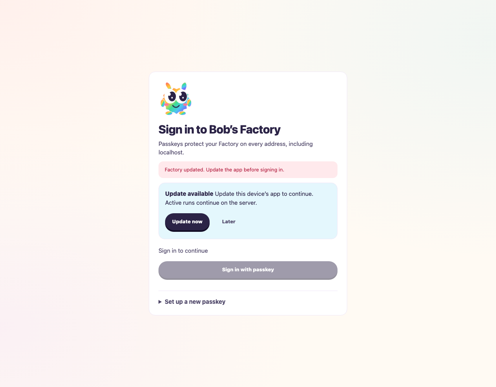
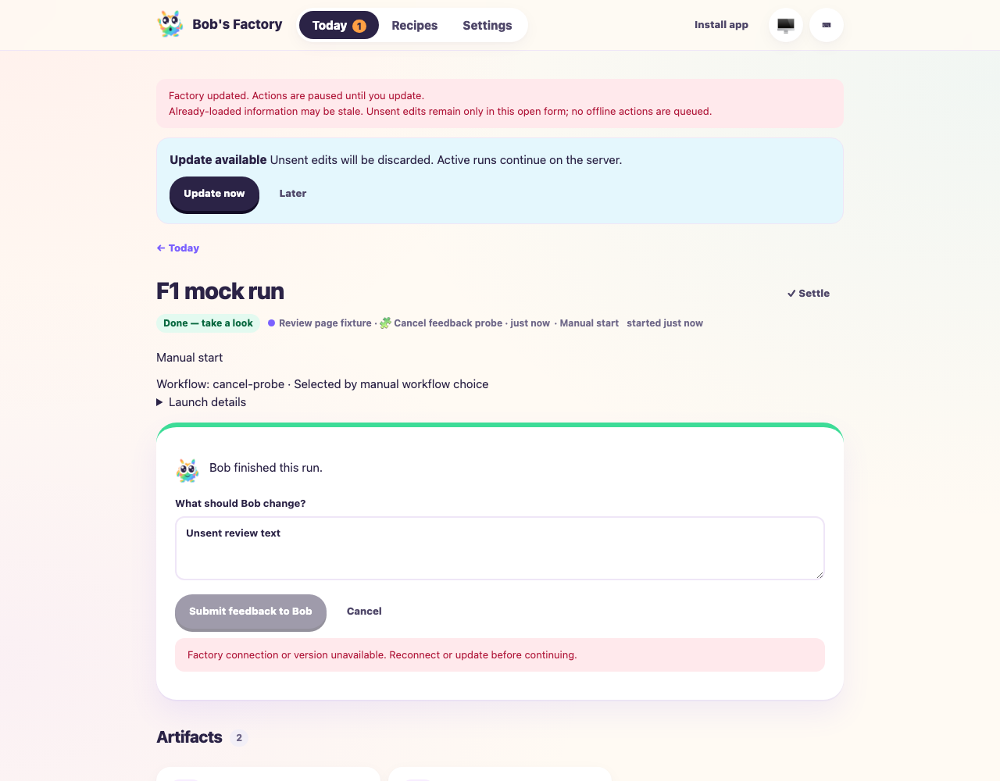
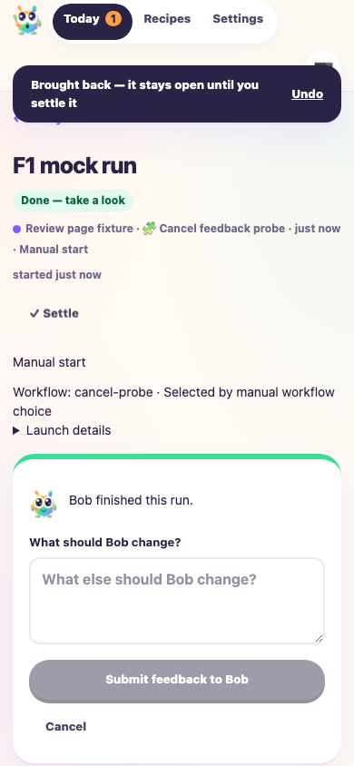

# Transient inputs integrate with passkey access

Date: 2026-10-07. Tested merge working tree of PR #41 head
`7049629f5a174a29855d9a5c3320ff48c6c26d28` and base
`9badbae64b4116305ef96aff7c0554b0968dc940`, plus the conflict resolutions
and passkey form reset changes accompanying this report. Built dashboard:
`34abed13c1a2aa18ef03f1b0`.

## Scope and fixture

F1 applies to the integration of input resets with authenticated dashboard
access, logout and app-update notices. Earlier full form/update validation is
retained in the input-reset and Cancel-feedback reports; this drive covers the
changed integration. Unsent inputs remain local while pending locks and reading
state remain independent of input storage.

Fresh isolated repository: `/tmp/f1-ci-merge-50347929/repo`.
Worker home: `/tmp/f1-ci-merge-50347929/home`. Ports: 3737 dashboard,
3738 F1 RPC and 3739 fixture controls. The embedded EdgeWorker injects
`f1AgentHandlers("mock")`; workflow roles and title generation are deterministic.
No live provider or production data is used. Playwright runs with
`headless: true` and a Chromium virtual authenticator. Passkey enrollment and
login use the real verification endpoints, not an authentication bypass.

## Results

- Frozen-lockfile install, monorepo build and typecheck passed.
- 115 tests passed across FactoryPwa, FactoryReviewFeedback, FactoryReviewState,
  FactoryWebClient, FactoryServer, Questions, FactoryAccess, FactoryAuth,
  EgressProxy and ReviewFiles. Settings route snapshots exclude inputs in both
  access states. Logout releases feedback locks; old callbacks cannot release
  a new request's lock or modify its edits.
- Biome checks on the seven integration files and `git diff --check` passed.
  `pnpm audit` reported no known vulnerabilities.
- F1 ping and status confirmed the actual worker/RPC was ready.
- Signed-out Settings shows Update now and keeps private APIs at HTTP 401.
- Real virtual-passkey enrollment reaches Settings. Cancel and reopening
  Add passkey clears the unsent name.
- Authenticated launch inputs reset on navigation and reload, including with a
  seeded legacy input snapshot.
- A completed simulated run reopens canceled follow-up feedback empty.
- A controlled version mismatch displays the authenticated discard notice and
  blocks the write. The signed-out notice still offers updating before sign-in.
- Logout hides private work and makes private requests return HTTP 401. Verified
  re-login and returning to the completed run do not revive unsent feedback.
- Fresh feedback submits through the authenticated real API with exactly
  `Fresh CI merge follow-up` as the new run's input.
- No uncaught browser errors occurred. Screenshots below were inspected at
  1280×1000 and 390×844.

An early driver expected a completed run's follow-up card after re-login without
accounting for Factory's existing “Seen after it finished” behavior. The receipt
showed a valid authenticated run view. Selecting Bring back corrected the test;
this required no product change. The final browser run passed all seven assertions.

## Evidence and commands

Evidence directory:
`/Users/jappy/.cyrus/factory/evidence/manual-50347929-ffc6-40cc-a0a4-53f774a3076a`.
Receipts: `ci-merge-browser-receipt.json`, `ci-merge-tests-final.log`,
`ci-merge-build.log`, `ci-merge-typecheck.log`, `ci-merge-audit.log`.
Fixture and browser script: `ci-merge-f1-fixture.mjs`, `ci-merge-browser.mjs`.

```sh
F1_AGENT_MODE=mock CYRUS_PORT=3738 apps/f1/f1 init-test-repo --path /tmp/f1-ci-merge-50347929/repo
F1_AGENT_MODE=mock node <evidence-directory>/ci-merge-f1-fixture.mjs
CYRUS_PORT=3738 apps/f1/f1 ping
CYRUS_PORT=3738 apps/f1/f1 status
node <evidence-directory>/ci-merge-browser.mjs
```







## Limits and cleanup

This drive uses simulated agents and a virtual authenticator. Real-agent quality,
physical passkeys/devices, Safari and installed mobile apps remain unverified.
Version mismatch notices were controlled browser responses; this integration
run does not claim an actual deployed shell upgrade. Existing full update
lifecycle evidence remains in the earlier input-reset report, and the shell
activation/Settings restoration tests pass on the merged code.

The headless browser closed in the driver's finally block. The isolated worker
was stopped with SIGTERM after receipts were saved. No production tracker was
used and no ticket synchronization is claimed. Historical reports are unchanged.
