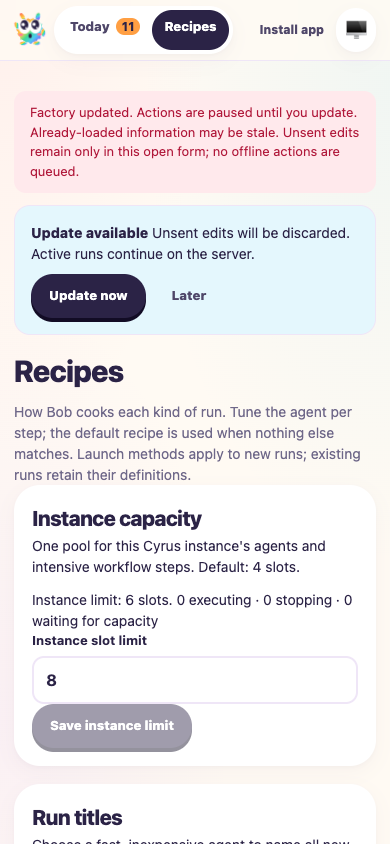
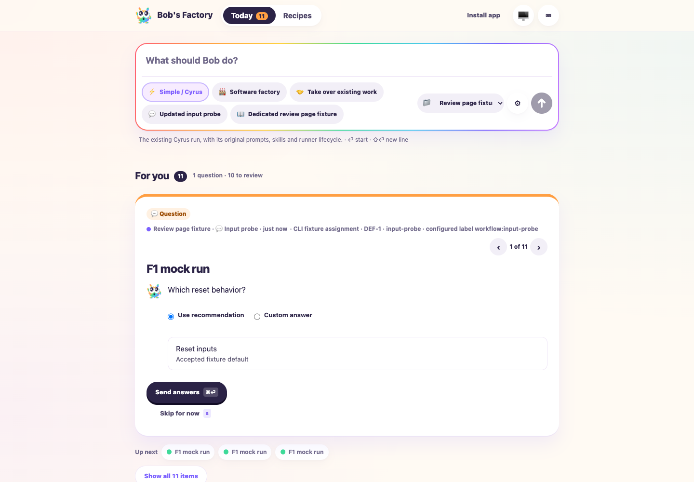
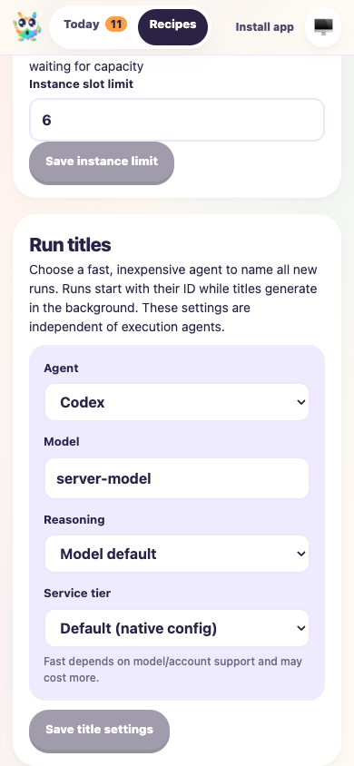
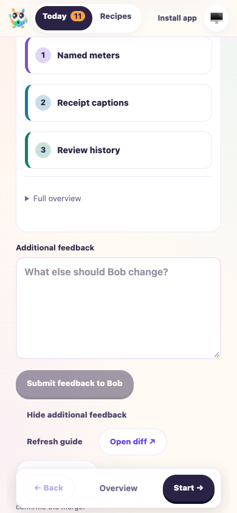

# Factory form edits reset when their context ends

Date: 2026-10-07. Tested `0de51ccffc335155b0d1ebaca66c6c171f73f74e` plus the uncommitted implementation accompanying this report. Final dashboard build: `a8e2497bca5cf2ac7e2e14db`. Implementation remains on the factory branch for the delivery step; no PR was created or published.

## Scope and fixture

F1 applies because the change affects launch, questions, chat, review submissions, settings and app-update behavior. The accepted human decision is: **Reset drafts on navigation or context changes.** Unsent values stay within their mounted form and unchanged content context. Pending writes still block duplicate submissions across navigation. Server data, reading preferences, shell integrity and offline/version checks remain supported.

The isolated repository is `/tmp/f1-input-reset-50347929/repo`, with a local bare Git origin and worker home `/tmp/f1-input-reset-50347929/home`. The compiled EdgeWorker uses the CLI tracker, real factory APIs, SSE notifications and worktrees. Ports are UI 3717, RPC 3718 and fixture controls 3719. Embedded handlers use `f1AgentHandlers('mock')`; title generation, question roles, guides and fix roles are deterministic fixtures. No real provider ran.

The input-probe workflow reaches a clarification wait. The review70 workflow produces a three-chapter guide and a real pending review gate tied to the isolated repository's commit. Simple uses its native session/continuation path with a simulated provider. Fixture controls replace question recommendations, questions, review gates, guides and conversation context, and emit unrelated updates. A second local repository option tests launch selection. Held browser requests exercise late success/failure without timing-dependent provider behavior.

## Commands and evidence

Evidence directory: `/Users/jappy/.cyrus/factory/evidence/manual-50347929-ffc6-40cc-a0a4-53f774a3076a`. It contains the fixture, browser scripts, successful assertion receipts, exact submitted feedback, server logs and screenshots.

```sh
pnpm install --frozen-lockfile
pnpm --filter cyrus-edge-worker test:run test/FactoryPwa.test.ts test/FactoryReviewFeedback.test.ts test/FactoryReviewState.test.ts test/FactoryWebClient.test.ts test/FactoryServer.test.ts test/Questions.test.ts
pnpm typecheck
pnpm build
pnpm exec biome check <18 changed TypeScript/TSX files>
git diff --check
CYRUS_PORT=3718 apps/f1/f1 init-test-repo --path /tmp/f1-input-reset-50347929/repo
F1_AGENT_MODE=mock node <evidence-directory>/f1-fixture.mjs
CYRUS_PORT=3718 apps/f1/f1 ping
CYRUS_PORT=3718 apps/f1/f1 create-issue --title '<fixture title>' --description '<fixture description>' --labels workflow:input-probe
CYRUS_PORT=3718 apps/f1/f1 start-session --issue-id issue-1
CYRUS_PORT=3718 apps/f1/f1 create-issue --title '<fixture title>' --description '<fixture description>' --labels workflow:review70
CYRUS_PORT=3718 apps/f1/f1 start-session --issue-id issue-2
CYRUS_PORT=3718 apps/f1/f1 view-session --session-id session-1 --limit 8
CYRUS_PORT=3718 apps/f1/f1 view-session --session-id session-2 --limit 8
node <evidence-directory>/browser-qa.mjs
node <evidence-directory>/browser-qa-remaining.mjs
node <evidence-directory>/browser-qa-chat-settings-review.mjs
node <evidence-directory>/browser-update-qa.mjs
node <evidence-directory>/browser-final-qa.mjs
```

Browser QA used the named `agent-browser --headed false --session input-reset-50347929` session and fresh Playwright contexts launched explicitly with `headless: true`. The update script pauses at `READY for isolated server restart`; the worker was gracefully stopped and restarted against the rebuilt final dashboard while those tabs remained mounted. Successful final receipts are `browser-receipt.json`, `update-receipt.json` and `final-browser-receipt.json`. The broad lifecycle receipt includes assertions from resumed earlier scripts; it is not a claim that every exploratory invocation passed uninterrupted. The final update and final browser runs completed successfully.

## Results

- All 67 focused tests in six files passed. Monorepo typecheck and build passed. Biome checked the 18 changed TypeScript/TSX files without fixes. `git diff --check` passed.
- Both CLI-assigned issues routed to the isolated repository. The activity timeline contains startup, routing and the expected question/review responses. Question waits and pending review gates use the actual runtime.

| Form or behavior | Observed result |
| --- | --- |
| Launch inputs and agent overrides | Route return, reload, workflow change and repository change reset values. Unrelated SSE activity and capacity-only configuration refresh preserve current typing. A held launch stays locked across remount; its completion does not clear replacement input. |
| Clarification choices and custom text | Switching answer modes preserves text within the unchanged form. Changed questions/recommendations reset choices and custom text. Remount prevents duplicate submission and starts fresh. The accepted serialized answer remains on the server. |
| Chat | Route return, reload and changed conversation context reset text. A held successful native Simple continuation stays locked across navigation and preserves replacement text. |
| Instance limit and title settings | Unrelated updates preserve typing. Route return uses saved values; changed saved settings reset edits. Held saves remain locked across remount. Old failures unlock fresh forms without restoring text or displaying errors from a discarded context. |
| Recipe JSON, creation and step settings | Closing/reopening and reload discard edits. Changed saved definitions start from current source without merging unsaved JSON. Closing and reopening the same edit modal while its save is held preserves the lock, drops the old failure and retains fresh replacement edits. |
| Review collection | Comments remain collected across chapters and unchanged refreshes. Leaving the form or changing guide, commit or gate resets the collection without acknowledgment. Held success and failure retain the submission lock across remount without resurrecting discarded feedback. |
| Review serialization | A comment from Overview, a comment from a second chapter and general feedback submit as one exact combined message. Request content equals the saved server decision; `exact-combined-feedback.json` retains it. |
| Browser storage | Legacy update input snapshots are ignored/removed; legacy feedback at the exact current key does not populate the form. Unsent edits in another tab do not appear in fresh forms. Denied local/session storage does not block editing. |
| Explicit update | Five separately mounted tabs hold unsent launch/override, title, answer, chat and review values. Update waits for a held write and leaves other tabs mounted. Denied snapshot storage does not block completion. Each updated tab resets editable values; saved settings, accepted answers, submitted feedback and pending server review survive. |
| Rendering | Desktop 1440×1000 and mobile 390×844 viewports were inspected. Successful final browser runs report no uncaught browser errors. |

Unit checks also retain complete-shell cache validation, version safety, bounded reading restoration and feedback ordering/length validation. They verify that view snapshots exclude editable fields and pending feedback state contains no shared draft content.

Screenshots were saved to the evidence directory and visually inspected. Copies accompanying this report show the actual tested dashboard:









## Limits and cleanup

This validates orchestration and the mounted built UI with simulated agents. It does not validate real-agent suggestion quality, physical devices, installation as a standalone OS app or remote provider PR behavior. The guide's unavailable source images are intentional fixture content, not evidence of a new image-loading problem. No production tracker, remote PR, merge or publication was changed. There is no originating ticket; no production ticket synchronization is claimed.

Exploratory browser scripts needed locator corrections and waits for coalesced SSE events. The multi-tab retry used independent browser contexts to avoid request contention between long-lived event streams. These driver issues were corrected before the successful final runs; historical reports remain untouched.

Cleanup used `CYRUS_PORT=3718 apps/f1/f1 stop-session --session-id session-1`, the real stop API for four remaining unfinished runs, `agent-browser --session input-reset-50347929 close` and SIGTERM for the recorded worker PID. Each completed successfully. The fixture's unfinished runs were stopped only after preserving the server receipts, then the named browser and isolated worker were closed. The test repository and evidence remain for reproduction.
