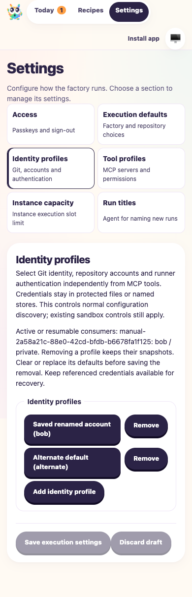

# Execution profiles after fresh-input integration

**Date:** 2026-10-08
**PR:** [#30](https://github.com/Attraccess/bobs-factory/pull/30)
**Candidate:** merge worktree based on `3b6c80db2c6f97feee18748464df7156f7ea9ae8`
with main `d6e3ad8322c4e7445de51a0b81e73c932e95be15` and the pending CI fixes.

Main PR #41 intentionally clears unsent form inputs. This integration preserves
independent identity/tool selection and accepted execution snapshots while applying
that behavior to composer selections and the separate Settings pages. It supersedes
the earlier browser-draft restoration expectations; historical reports remain intact.

## Executed checks

An isolated embedded EdgeWorker used `F1_AGENT_MODE=mock` and injected
`f1AgentHandlers('mock', ...)`. A headless Chromium browser enrolled a virtual passkey
through the real local registration endpoints. No host authentication store changed.

- Changing the selected workflow cleared both unsent profile choices.
- Reload ignored and removed legacy composer profile storage, displaying current
  defaults without importing old selections.
- Explicit Start supplied Bob/private profiles to the simulated Claude agent.
  The selected credential appeared only in its controlled child configuration;
  the run completed with the expected JSON output.
- Leaving the capacity page discarded an unsaved limit. A PUT response confirmed
  explicit saving; the saved limit survived reload.
- Leaving the identity page discarded its unsaved display-name edit.
- An externally saved profile change reset the open editor and appeared after
  reload. The completed run's original accepted execution snapshot stayed identical.
- The 390px Settings screenshot was opened and inspected. All six section links,
  saved profiles and Save/Discard controls are visible and fit the page.



## Commands and evidence

```sh
pnpm build
pnpm typecheck
pnpm --filter bobs-factory-claude-runner test:run
pnpm --filter bobs-factory-edge-worker exec vitest run test/FactoryPwa.test.ts test/FactoryExecution.test.ts test/ExecutionCapabilities.test.ts test/ExecutionProfiles.test.ts test/FactoryWebClient.test.ts test/FactoryReviewFeedback.test.ts
pnpm --filter bobs-factory-mcp-tools exec vitest run --maxWorkers=1
pnpm --filter bobs-factory-edge-worker build
F1_AGENT_MODE=mock bun node_modules/.cache/ci57-input-merge.ts
pnpm lint
```

Claude: 135 tests passed. Focused worker checks: 94 passed. MCP: 46 passed with
one worker. Build/typecheck passed; lint retained 18 existing CSS warnings.
Initial broad parallel local runs hit existing five-second MCP test timeouts.
The one-worker MCP run passed without changing timeout limits. A snapshot test
now locates the input file in both source-checkout and packaged command layouts.
The three CI Claude failures reproduced before updating their exact SDK-option
expectations to include the prepared executable path.

Evidence directory:
`/Users/jappy/.cyrus/factory/evidence/manual-a51c4397-ff88-400d-ab07-b692f7f15df5`.
`ci57-input-merge-receipt.json`, `ci57-input-merge.log` and the driver copy
`ci57-input-merge.ts` record the scenario. Driver imports are relative to its original
`node_modules/.cache` location. Early selector/timing mistakes in the driver were
corrected; assertions were retained. Owned browser and server stopped after testing.

## Limits

Agents and background titles were simulated. This does not establish live model
or provider authentication. The browser used a virtual passkey, not physical
hardware. View-only update snapshots are covered by the PWA tests; this drive
checked reloads rather than a complete service-worker replacement. Previous waived
live runner/GitLab checks, unverified live Codex/App/enterprise/hardware cases and
the originating-ticket synchronization discrepancy remain limitations.
