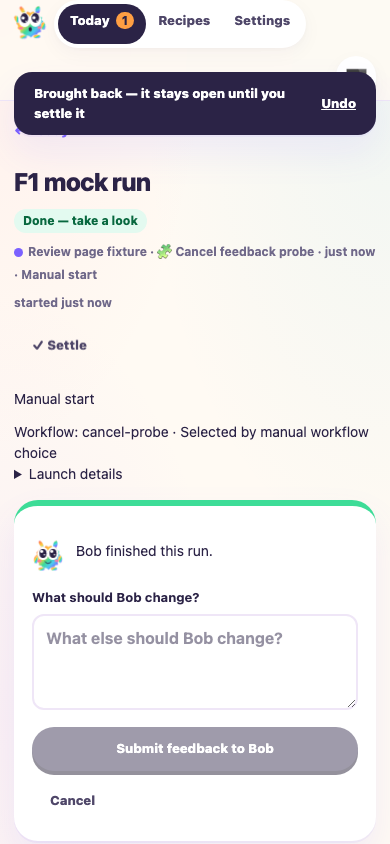

# Input resets after the Bob’s Factory base merge

Tested PR #41 head `466e8c194d8fc0678f8bc46f0c90761380aa9c81` merged
with base `73f9ce455e4217e30e236250788911d8738d27c8` and the documentation
conflict resolution in this commit. Built dashboard: `a3081b48fa46b98a734fb168`.

The base renamed packages, homes and environment variables. The only manual
conflict was the questions documentation: input drafts reset, while the server
retains unchanged pending assistance questions and their batch ID after restart.
The dashboard code merged automatically. F1 covers that runtime integration;
historical input-reset and passkey evidence remains unchanged.

## Validation

- Frozen-lockfile install, monorepo build and typecheck passed.
- 100 tests passed across FactoryPwa, FactoryReviewFeedback, FactoryReviewState,
  FactoryWebClient, FactoryServer, Questions, FactoryAccess, FactoryAuth and
  ReviewFiles.
- Biome passed on the dashboard, FactoryServer and changed tests, with 16 existing
  CSS specificity warnings. `git diff --check` passed.
- F1 ping and status reported a healthy, ready worker.
- All seven headless browser assertions passed: signed-out update/private API
  protection; virtual-passkey enrollment and Cancel; navigation/reload input
  resets and ignored legacy snapshots; canceled feedback reopening empty;
  authenticated update notice and write blocking; logout/re-login clearing;
  fresh feedback submitted through the real authenticated API.
- No uncaught browser errors. Desktop update screens and the mobile empty
  feedback form were opened and inspected.

## Reproduction and evidence

Fresh repository `/tmp/f1-ci-reconcile-50347929/repo`; isolated home
`/tmp/f1-ci-reconcile-50347929/home`. Embedded EdgeWorker injects
`f1AgentHandlers("mock")`, with deterministic workflow roles and title generation.
Playwright uses `headless: true` and a virtual authenticator; enrollment and
login use actual passkey verification endpoints.

```sh
F1_AGENT_MODE=mock apps/f1/f1 init-test-repo --path /tmp/f1-ci-reconcile-50347929/repo
F1_AGENT_MODE=mock BOBS_FACTORY_MIGRATION_SOURCE_CAPACITY_DIRECTORY=/tmp/f1-ci-reconcile-50347929/legacy-capacity node <evidence-directory>/ci-reconcile-f1-fixture.mjs
BOBS_FACTORY_PORT=3738 apps/f1/f1 ping
BOBS_FACTORY_PORT=3738 apps/f1/f1 status
node <evidence-directory>/ci-reconcile-browser.mjs
```

Evidence directory:
`/Users/jappy/.cyrus/factory/evidence/manual-50347929-ffc6-40cc-a0a4-53f774a3076a`.
Receipts: `ci-reconcile-browser-receipt.json`, `ci-reconcile-tests.log`,
`ci-reconcile-build.log`, `ci-reconcile-typecheck.log`.

Initial setup correctly refused the host’s live legacy capacity pool. The fresh
fixture explicitly selects its own empty migration-source pool; host state is
untouched. The first browser attempt raced the initial setup screen and chose
an unavailable new-passkey toggle. Waiting for the setup-code field fixed the
driver. Neither setup issue required product changes.



## Limits and cleanup

Simulated agents and a virtual passkey do not validate real-agent output or
physical devices. Version mismatch responses are controlled browser fixtures,
not an actual deployed upgrade. Earlier full update lifecycle evidence remains
in the retained reports. Browser closed and the isolated worker stopped with
SIGTERM. No production tracker was used; no ticket synchronization is claimed.
