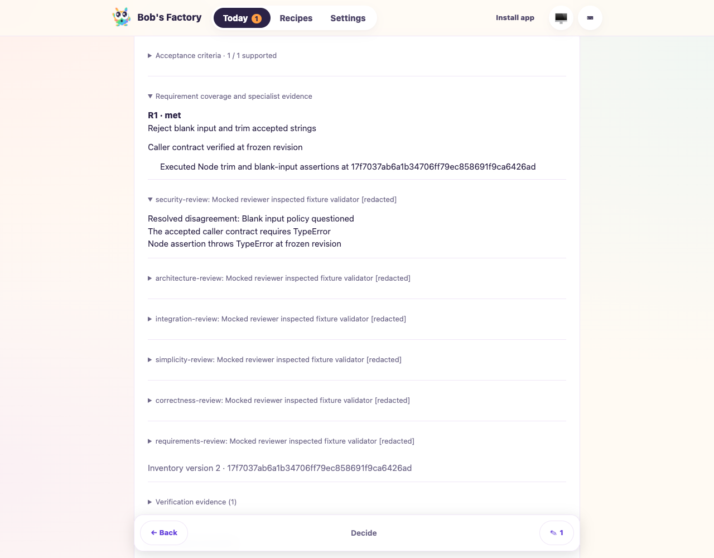
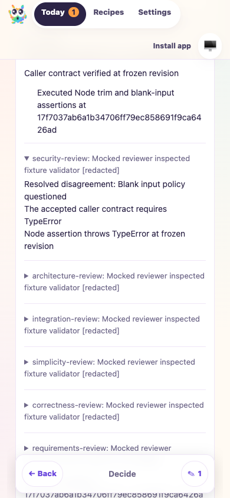
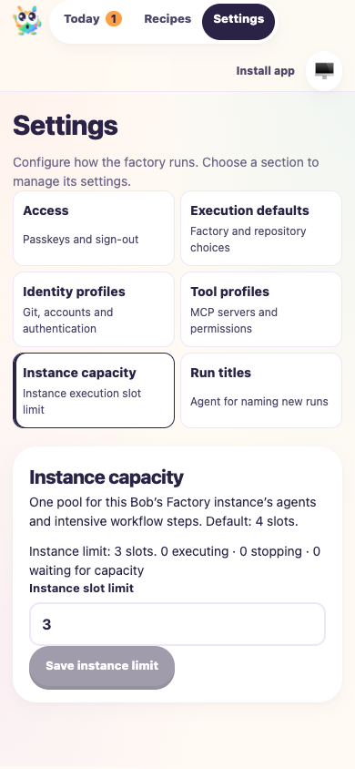
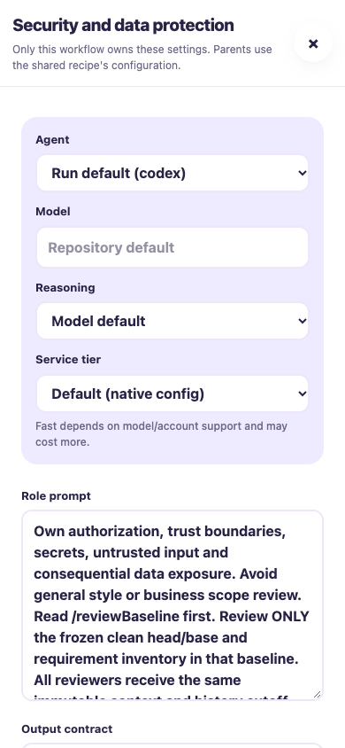

# Specialist review and execution-profile integration

Date: 2026-10-08. PR: [#32](https://github.com/Attraccess/bobs-factory/pull/32).
Tested the uncommitted merge of main `eebe4d14897a2654784b16847ca8a64e11f2d129`
into `23100374ebf993de957e6b3a51b4b0d85744bcbe`.

The merge preserves specialist frozen baselines, propagated review associations,
contract validation and revision stamping alongside execution environments,
error/result redaction and continued assistance conversations from main.
Capability guidance and the complete routing prompt retain both features.
Dedicated Settings pages, concurrency proxy handling and PWA response validation
are retained. Historical reports and both changelogs are preserved.

## Checks

- `pnpm build`, `pnpm typecheck`, `git diff --check`: passed.
- `pnpm biome ci`: passed with 19 existing warnings.
- With `BOBS_FACTORY_INTERNAL_EXECUTABLE` unset and `F1_AGENT_MODE=mock`, 378
  focused Vitest tests passed in 14 suites: SpecialistReview, WorkflowRuntime,
  FactoryExecution, ExecutionProfiles, ExecutionCapabilities, Guide,
  FactoryPipeline, FactoryServer, FactoryWebClient, FactoryPwa,
  EdgeWorker.workflow-triggers, EdgeWorker.persistence,
  EdgeWorker.capture-recovery and prompt-assembly.routing-context.

## Simulated-agent F1 drive

Command: `F1_AGENT_MODE=mock node <evidence>/ci-r12/integration.mjs`.
Scripts and complete receipts are retained in the run evidence directory:
`/Users/jappy/.cyrus/factory/evidence/manual-0b7cf77f-8296-4e61-9df5-b03561e59729/ci-r12/`.

The actual compiled EdgeWorker runs with a fresh temporary home, repository,
capacity directory and ports 4886/4887. F1 handlers, role runners and the resolved
execution hook are deterministic fixtures. No real agents or paid APIs run.
The execution hook injects a synthetic redaction canary; focused execution tests
separately exercise the production environment resolver with fixture credentials.

Passed assertions:

1. Malformed requirement extraction is corrected; recommendations do not run
   reviewers until an explicit fixture answer is submitted.
2. All six specialists receive the same frozen revision and resolved execution
   context. Real Node assertions validate the synthetic caller contract.
   Complete R1 coverage aggregates; the synthetic canary is redacted from every
   reviewer summary and absent from persisted history.
3. Missing nonvisual maps receive guide-only correction. Coverage, attributed
   disagreement rationale/evidence and Markdown exports remain intact.
4. A fresh headless agent-browser session uses virtual passkey enrollment;
   private API access returns 401 before authentication. Map, desktop/mobile
   coverage and Decide comments render; no mobile page overflow occurs.
5. Capacity saves through dedicated Settings using the concurrency contract.
   Recipes still exposes specialist output contracts. Escape restores focus to
   the exact opening button after the dialog closes. Leaving review clears
   unsent comments. No page errors or human approval submissions occur.
6. Worker and named browser sessions stop cleanly.

The first browser driver navigated before the Settings default-page redirect
settled. Its next attempt checked focus before dialog-close handling settled.
The final driver awaits both transitions and retains the original assertions.
Initial failed logs and final `browser-results.json`, `results.json`,
`commands.json` and `cleanup.json` remain in evidence; product code was unchanged.

## Inspected screenshots

Real-agent judgment, physical passkeys and production provider connectivity are
not established by simulated evidence. Tracking remains runtime-owned; historical
recovery incidents remain documented. This drive does not approve or merge a PR.
