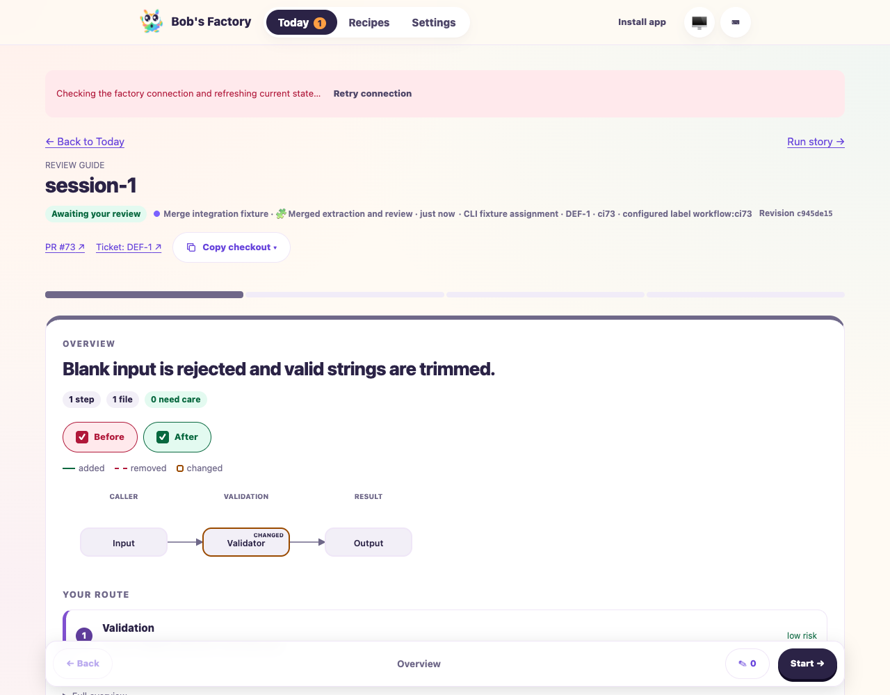
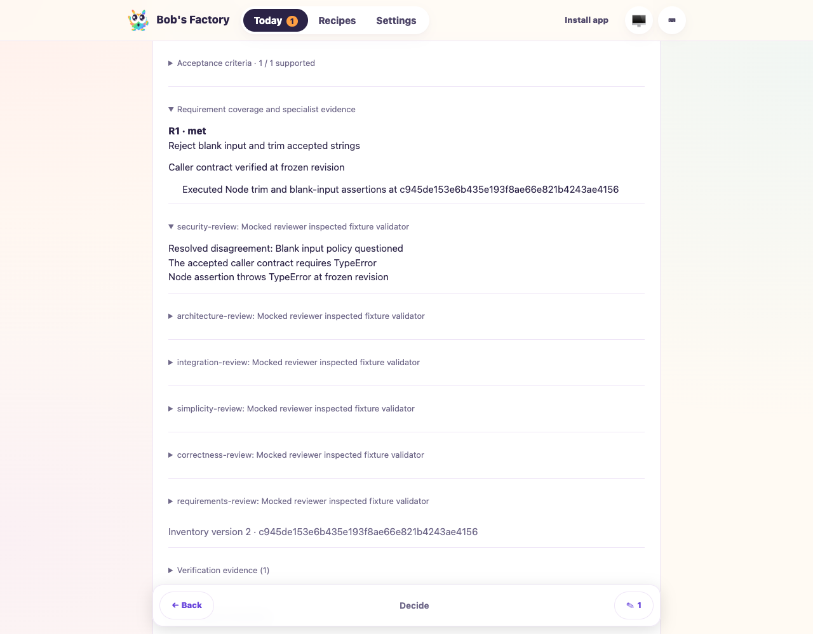
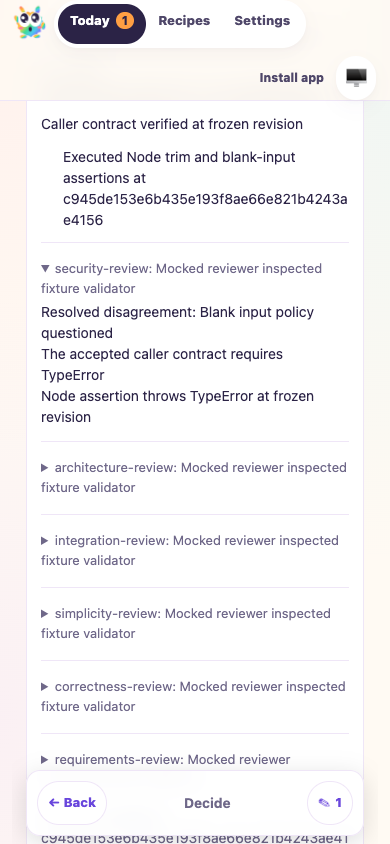

# Specialist review and guide-map integration

Date: 2026-10-08. PR: [#32](https://github.com/Attraccess/bobs-factory/pull/32).
Tested the merge of `58cce00b2ae6a4f2ab2c51f1fdfa8912ba466d6a` into
`cf49c1c3160c4931e9ec5ed1abfbc284a5a0a248`, before committing the resolution.

The base adds whole-PR guide classification, required nonvisual system maps and
Decide feedback controls. The resolution preserves those behaviors alongside
specialist requirement coverage, attributed disagreements and Markdown exports.
Both capability descriptions and the complete routing-prompt expectation retain
the combined contracts. Historical guides remain readable.

## Validation

- `pnpm build`: passed.
- `pnpm --filter bobs-factory-edge-worker typecheck`: passed.
- `pnpm biome ci`: passed with 19 existing warnings.
- `git diff --check`: passed.
- With `BOBS_FACTORY_INTERNAL_EXECUTABLE` unset and `F1_AGENT_MODE=mock`, focused
  Vitest suites passed 254 tests in 11 files: SpecialistReview, Guide,
  WorkflowRuntime, FactoryPipeline, ReviewModel, FactoryReviewState,
  FactoryReviewFeedback, ReviewFiles, prompt-assembly.routing-context,
  EdgeWorker.capture-recovery and Incremental.

## Simulated-agent F1 drive

Scripts and receipts are retained under
`/Users/jappy/.cyrus/factory/evidence/manual-0b7cf77f-8296-4e61-9df5-b03561e59729/ci-r11/`.

Command: `F1_AGENT_MODE=mock node <evidence>/integration.mjs`.
The fixture injects deterministic F1 handlers and role runners into the actual
compiled EdgeWorker and Factory runtime, with a fresh temporary home, repository
and capacity directory. UI and provider ports are 4786 and 4787. F1 commands
verify health, create a synthetic issue, start its session and read activities.
No production state or paid providers are used.

Executed assertions:

1. Malformed requirement output is corrected through the production boundary.
   A generated recommendation does not start reviewers before explicit fixture
   answer submission.
2. All six configured specialists execute against the same clean, frozen
   revision. R1's blank-input and trimming contract has complete coverage,
   supported by real Node assertions against the synthetic repository.
3. A guide lacking its required nonvisual map receives a guide-only correction.
   The second attempt retains the exact requirement ID, criterion and status,
   three map lanes and chapter part links. Earlier extraction/review work is not
   repeated. The final guide includes all six attributed specialist receipts.
4. Runtime-authored coverage retains resolved disagreement text, rationale and
   evidence. Generated Markdown retains that disagreement.
5. A fresh `agent-browser --headed false --session ci73-guide-merge-<timestamp>`
   session uses a virtual passkey through operator-authorized enrollment. Private
   API access returns 401 before authentication.
6. The actual reader displays the map, then shows authoritative R1 coverage and
   attributed dispute evidence on Decide. A comment survives chapter navigation
   and appears in collected feedback. Leaving review clears unsent comments.
   The 390px view has no page overflow. No browser page errors occur.
7. No human approval is submitted. The isolated worker and browser are stopped.

The initial harness needed explicit workspace package resolution. Its first
browser assertion requested an exact paragraph match although the paragraph also
contained resolution rationale and evidence. The corrected, scoped locator
passed; product code did not change for either driver issue. Initial logs remain
available. Final receipts: `results.json`, `browser-results.json`, `commands.json`
and `cleanup.json`.

## Inspected screenshots

These are synthetic validation content, not evidence of real-agent judgment.
The overview capture includes a transient connection-refresh banner; the
protected API and browser interaction assertions passed. Real-agent authoring,
physical passkeys and provider merges remain untested. Ticket tracking remains
runtime-owned; historical recovered capacity-lock and iteration-limit incidents
remain recorded limitations. This drive does not change PR readiness or merge.
