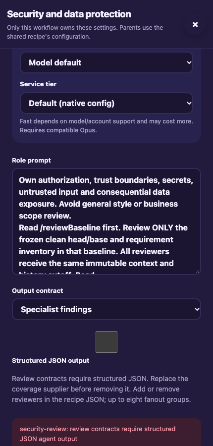
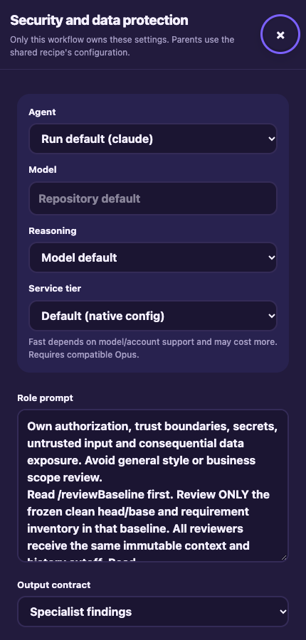

# Specialist review and dashboard input resets

Date: 2026-10-08
PR: [#32](https://github.com/Attraccess/bobs-factory/pull/32)

## Scope

Merge main at `d6e3ad83` into specialist review at `71278c9b`.
The Recipes conflict combines occurrence-specific specialist saves and editable
review contracts with the base's input resets and late-response protections.
The documentation retains new question notifications and unchanged-wait
notification deduplication, while describing unsaved answer resets accurately.
Existing accepted workflows and historical evidence remain retained.

## Validation

- `pnpm build`, `pnpm typecheck`, `pnpm biome ci`, and whitespace checks passed.
  Biome reports 18 existing warnings.
- 211 focused tests passed across FactoryPwa, FactoryReviewFeedback,
  FactoryWebClient, FactoryServer, SpecialistReview, WorkflowRuntime, Questions
  and Guide. Source tests unset `BOBS_FACTORY_INTERNAL_EXECUTABLE` so subprocesses
  use the source context server instead of the installed binary.
- F1 production EdgeWorker/CLI scenario with simulated agents passed: malformed
  inventory correction, explicit answer before review, six configured specialists
  sharing a frozen revision, complete coverage, and compact MCP review context.
  Command: `env -u BOBS_FACTORY_FACTORY_ORIGIN
  -u BOBS_FACTORY_FACTORY_PUBLIC_ORIGIN F1_AGENT_MODE=mock bun
  <evidence>/ci-r10/integration.mjs`.

- Fresh headless browser assertions passed against an isolated authenticated
  Factory server: a valid save changed only the selected specialist; closing,
  navigation and reload discarded unsaved edits; Escape restored the exact
  opening button; invalid structured output was rejected without changing saved
  recipes; reopening discarded the invalid edit. Mobile screenshots were opened
  and inspected. Command: `node <evidence>/ci-r10/recipes-reset.mjs`.
- The initial browser driver could not parse checkbox references carrying a
  checked-state attribute. Its reference parser was corrected; the complete
  scenario then passed. No product change was needed for that driver failure.

## Evidence and limits

Evidence directory:
`/Users/jappy/.cyrus/factory/evidence/manual-0b7cf77f-8296-4e61-9df5-b03561e59729/ci-r10`.
Build, typecheck, Biome and test logs are adjacent `ci-r10-*.log` files.
Agents and tracker boundaries are simulated. Real-agent judgment, physical
passkeys and production connectivity remain unverified. The browser fixture
uses a server-seeded isolated session, with no credential ceremony or agents.
No provider credits, approval, readiness change, publication or merge were used.
Prior resolved review findings and historical recovery limitations remain retained.

Receipts: `ci-r10/results.json`, `ci-r10/recipes-reset-receipts.json` and
`ci-r10/cleanup.json`. The isolated worker and named browser sessions were stopped.

