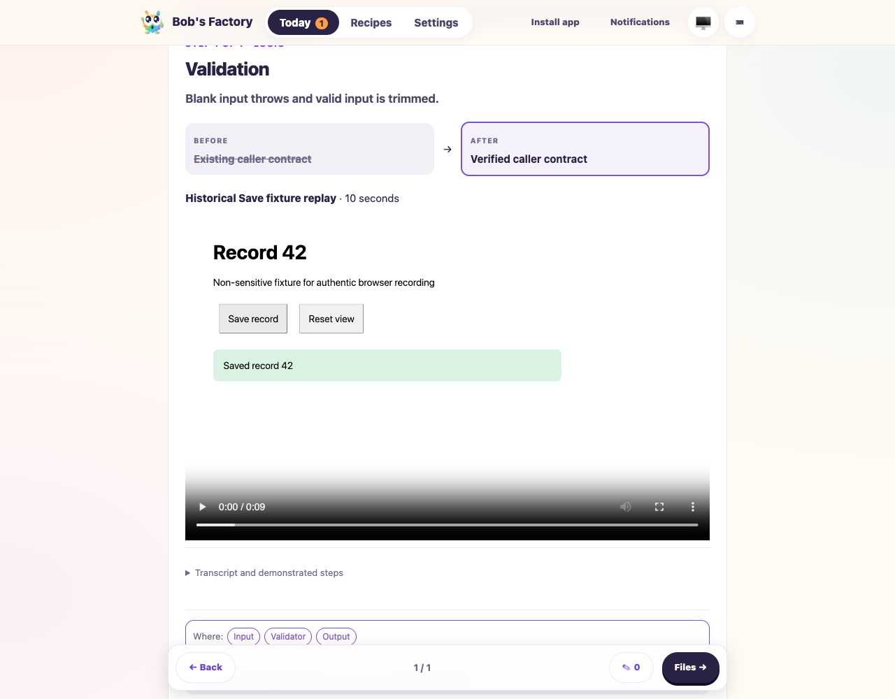
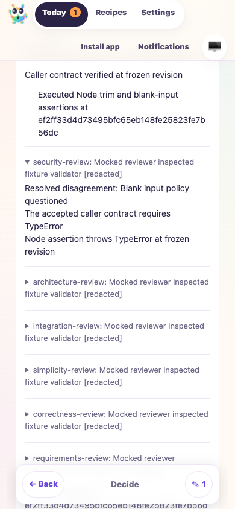

# Video evidence and specialist review integration

Date: 2026-10-08. Tested draft PR [#33](https://github.com/Attraccess/bobs-factory/pull/33) at `f58ef9285a53bae197b3e41eeb76a35dbca4fb1a` plus integration of main `ec185ab33e9a903c7358a60204bc1e71051e2d29` and the saved-stock-recipe compatibility fix.

F1 applies because the merged workflow combines specialist requirement coverage with video validation and guide generation. All agents were deterministic injected runners with `F1_AGENT_MODE=mock`; no live model credits, production ticket mutations, publication, approval or merge were used. The drive used the compiled EdgeWorker, production role output correction, factory-context MCP snapshots, real F1 CLI tracker/RPC, a disposable Git worktree and a separate capacity pool.

## Scenarios and assertions

- Requirement extraction rejected an empty inventory and corrected it. Its recommendation remained pending until an explicit fixture answer. The answer resumed extraction without approving the human guide.
- Six configured stock reviewers executed actual local Node assertions for trim/blank-input behavior against one frozen revision. The aggregate retained complete R1 coverage, attributed dispute evidence and redacted execution output.
- An existing authentic Save recording was replayed through media validation at the fixture revision. This was media integration evidence, not a fresh recording or a demonstration of the fixture validator. Simulated acceptance supplied a historical playback receipt; separate headless Chromium execution verified actual playback.
- Guide production rejected a missing system map, then an incorrect recording hash. Correction preserved authoritative coverage from all six specialists and retained the validated video reference. The workflow waited for human review with no submitted approval.
- A headless browser enrolled a disposable virtual passkey and confirmed unauthenticated API denial. It played the recording in the guide, displayed the transcript control, retained an item comment through chapter navigation, and displayed complete specialist coverage and resolved dispute evidence on Decide. Mobile coverage had no page overflow. Recipes kept the specialist contract editor and exact trigger focus after Escape. Leaving review cleared unsent comments.
- All owned worker/browser resources were closed. The isolated test run was stopped during cleanup.

## Commands and evidence

```sh
pnpm --filter bobs-factory-edge-worker typecheck
pnpm --filter bobs-factory-edge-worker exec vitest run test/Video.test.ts test/SpecialistReview.test.ts test/WorkflowRuntime.test.ts test/Guide.test.ts test/FactoryPipeline.test.ts test/EdgeWorker.capture-recovery.test.ts test/EdgeWorker.persistence.test.ts test/TicketTracking.test.ts test/prompt-assembly.routing-context.test.ts
pnpm build
F1_AGENT_MODE=mock node <evidence-directory>/ci-specialist-integration/integration.mjs
```

272 targeted tests passed after the saved-stock video-upgrade correction: 271 initial passes, with the complete 15-test video suite passing on rerun. Build and edge-worker typecheck passed. The initial drive incorrectly configured an HTTP public proxy origin, which the product correctly rejected; removing that proxy override in the disposable harness produced the passing execution.

Evidence directory: `/Users/jappy/.cyrus/factory/evidence/manual-30032642-7584-4d54-9ff6-0baa919d6148`. The `ci-specialist-integration` subdirectory retains `integration.mjs`, `browser.mjs`, `results.json`, `browser-results.json`, `commands.json`, `f1-retry.log`, `guide.md` and `cleanup.json`. Root logs use the `ci-specialist-video-` prefix. The browser receipts record ten passed checks with no unhandled errors.





## Limitations

This delta drive does not establish real-agent reasoning, native Safari/iOS playback, physical passkeys or push delivery, native sandbox enforcement or live GitLab API behavior. Existing sticky-footer overlap remains a nonblocking observation; normal scrolling restores access. Live originating-ticket synchronization remains independently unverified; delivered runtime receipts coexist with a backlog ticket snapshot. Tracking stays runtime-owned. Current-revision human approval is still required.
