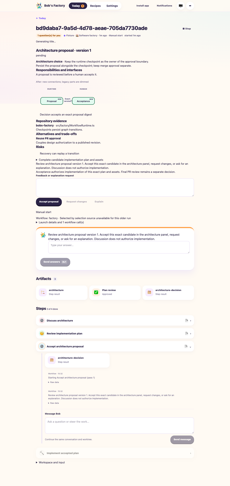
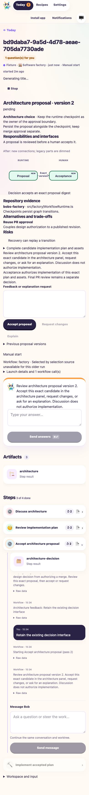
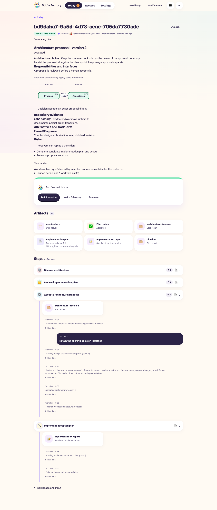
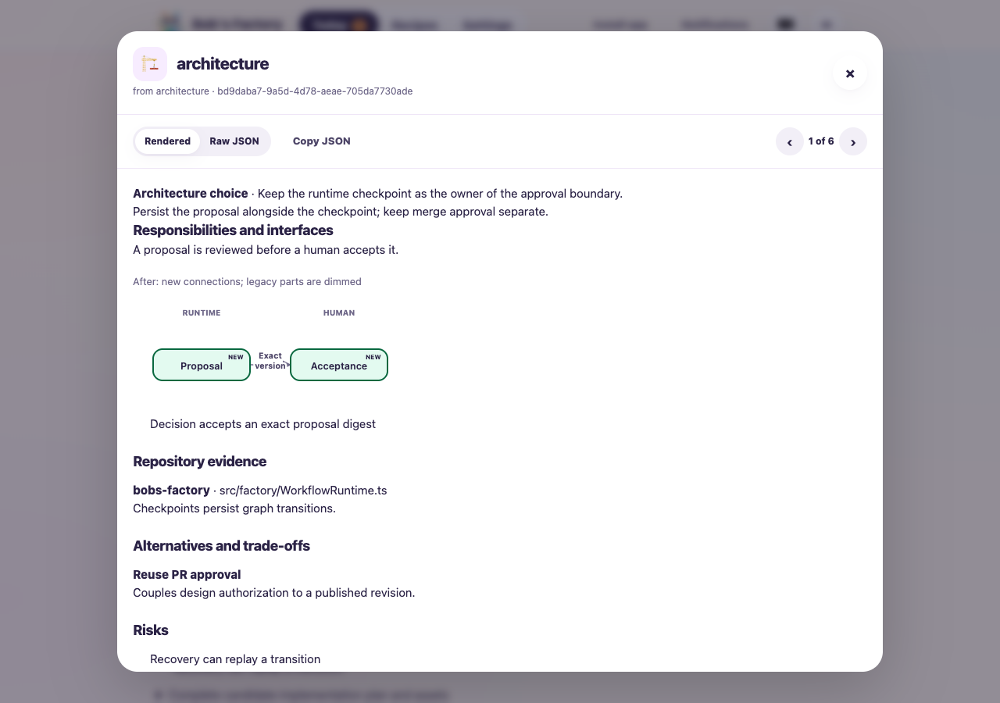

# Architecture proposals before implementation

Date: 2026-10-09. Taskbot #90. Tested the uncommitted implementation on
`3e117128f77ecf256b1f7866f65906b33c83e9fb`; dashboard build
`dc7ee62571c0d11f7a2dab3d`. Validation made no production changes.

## Applicability and setup

F1 applies because architecture discussion changes workflow waits, recovery and
implementation handoff. The expected behavior was an exact-version acceptance
boundary shared by Factory and Takeover, with discussion-driven revision and a
recorded routine bypass.

The embedded CLI-platform EdgeWorker used an isolated home, fresh local repository,
local Git remote and temporary worktrees. The F1 `MockAgentRunner` supplied every
role and background title response. It emitted actual runner events through
EdgeWorker; no agent CLI or inference API was called. The real private
factory-context stdio connection and output validation remained enabled. The
fixture cleared the inherited packaged-executable flag so source-mode stdio could
start correctly. The shared pipeline stopped after implementation, excluding
publication and later delivery gates from this focused drive.

The driver and complete receipts are retained in:

```text
/Users/jappy/.bobs-factory/factory/evidence/manual-ca2bb7eb-c67e-4b8b-ac2f-1e62bf6cad37/
  architecture-f1-drive.ts
  architecture-f1-drive.log
  architecture-f1-results.json
  architecture-f1-manual-*.json
  architecture-browser-fixture.ts
  architecture-browser-results.json
```

```sh
F1_AGENT_MODE=mock bun /Users/jappy/.bobs-factory/factory/evidence/manual-ca2bb7eb-c67e-4b8b-ac2f-1e62bf6cad37/architecture-f1-drive.ts
```

## Executed results

All four drives passed:

| Workflow | Scenario | Result |
| --- | --- | --- |
| Factory | Meaningful architecture | Three reviewed versions; implementation ran once after acceptance |
| Takeover | Meaningful architecture | Three reviewed versions; implementation ran once after acceptance |
| Factory | Routine existing pattern | Completed without a human decision; bypass reason retained |
| Takeover | Routine existing pattern | Completed without a human decision; bypass reason retained |

Each meaningful drive asserted that implementation had not started during the
initial wait. Explanation retained the same pending proposal and granted no
acceptance. The runtime shut down and was reconstructed from its saved home while
waiting; it restored the same proposal and still did not implement. Discussion
created version 2, rejection created version 3, and acceptance of version 1 was
rejected. Accepting version 3 advanced implementation exactly once.

The implementation input contained its self-contained accepted plan and answers,
without full ticket text or history. Takeover retained its existing tracker
identity and synchronization receipts. The fixture plan's inherited PR/branch
instructions survived handoff. Both Takeover worktrees retained the original
fixture ticket branch `def-1-existing-architecture-fixture`. Forge inspection was
simulated; this drive does not establish remote PR inspection or delivery.

## Headless dashboard verification

A separate real protected Factory server used a software passkey through the real
registration verifier. An isolated headless `agent-browser` session displayed the
built dashboard at desktop and 390×844 mobile widths. All images below were
captured from the running application and inspected.

The executed flow displayed pending version 1, requested an explanation without
acceptance, submitted feedback to obtain reviewed version 2, then accepted version
2 and completed the simulated implementation. The artifact inspector rendered the
proposal and diagram. Acceptance submissions after completion returned HTTP 409.
Focused API tests additionally reject stale versions while waiting and duplicate
submissions. The owned browser and servers were closed after validation.









## Other checks and limits

- The six affected architecture, pipeline, runtime, server, web-client and chat
  test files passed: 211 tests. The earlier four process-inspection failures were
  resolved by rerunning with the corrected environment.
- The 13 architecture checks cover malformed/fake approval, diagram references,
  immutable assets, stale/duplicate decisions, candidate review failure, scoped
  handoff, renamed roles, customization, frozen runs, stop/resume and recovery
  before and immediately after acceptance.
- EdgeWorker typecheck, build, changed-source Biome checks and `git diff --check`
  passed. No dependency graph changed.
- Simulated agents establish orchestration and input boundaries, not the quality
  of architecture recommendations. Real-agent validation was not authorized.
- This role did not publish a PR, merge changes or mutate the originating ticket.
