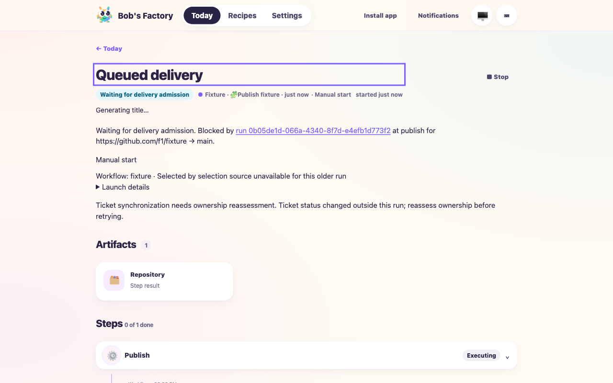

# Factory delivery boundaries

Date: 2026-10-09. Tested implementation commit
`1b5be60b7be021de682a7a0406bdcd389d7934fd`, based on current main
`be36eb345ab5b182ff3a1ffcba2f27fa7e2ef599`. Ticket:
[Taskbot #126](https://taskbot.apps.janjaap.de/p/bobs-factory/t/126).

F1 applies because admission, tracker delivery and workflow execution changed.
Both drives use fresh Git repositories and isolated Factory state. Agent and
forge boundaries are deterministic; no live coding agent, inference API or
production service is used.

## Controlled before/after comparison

```sh
F1_AGENT_MODE=mock bun apps/f1/test-drives/assets/factory-delivery-boundaries.mjs
```

Evidence: `/var/folders/_r/fld8l71j7ts635hlb5vtgnb80000gn/T/f1-delivery-boundaries-disLlJ/results.json`.
Log: `/tmp/factory-delivery-boundaries-1b5be60b.log`.

The driver loads WorkflowRuntime and DeliveryCoordination from the pinned
baseline for the before case, and current source for the after case. Other
helpers, tool/tracker scripts and input workflow stay the same, isolating the
admission and tracking boundary rather than comparing whole installations.
Both cases launch two runs through the authenticated Factory API, create real
isolated Git worktrees and publish using FactoryTools against a local bare
remote with scripted GitHub responses. The first run's tracking adapter pauses
after its publication receipt has been saved.

| While first tracking remains pending | Before | After |
| --- | --- | --- |
| PR publications | First only | First and second |
| Second run QA invocations | 0 | 1 |
| Second run delivery admission | Queued | Released after operation |
| Second run checkpoint | Waiting for delivery | Explicit human review |

The after case retains a pending human gate at the current head, with no human
decision. An external commit advances the actual base; review-after-fix reports
`reviewRequired: true` with `invalidation.kind: base-change`. Green checks do not
waive that invalidation. Releasing tracking and restoring saved runs preserves
tracker effects and produces no duplicate first PR, status, comment or link.
Both cases stop their runs and close the API server cleanly; this drive binds no
network port.

These invocation counts establish progress under the same scripted blocker.
They do not measure elapsed production savings, model cost or conflict frequency.

## EdgeWorker, CLI tracker and runner path

```sh
pnpm build
F1_AGENT_MODE=mock bun apps/f1/test-drives/assets/factory-delivery-edge.mjs
```

Evidence: `/var/folders/_r/fld8l71j7ts635hlb5vtgnb80000gn/T/f1-delivery-edge-Vq6gZ5/results.json`
and `activities.txt`. Log: `/tmp/factory-delivery-edge-1b5be60b.log`.

The built EdgeWorker runs in CLI platform mode on isolated port 3600. The F1 CLI
creates two issues and starts their sessions through the real routing and native
CLI tracker paths. `f1AgentHandlers("mock", "{}")` intercepts every agent role
and title job. Publication and human-review inspection are scripted; publication
commits only inside the fixture worktree. The real EdgeWorker tracking hook uses
TicketTracking with its native adapter, paused for the first PR milestone.

Both runs publish. The second invokes its independent QA role exactly once and
reaches pending human review while the first publication tracking remains
pending. Its delivery reservation is released. `view-session` returns four
timestamped activities and the `claude/f1-mock` model receipt; saved workflow
events identify the QA visit. Both sessions stop through the F1 CLI, the worker
shuts down and port 3600 is released. Paid calls: 0.

## Operational wait visibility

The T3 collaborative browser inspected the built dashboard against a fresh
scripted FactoryServer on port 31057. Actual admission between two fixture runs
provided the blocker; a saved tracker ownership conflict supplied the separate
tracking message. Desktop (1280 pixels) and narrow (390 pixels) views show the
blocking run link, publication operation and readable repository/base target,
alongside the independent synchronization reassessment. Neither view has
horizontal overflow. The local fixture server was stopped after inspection.



## Regression coverage and limits

Focused suites cover seven selected repositories with three dirty/inherited/
published targets, atomic expansion before publication, context-only progress,
nested publication expansion without releasing its refreshed lease early,
shared QA resource contention, ordinary CI polling during another correction,
queued failure refresh, remaining local changes/comments/scope/QA gaps, nested
and fanout leaves, fairness, cancellation and restart. A refreshed green check
with a changed base skips the obsolete fixer but still requires review using
the retained correction baseline. Merge releases ownership between provider
polls and rechecks approved head/grouped scope before another request.

Tracker checks retain failed documentation and links when newer status intent
arrives, reconcile ambiguous side effects and preserve explicit ownership
conflicts. All 354 tests in the 13 focused suites pass. Required workspace build,
type checking and Biome checks pass. The focused suite
uses process-local `commit.gpgsign=false` for temporary repositories: an initial
run hit the host signing agent in an existing baseline-commit fixture.

The drives validate orchestration and provenance with scripted QA/provider
receipts. They do not establish live GitHub/GitLab merge-queue behavior, real
shared-cluster isolation or successful repair of the inspected production runs.
Existing provider identity checks remain covered by publication regressions;
account/token permissions, including workflow push scope, were not changed or
validated live. No production rollout, service restart or active-run edit occurred.
