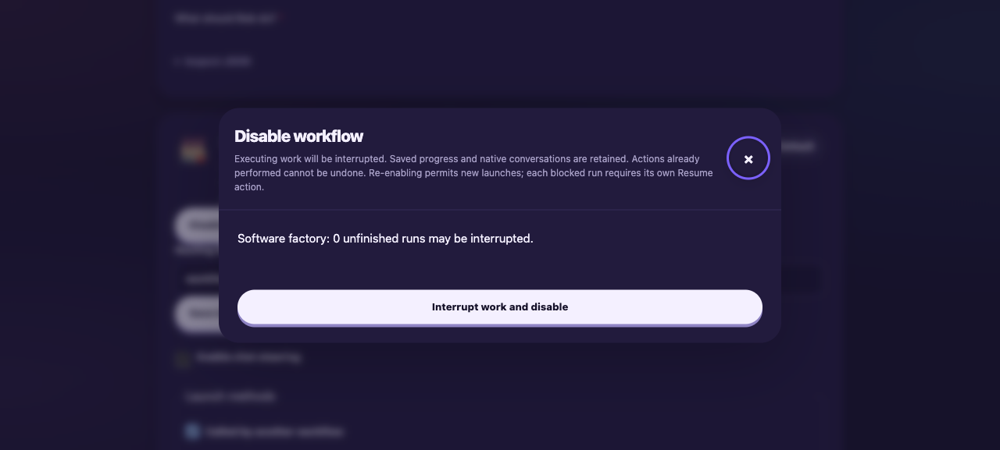
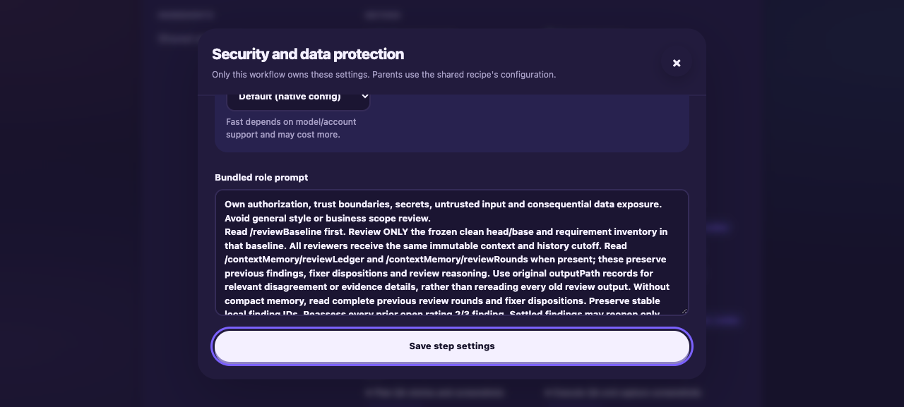
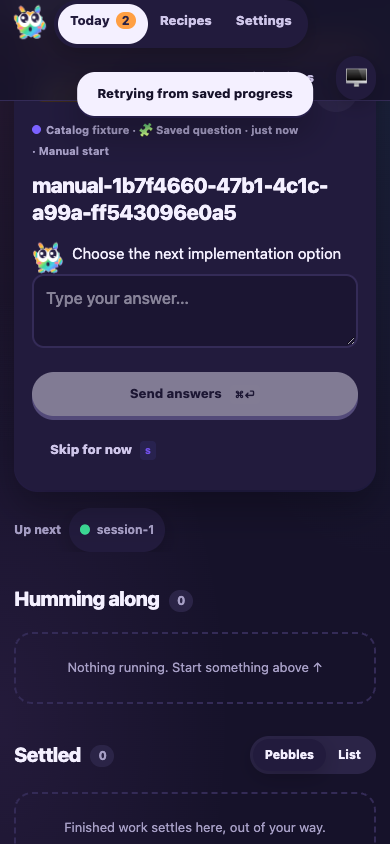

# Workflow catalog review fixes: compatibility and keyboard validation

Date: 2026-10-10. Tested product revision: `c31619d46280b6e2805630ebcf8dc38608187473`.
Built web shell: `66174cf586ba7fd660e64a30` (unchanged by the commit hook rebuild).
All agent execution used simulated agents. No provider-credit tests or production updates ran.

The catalog now keeps main's external delivery, ticket-completion checks, operator
CLI/MCP and older-run capacity ordering. Unchanged frozen-base standards migrate
as bundled definitions. Deleted forks leave a valid export, and interrupted
backup creation recovers without accepting unrelated conflicting bytes.

## Focused checks

- Targeted edge-worker suites passed: WorkflowCatalog (18), WorkflowRuntime,
  FactoryPipeline (51), SpecialistReview, TicketDelivery, TicketTracking,
  MachineCapacity, RunnerConcurrency, Guide, Video, FactoryServer and routing
  prompt assembly. These total 346 tests after the affected fixture rechecks.
- Workflow triggers, MCP OAuth, session chat, integration capacity and review
  brief suites passed another 96 tests. The queued Cursor recovery check was
  rerun with `env -u BOBS_FACTORY_INTERNAL_EXECUTABLE`: the managed agent's
  executable path otherwise adds a valid sandbox read permission to the fixture.
- MCP connection discovery, compiled operator CLI and simulated operator recovery:
  13 tests passed. The recovery fixture uses its own legacy-capacity directory;
  it does not inspect or alter the host's active coordinator.
- CLI terminal composer, local startup and migration: 41 tests passed.
- Monorepo build and typecheck passed in the commit hook. Biome and
  `git diff --check` passed.
- An isolated archive of frozen base `d982159b94f56469eaed270e0f7e36406149c460`
  was loaded into the catalog: zero local workflows, empty migration mappings,
  Factory remained the default, and installed delivery routing remained present.
  [Observed values](assets/workflow-catalog-review-fixes/fix-base-compatibility.json).

Useful commands (from the repository root):

```sh
pnpm --filter bobs-factory-edge-worker exec vitest run test/WorkflowCatalog.test.ts test/WorkflowRuntime.test.ts test/FactoryPipeline.test.ts test/SpecialistReview.test.ts test/TicketDelivery.test.ts test/TicketTracking.test.ts test/MachineCapacity.test.ts test/RunnerConcurrency.test.ts test/Guide.test.ts test/Video.test.ts test/FactoryServer.test.ts test/prompt-assembly.routing-context.test.ts --maxWorkers=2
pnpm --filter bobs-factory-mcp-tools exec vitest run test/factory-operator.integration.test.ts test/factory-operator-recovery.f1.test.ts test/connection-discovery.test.ts --maxWorkers=1
pnpm --filter bobs-factory exec vitest run src/tui/tui.test.ts src/local.test.ts src/migration/migration.test.ts --maxWorkers=2
F1_AGENT_MODE=mock F1_CAPTURE_WAIT=1 F1_RECEIPT_PATH=/tmp/catalog-receipt.json node apps/f1/test-drives/assets/run-workflow-catalog-129.mjs
```

## Simulated F1 and keyboard checks

The existing isolated F1 drive passed migration, preference retention, new-run
selection, independent private forks, disabled dependencies, interruption,
restart without automatic continuation, individual graph/native Resume and
protected import/export. [Runtime receipt](assets/workflow-catalog-review-fixes/fix-catalog-f1.json).
The fixture's expected stop errors accompanied deliberate interruption;
all changed-behavior assertions passed and both temporary servers stopped.

Opened the built UI with:

```sh
agent-browser --headed false --session catalog-review-fix-129 open http://localhost:3649
```

The fixture supplies a local test session cookie. Used keyboard Enter to navigate
Recipes and open bundled inspection. Focus moved inside the dialog and stayed
inside on reverse Tab. Escape dismissed it and returned focus to its opener.
Keyboard typing changed a specialist model preference; Tab reached Save and
Enter persisted the typed value, confirmed through catalog export. The bundled
prompt remained read-only. No agent was launched with the temporary model text.

Disable displayed the interruption warning. Escape dismissed it and returned
focus. Reopening, Tab and Enter confirmed disabling; the API reported disabled
state. Enter re-enabled the workflow. Enabling Saved question left its run
blocked with its question intact. Only Enter on that run's Resume cleared the
block and returned it to the original unanswered question. Desktop and mobile
screenshots were opened and inspected for readability.
[Keyboard receipt](assets/workflow-catalog-review-fixes/keyboard-receipt.json).







Real-agent output quality and live tracker/provider behavior remain untested;
this task authorizes simulated checks. Draft PR publication and later review,
QA and human acceptance stay with their assigned workflow steps. No merge,
ready transition or ticket status update was performed.
