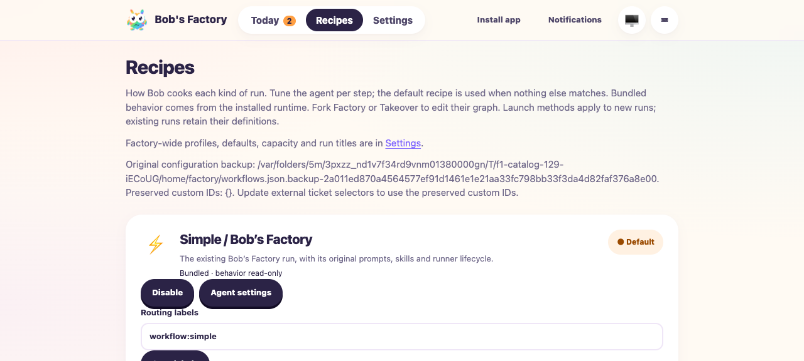
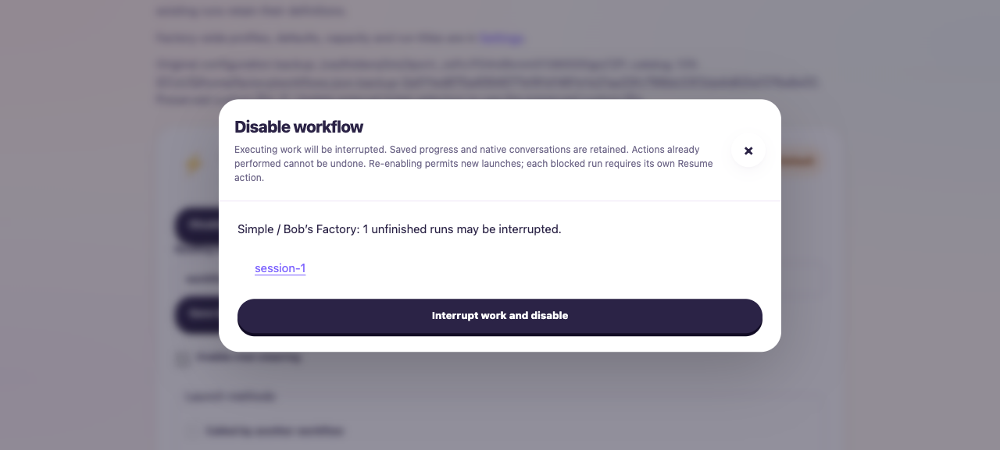
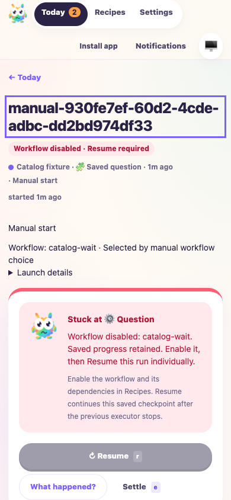
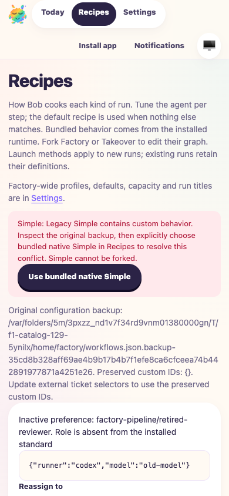

# Bundled workflow catalog, preferences and disabling

Date: 2026-10-10. Tested the implementation working tree based on
`dd7348c3f059fd8b260d7498d1e92b4224d20f5e`, before publication.
Request: Taskbot [#129](https://taskbot.apps.janjaap.de/p/bobs-factory/t/129).
Driver: [workflow-catalog-129.ts](assets/workflow-catalog-129.ts), launched through
[the isolated wrapper](assets/run-workflow-catalog-129.mjs).
Receipt: [receipt.json](assets/workflow-catalog-129/receipt.json).

## Changed behavior

Factory, Takeover, Simple and their shared dependencies come from the installed
runtime. Operators can adjust agent settings and launch permissions without
editing bundled behavior. Factory and Takeover can be forked into independent,
editable dependency graphs. Simple remains the native agent workflow.

Existing configuration is backed up byte for byte before migration. Recognized
stock definitions adopt the current installed graph while retaining agent
preferences. Customized graphs receive stable local IDs. Customized Simple
requires an explicit choice; unmatched preferences remain visible for reassignment
or removal.

Disabling checks the entire dependency graph and shows affected unfinished runs.
It stops active and queued execution, including native Simple and title work,
and persists a blocked checkpoint. Re-enabling does not resume work. Individual
Resume retains saved questions, native conversation IDs and pending instructions.
Accepted launches and runs keep their original graph and preference snapshots.

## Applicable F1 validation

Workflow selection, persistence, execution and native session recovery changed,
so relevant F1 validation was required. The fixture used an isolated temporary
Git repository and real worktrees, the actual EdgeWorker, CLI issue tracker,
RPC listener on port 3650, and protected Factory HTTP listener on port 3649.
Agent and title runners were simulated deterministically. No real agent or
inference API was invoked, and no production tracker or forge was changed.

```sh
pnpm build
pnpm typecheck
F1_AGENT_MODE=mock pnpm -r --workspace-concurrency=1 test:run --maxWorkers=4
F1_AGENT_MODE=mock node apps/f1/test-drives/assets/run-workflow-catalog-129.mjs
```

The full test command passed 3,227 tests across 18 package summaries. Within the
managed agent environment, a local wrapper removed inherited `BOBS_FACTORY_*`
and `CYRUS_*` execution bindings from child processes before invoking that exact
pnpm test command; it did not modify saved configuration or print credentials.

The F1 driver passed these scenarios:

- Stock migration preserved exact backup bytes, adopted current inventory and
  six specialist roles, and retained migrated per-role agent preferences.
- Factory forks had independent private dependencies. Disabling a dependency
  rejected new launches of callers without disabling an unrelated fork.
  Simple could not be forked.
- Incompatible inherited native agent preferences rejected before setup.
- A scripted run retained its question and completed preparation checkpoint
  across disable, re-enable and restart. It stayed blocked until individual
  Resume, without replaying completed preparation.
- Native Simple queued behind capacity was interrupted before another turn.
  Its conversation ID and unsent instruction survived. Active native execution
  also stopped and resumed the same conversation after settling. Captured mock
  prompts confirmed queued and interrupted instructions reached Resume.
- Protected catalog import/export round-tripped successfully.

Focused catalog tests passed 14 tests after the final migration normalization
change. They also cover reserved identity protection, atomic staging recovery,
full-closure disable checks, late execution results, fresh impact confirmation,
old GUI-expanded launch fields, independent specialist settings, inactive
preference reassignment, and accepted admission snapshots during setup.
The final owning-package build and Biome checks passed. `git diff --check` passed.

## Headless browser evidence

All browser checks used fresh `agent-browser --headed false` sessions against
this fixture. Screenshots were inspected at desktop and mobile sizes. Browser
checks confirmed read-only bundled JSON and prompts, editable individual agent
settings, disable impact, unavailable workflows missing from the composer,
blocked Resume eligibility, and the original question returning after Resume.
Changing one specialist model left the other five settings unchanged.

A separate `F1_CAPTURE_MIGRATION=1` fixture displayed a real customized-Simple
conflict and retired-role preference. Browser actions reassigned the preference
and explicitly selected bundled Simple; the API confirmed the conflict cleared
and the original backup remained. The migration button was shortened after a
mobile screenshot showed overflow, then desktop and mobile were recaptured and
inspected. The migration fixture independently rejected Simple launches while
its conflict was unresolved.

General-flow captures used web build `e4b149a0fc2233c49e53f2e5`. Final migration
captures used build `b2aea40af6694a574434422e`; the intervening visual change was
the migration-choice button. Later formatting did not change behavior.









Additional inspected captures:
[read-only inspection](assets/workflow-catalog-129/catalog-bundled-inspection.png),
[role settings](assets/workflow-catalog-129/catalog-role-preferences.png),
[blocked desktop](assets/workflow-catalog-129/catalog-blocked-desktop.png),
[available composer](assets/workflow-catalog-129/catalog-composer-mobile.png),
[retained question after Resume](assets/workflow-catalog-129/catalog-resumed-question.png),
[migration desktop](assets/workflow-catalog-129/catalog-migration-desktop.png).

## Limits

Real provider model compatibility and real-agent output quality were not exercised;
execution evidence uses simulated agents. Historical stock recognition includes
30 archived default-workflow revisions; unrecognized behavior is conservatively
preserved as customization or a Simple conflict.

The runtime supplied no originating ticket identity for this manual run. The
Taskbot URL above comes from accepted task context; no tracking-service update
was attempted. Publication, review and delivery are subsequent workflow steps.

Review findings and keyboard acceptance evidence are recorded in the
[review-fix follow-up](2026-10-10-workflow-catalog-review-fixes.md).
