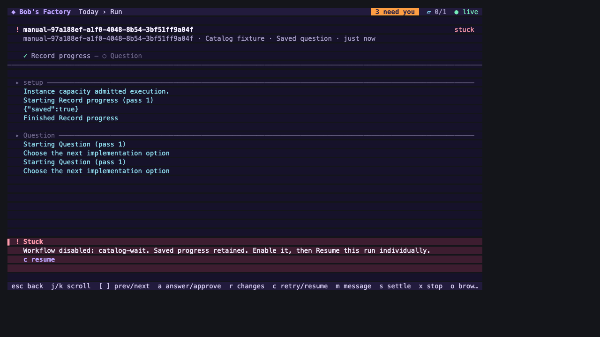
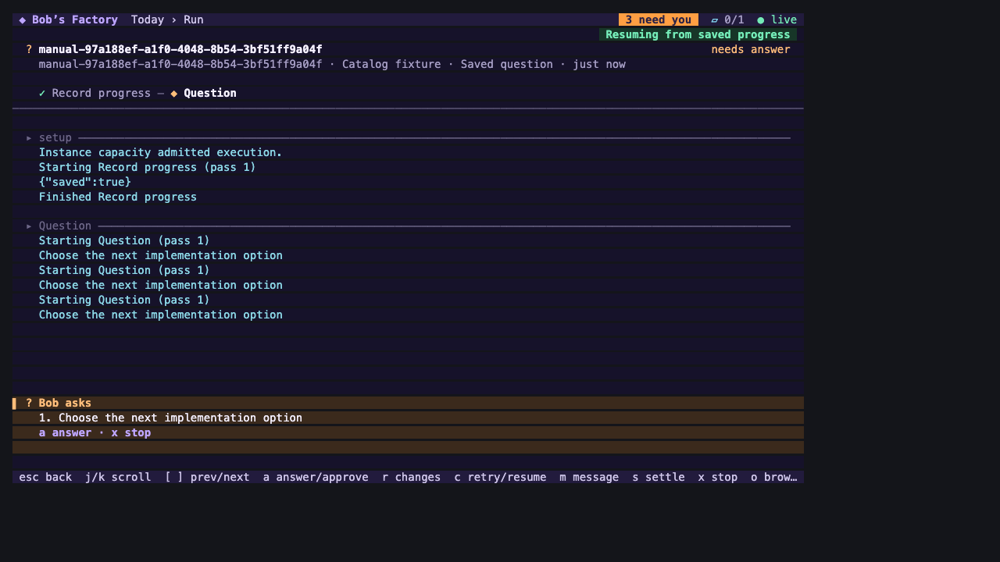

# Workflow Resume review fixes

Date: 2026-10-10. Tested source revision: `4766bbc20566c459481ec961de8787553debf9ec`.
The source was committed after validation, with formatting only in the commit hook.
The following evidence commit changes no product code. All agent execution used
simulated agents; no provider credits or production tracker changes were used.

Operator MCP now resumes blocked saved Simple runs through WorkflowRuntime,
clearing both saved blocks and continuing their accepted native conversation.
The unused native Resume hook was removed from OperatorService, eliminating its
unhandled asynchronous rejection path. Native ticket sessions keep their existing
awaited HTTP Resume handler.

The terminal shows why a run is blocked, displays `c resume` when eligible, and
uses the existing Resume endpoint. While disabled or still stopping, it sends no
Resume request. Workflow configuration events refresh run details so enabling a
workflow updates eligibility without restarting the terminal. Enabling alone
leaves each run blocked until an explicit Resume.

## Validation

- Operator integration: 12 tests passed, including disabled rejection and
  chat-enabled saved Simple recovery through the SDK/server boundary.
- Terminal suite: 14 tests passed, including the displayed reason, disabled
  action, configuration-event refresh and the exact Resume request path.
- WorkflowCatalog, WorkflowRuntime and FactoryServer: 147 tests passed.
- Monorepo build, type checking, Biome and `git diff --check` passed.
- The isolated simulated F1 drive passed its existing catalog/session scenarios
  and the new manual Simple scenario: interrupt, enable without automatic
  continuation, operator Resume, cleared runtime/catalog blocks, successful
  completion and unchanged native conversation ID.
  [F1 receipt](assets/workflow-resume-review-fixes/resume-fixes-f1.json).
- The actual TodayApp and FactoryClient connected to that fixture using a local
  terminal session. Keyboard checks confirmed the blocked reason, no disabled
  request, refresh after enabling, one `/resume` request on `c`, and restoration
  of the original saved question.
  [Terminal receipt](assets/workflow-resume-review-fixes/terminal-resume-receipt.json).
- The fixture stopped cleanly on SIGTERM and released its temporary servers and
  home. Deliberately interrupted simulated turns logged expected stopped errors.

Commands from the repository root:

```sh
pnpm --filter bobs-factory-mcp-tools exec vitest run test/factory-operator.integration.test.ts --maxWorkers=1
pnpm --filter bobs-factory exec vitest run src/tui/tui.test.ts --maxWorkers=1
pnpm --filter bobs-factory-edge-worker exec vitest run test/WorkflowCatalog.test.ts test/WorkflowRuntime.test.ts test/FactoryServer.test.ts --maxWorkers=1
F1_AGENT_MODE=mock F1_CAPTURE_WAIT=1 F1_RECEIPT_PATH=/tmp/resume-fixes-f1.json node apps/f1/test-drives/assets/run-workflow-catalog-129.mjs
bun run apps/f1/test-drives/assets/tui-workflow-resume.ts /tmp/resume-fixes-f1.json /tmp
```

## Inspected terminal captures

These images render the actual terminal cell grid and colors in a headless HTML
viewer at 1280×720. They are faithful captures of TodayApp output, not screenshots
of the web dashboard or an attached desktop terminal. Both were opened and
inspected. The first shows an eligible individual Resume after enabling; the
second shows the retained unanswered question after pressing `c`.





Real-agent output quality and live tracker/provider behavior remain untested.
This fixer did not execute later pipeline QA, approve, merge, mark the PR ready,
or change ticket status. Reviewer reassessment remains required.
