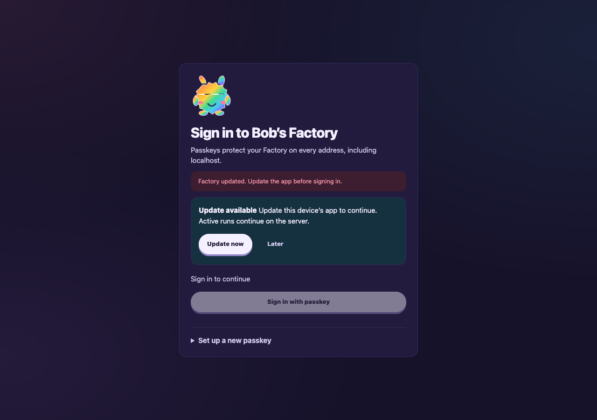

# Corrected signed-out update screenshot

QA79-SCREENSHOT-001 replaces only **Passkey login and app update** / **Signed-out
Settings cached-shell mismatch at 1280×900 in dark theme**. The prior 1280×577
capture remains historical evidence; the other nine accepted captures are retained.

[Capture receipt](receipt.json) records source revision, inherited compact source
provenance, distinct completed server and cached-shell build IDs, explicit
Playwright viewport, browser dimensions, PNG dimensions, theme, URL and image hash.
The full login card is visible. Sign-in is disabled, Update now is available,
a complete replacement worker is waiting, and the protected API returns 401.

The capture used a fresh named **headless** agent-browser session and an isolated
EdgeWorker fixture with mocked agent handlers and a Chromium virtual authenticator.
A real complete shell rebuild and isolated listener restart created the mismatch;
no product source or production service was changed. The capture sets and asserts
1280×900 immediately before taking the screenshot and verifies the saved PNG
header dimensions. This is a targeted browser evidence correction, not a new
workflow behavior or an additional F1 drive. Required repository build/typecheck
hooks still run for this evidence-only commit.

The local evidence directory is
`/Users/jappy/.cyrus/factory/evidence/manual-09e877cd-6bbb-4ad8-9aec-85b6d59877e8/fix-screenshot-001/`.
It retains `capture.mjs`, `capture.log`, `server.mjs`, `server.log`,
`build-fixture.mjs`, the original receipt and `replacement-screenshot.json` for
subsequent capture/review roles. Setup authorization stays in temporary private
fixture state and is absent from these committed receipts.

Earlier resolved findings (FACTORY-AUTH-001, FACTORY-AUTH-002,
QA79-CONFIG-001 and QA79-PUBLIC-001) remain resolved. Nonblocking connection wording
and worker-registration timing observations are unchanged. Live tracker
synchronization remains independently unverified. Historical physical phone
results remain operator-reported on an isolated public share; no new phone or
production-origin validation is claimed. Human approval remains required.
